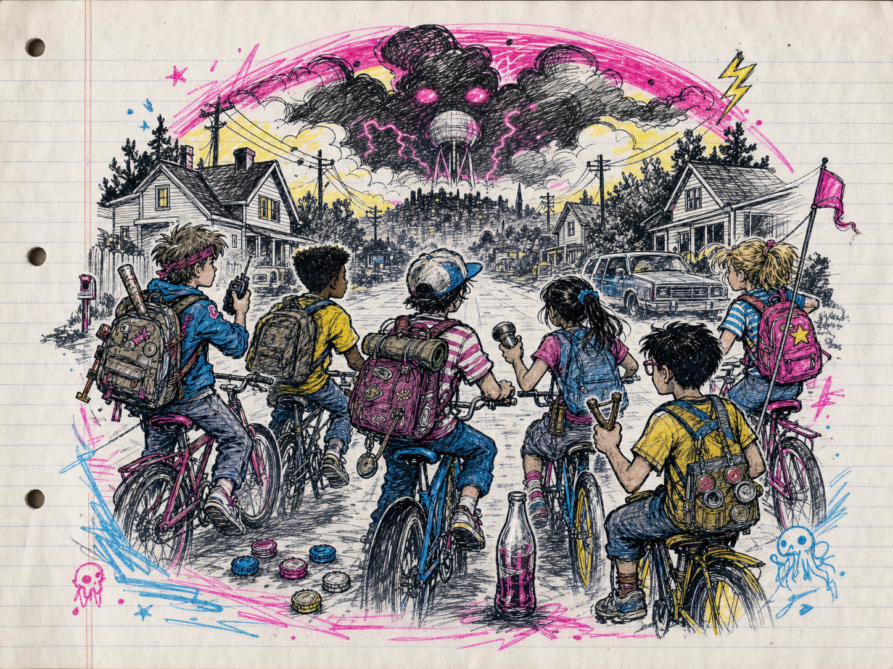

# CHILDHOOD

## Edición española para tablero de casillas

> **Regla de oro de esta adaptación.** Toda distancia se cuenta en casillas. Si una
> regla transcrita del original contradice este recuadro, manda este recuadro.

### Resumen de medición

- **Movimiento base:** `(5 + Cuerpo) / 2` casillas, redondeando hacia arriba.
- **Movimiento ortogonal:** una miniatura solo avanza arriba, abajo, a izquierda o a
  derecha. Cada cambio de casilla cuesta 1. No se permite movimiento diagonal.
- **Distancias y alcances:** cada distancia original en pulgadas se divide entre 2.
  Si el resultado no es entero, se redondea hacia arriba.
- **Distancias aleatorias:** tira primero los dados indicados, divide el resultado
  entre 2 y redondea hacia arriba para obtener las casillas.
- **Cuerpo a cuerpo:** un objetivo está trabado si ocupa cualquiera de las ocho
  casillas adyacentes; las diagonales cuentan únicamente para determinar esta
  adyacencia, no para mover.
- **Línea de visión:** puede trazarse en cualquier dirección, incluidas diagonales,
  desde el centro de la casilla atacante al centro de la casilla objetivo. Queda
  bloqueada si atraviesa cualquier casilla ocupada o terreno que bloquee visión.
  Las casillas de origen y destino no bloquean su propio disparo.
- **Apariciones:** los Malos aparecen en las **Casillas de Borde (Spawns)** señaladas
  por la aventura. Cuando se indique un borde aleatorio, elige o sortea uno de esos
  Spawns.
- **Empujón o retroceso:** desplaza al objetivo 1 casilla ortogonal directamente en
  sentido opuesto al origen del efecto. Si hay dos direcciones válidas, quien causa
  el empujón elige. No atraviesa casillas ocupadas ni terreno infranqueable.
- **Áreas:** convierte su radio o dimensiones dividiendo las pulgadas entre 2. Una
  casilla queda afectada si su centro está dentro del área.

### Referencia rápida de conversiones

| Original |  Cuadrícula |
| -------: | ----------: |
|    1"–2" |   1 casilla |
|    3"–4" |  2 casillas |
|    5"–6" |  3 casillas |
|       8" |  4 casillas |
|      12" |  6 casillas |
|      18" |  9 casillas |
|      24" | 12 casillas |

# Bienvenidos a Childhood



Vuelve el verano. A ti y a tus amigos os esperan días larguísimos de aventuras, misterio e imaginación. Pero este verano no se parece a ninguno de los anteriores.

Algo siniestro ha llegado al pueblo. Tendréis que resolver el misterio, derrotar a los Malos y terminar todas vuestras Tareas para conseguir más tiempo libre. En el corazón de Cardisota está creciendo algo bastante chungo.

## ¿Qué es Childhood?

Childhood es un juego de escaramuzas con miniaturas de 28 mm que no exige una gama concreta. Usa las figuras que ya tengas o monta las tuyas propias. Un caballero espacial, gracias a la imaginación de un peque, puede ser perfectamente el nuevo de la pandilla.

Las pruebas utilizan dados poliédricos y normalmente tienen dificultad **DR12**. Tira 1D20, suma los modificadores y consigue 12 o más. Los modificadores de atributos, Hazañas, Defectos, habilidades y equipo son acumulativos. Un 1 natural siempre es una pifia y un 20 natural siempre es un crítico.

Se puede medir y comprobar la línea de visión antes de declarar una acción.

## Qué necesitas

- Cuatro miniaturas por jugador para representar a los peques.
- Miniaturas para los Malos. Si no tienes la figura perfecta, cambia la descripción del enemigo y tira millas.
- Dados D20, D12, D10, D8, D6 y D4.
- Un tablero de al menos **12 × 12 casillas**.
- Escenografía improvisada con cajas, juguetes, libros y todo lo que un peque pudiera encontrar por casa.

## Propiedades y palabras clave

- **Malo:** monstruo, adulto hostil u otro personaje no jugador enemigo.
- **Peque:** miniatura controlada por un jugador.
- **Ciego:** no puede trazar línea de visión. Un Malo Ciego no mueve; emplea su activación en eliminar este estado.
- **Consecuencias:** representan heridas y problemas persistentes. Cuando un peque acumula tantas como permita su perfil, se retira del juego.
- **Consumible:** se pierde después de utilizarse.
- **Plástico duro:** ignora toda la Defensa proporcionada por armaduras y atuendos.
- **A distancia:** permite atacar hasta 6 casillas, salvo que se indique otro alcance.
- **A distancia X:** permite atacar hasta X casillas.
- **Recarga:** para recargar, la miniatura renuncia a su movimiento y después puede realizar una acción.
- **Recarga X:** puede dispararse X veces antes de tener que recargar.
- **Devolver al remitente:** cuando recibe el ataque de un arma Arrojadiza, el portador puede realizar una tirada de ataque. Si falla, recibe el impacto normalmente. Si tiene éxito, devuelve el proyectil al atacante. Si este también posee Devolver al remitente, puede responder y empezar un peloteo digno de Wimbledon.
- **Arrojadiza:** puede lanzarse hasta 3 casillas sin penalización.
- **Atrapado:** no puede mover durante el resto de la ronda.
- **Empapado:** si recibe un impacto con Agua, tira 1D6; con 4+, el objeto queda destruido.
- **Agua:** causa el doble de daño a robots y criaturas con la palabra clave Sucio. También interactúa con Empapado.

## Bienvenidos a Cardisota

Así que has decidido hacerte cardisotiano. Enhorabuena: estás en la mejor compañía posible. Cardisota tiene bosques verdes, ríos de montaña que desembocan en el mar, una central nuclear perfectamente segura —según el folleto— y la floreciente ciudad de Montillery, sede internacional de TBEC Inc.

Los pintorescos pueblos de Ebber Vale, Welshpool y New Quack tienen sus propias escuelas y mantienen una rivalidad supuestamente amistosa. Montillery High es el instituto más prestigioso del estado, y sus estudiantes más distinguidos terminan en la Universidad Estatal de Cardisota.

> **OFERTA DEL VERANO:** compra un Zumo de Duende de 500 ml y llévate otro gratis. Disponible en sabor original, sorpresa de bayas, menta tóxica, amarillo y sofá usado. Se aplican términos y consecuencias.

## Una historia local bastante regulera

Cardisota es un territorio pequeño y poco importante, dominado históricamente por vecinos mucho más grandes. La región se pobló después de la última glaciación y recibió colonos y misioneros durante el siglo XI. Tras años de tensiones y escaramuzas, acabó convertida en una provincia famosa por enviar soldados a morir y árboles para construir la nación.

Durante el caos de la Última Guerra, Cardisota quedó aislada del gobierno central. Un golpe de Estado la convirtió de repente en un país independiente, pobre y al borde de la ruina. Con determinación, hambrunas de escala razonable y trabajos forzados, logró evitar la bancarrota y avanzar hacia un futuro basado en el consenso y el estado del bienestar.

Hoy los tiempos oscuros parecen haber quedado atrás. La educación pública es sólida e Internet promete ser la gran novedad del futuro. El auge económico de los ochenta dejó tiradas a muchas comunidades, pero quizá la expansión de TBEC y su catálogo de bebidas energéticas aporte empleos e impuestos. Seguro que no sale nada mal.

> **¿SABÍAS QUE…?** New Quack se construyó sobre un antiguo cementerio de mascotas. Antes había sido un vertedero de residuos tóxicos y, antes de eso, un pueblo fantasma surgido durante la fiebre de la plata. Un lugar ideal para criar peques.

# Crear la pandilla


## Formar la pandilla

Cada jugador controla una pandilla de cuatro peques. Para crearla:

1. Elige cuatro miniaturas.
2. Pon nombre y apellido a cada peque, eligiéndolos o tirando en las tablas.
3. Genera y asigna sus atributos.
4. Tira un Trasfondo para cada uno.
5. Gasta las 50 chapas iniciales en equipo.
6. Sal a buscar aventuras. Volver entero es opcional.

## Atributos

Elige una de estas matrices o tira 1D6. Reparte sus cuatro valores entre Mente, Corazón, Cuerpo y Molar como prefieras.

| 1D6 | Valores disponibles |
| --: | ------------------- |
| 1–2 | +2, 0, 0, −2        |
| 3–4 | 0, 0, 0, 0          |
| 5–6 | +1, 0, 0, −1        |

Ningún atributo puede superar +5 ni bajar de −5.

- **Mente:** resolver problemas, investigar y mentir a tus padres sobre dónde has estado todo el día.
- **Corazón:** determina la Salud y lo duro que resulta el peque. **Salud = 5 + Corazón.**
- **Cuerpo:** pruebas de fuerza, saltos y golpes en la cabeza. También determina el Movimiento.
- **Molar:** pruebas de Gallina, impresionar a otros y hacer cosas que molan.

> **Movimiento = (5 + Cuerpo) / 2 casillas, redondeando hacia arriba.**

## Trasfondos

Al crear o reclutar un peque, tira 1D100 para determinar su Trasfondo. Si otro integrante de la pandilla ya lo tiene, repite la tirada hasta obtener uno distinto.

Los Trasfondos conceden objetos, reglas, Hazañas o Defectos. Anota todos sus efectos en la ficha. Un peque solo puede tener un Trasfondo, salvo que una aventura o regla diga expresamente lo contrario.

## Registro escolar: nombres y apellidos

Para poner nombre a un peque, tira **1D100** en la tabla de **Nombre o apodo** y **1D100** en la tabla de **Apellido**. Combina ambos resultados.

Ejemplos: **Álex Navarro**, **Nico Redfield**, **Frida Calavera**, **Rufio Summers**.

> Algunas entradas son apodos de patio, no nombres de partida de nacimiento. Si sale una combinación demasiado famosa, demasiado rara o que en vuestra mesa suena mal, repite una de las dos tiradas.

### Nombre o apodo

| D100 | Nombre   | D100 | Nombre  | D100 | Nombre   | D100 | Nombre    |
| ---: | -------- | ---: | ------- | ---: | -------- | ---: | --------- |
|    1 | Andy     |   26 | Bruno   |   51 | Ness     |   76 | Bea       |
|    2 | Kevin    |   27 | Stanley |   52 | Sabrina  |   77 | Usagi     |
|    3 | Jeremy   |   28 | Raquel  |   53 | Prue     |   78 | Jill      |
|    4 | Calvin   |   29 | Bailey  |   54 | Ray      |   79 | Guido     |
|    5 | Óscar    |   30 | Inés    |   55 | Cory     |   80 | Susana    |
|    6 | Huey     |   31 | Kurt    |   56 | Will     |   81 | Doug      |
|    7 | Riley    |   32 | Kat     |   57 | Larry    |   82 | Daria     |
|    8 | Cole     |   33 | Jenny   |   58 | Guille   |   83 | Elisa     |
|    9 | Buzz     |   34 | Jack    |   59 | Misa     |   84 | Toni      |
|   10 | Jessie   |   35 | Eddie   |   60 | Rick     |   85 | Mustafa   |
|   11 | Natalie  |   36 | Zack    |   61 | Kori     |   86 | Tarkan    |
|   12 | Lara     |   37 | Robert  |   62 | Iris     |   87 | Reyhan    |
|   13 | Winona   |   38 | Russell |   63 | Drake    |   88 | Cerys     |
|   14 | Harry    |   39 | Nasir   |   64 | Merrill  |   89 | Richie    |
|   15 | Gwen     |   40 | Paz     |   65 | Melfina  |   90 | Rufio     |
|   16 | Janet    |   41 | Karl    |   66 | Ashley   |   91 | Ada       |
|   17 | Heather  |   42 | Tarja   |   67 | Phil     |   92 | Coral     |
|   18 | Sidney   |   43 | Ming    |   68 | Dexter   |   93 | Edgar     |
|   19 | Björk    |   44 | Ryan    |   69 | Arnold   |   94 | Alicia    |
|   20 | Filena   |   45 | Willy   |   70 | Velma    |   95 | Nico      |
|   21 | Mercedes |   46 | Frida   |   71 | Harley   |   96 | Pierre    |
|   22 | Mira     |   47 | Olaf    |   72 | Ash      |   97 | Samuel    |
|   23 | Álex     |   48 | Ninten  |   73 | Pingu    |   98 | Edu       |
|   24 | Shinji   |   49 | Lucas   |   74 | Hinata   |   99 | Spike     |
|   25 | Toni     |   50 | Alcide  |   75 | Carolina |  100 | Shigesato |

### Apellido

| D100 | Apellido    | D100 | Apellido   | D100 | Apellido    | D100 | Apellido   |
| ---: | ----------- | ---: | ---------- | ---: | ----------- | ---: | ---------- |
|    1 | Navarro     |   26 | Hart       |   51 | Frizzle     |   76 | Croton     |
|    2 | Itoi        |   27 | Leery      |   52 | Rocket      |   77 | Armanto    |
|    3 | Young       |   28 | Bilko      |   53 | Cartman     |   78 | Le Brun    |
|    4 | Crowe       |   29 | Ward       |   54 | Daggett     |   79 | Martín     |
|    5 | Corgan      |   30 | Camden     |   55 | Lindblom    |   80 | Delaney    |
|    6 | Malik       |   31 | Temple     |   56 | Reppuli     |   81 | Munny      |
|    7 | Thompson    |   32 | Black      |   57 | Redfield    |   82 | Ordos      |
|    8 | Calavera    |   33 | Ellerbee   |   58 | Belmont     |   83 | Andersson  |
|    9 | Maza        |   34 | Smith      |   59 | Harris      |   84 | Taldor     |
|   10 | Seinfeld    |   35 | Lawrence   |   60 | Marley      |   85 | Summers    |
|   11 | Cohen       |   36 | Crane      |   61 | Keen        |   86 | Verne      |
|   12 | Hoppus      |   37 | Bean       |   62 | Blair       |   87 | Barrett    |
|   13 | Walker      |   38 | Langley    |   63 | Dawson      |   88 | Hatfield   |
|   14 | Hill        |   39 | Kusanagi   |   64 | Sandiego    |   89 | Albatross  |
|   15 | Scott       |   40 | Silverberg |   65 | Bugg        |   90 | Knavik     |
|   16 | Kimble      |   41 | Lansing    |   66 | Croft       |   91 | Hayabusa   |
|   17 | Manson      |   42 | Valentine  |   67 | Jin         |   92 | Williams   |
|   18 | McCallister |   43 | Fudd       |   68 | Ace         |   93 | La Déveine |
|   19 | Lyme        |   44 | McGinnis   |   69 | Fluge       |   94 | Lawson     |
|   20 | Clinton     |   45 | Addams     |   70 | Caffeine    |   95 | Montero    |
|   21 | Higgins     |   46 | Gecko      |   71 | Stolar      |   96 | McCoy      |
|   22 | Koshiro     |   47 | Furlong    |   72 | Koppa       |   97 | Bone       |
|   23 | Travers     |   48 | Fielding   |   73 | Stanzak     |   98 | Quinn      |
|   24 | Valdsoo     |   49 | Szalinski  |   74 | Watermaster |   99 | Punch      |
|   25 | Bing        |   50 | Coles      |   75 | McDohl      |  100 | Von Rathen |

## Nombres para la pandilla

Este generador no da un nombre completo con una sola tirada. **Tira dos veces 1D100**:

1. Tira en la **Tabla A** para obtener el primer bloque del nombre.
2. Tira en la **Tabla B** para obtener el segundo bloque.
3. Combina el resultado como: **[Tabla A] [Tabla B]**.

Ejemplos: **Absurdo Club**, **Dinosaurio Goblins**, **Boomfunk Grupo Funky**, **Calle Maníaca Sistema**.

> Si una combinación te sale demasiado seria, demasiado rara o demasiado parecida al nombre de una pandilla rival, repite una de las dos tiradas. La regla de oro es que el nombre debe sonar a grupo de chavales que se lo han inventado en una tarde de verano.

### Tabla A: primer bloque

| D100 | Primer bloque  | D100 | Primer bloque | D100 | Primer bloque     | D100 | Primer bloque  |
| ---: | -------------- | ---: | ------------- | ---: | ----------------- | ---: | -------------- |
|    1 | Bestia         |   26 | Locura        |   51 | Índigo            |   76 | Delta          |
|    2 | Absurdo        |   27 | Gachas        |   52 | Sónico            |   77 | Método         |
|    3 | Tigre          |   28 | Verde         |   53 | Dinosaurio        |   78 | Natural        |
|    4 | Romántico      |   29 | Boomfunk      |   54 | As                |   79 | Principal      |
|    5 | Zapatilla      |   30 | Alcalino      |   55 | Lobo              |   80 | Nocturno       |
|    6 | Aplastante     |   31 | Helado        |   56 | Azul              |   81 | Carne          |
|    7 | Patapalo       |   32 | La            |   57 | Poético           |   82 | Carrete Grande |
|    8 | Demoledor      |   33 | Picante       |   58 | Llameante         |   83 | Perla          |
|    9 | Bofetada       |   34 | Aphex         |   59 | Apedreado         |   84 | Naranja        |
|   10 | Transvisión    |   35 | Eurítmico     |   60 | Notorio           |   85 | Otoño          |
|   11 | Rosa           |   36 | Viviente      |   61 | Moderno           |   86 | Mosca          |
|   12 | Digital        |   37 | Feliz         |   62 | Clase de Gimnasia |   87 | 10.000         |
|   13 | Astuto         |   38 | Chillón       |   63 | Tipo de           |   88 | Temible        |
|   14 | Doobie         |   39 | Cultura       |   64 | Duro              |   89 | Ataque         |
|   15 | Nine Inch      |   40 | Dandi         |   65 | Destino           |   90 | Kinto          |
|   16 | Civil          |   41 | Daft          |   66 | Buen              |   91 | Arco           |
|   17 | Fall Out       |   42 | Gran Malo     |   67 | Guapo             |   92 | Único          |
|   18 | Cualquier Cosa |   43 | Durmiente     |   68 | Masivo            |   93 | Foo            |
|   19 | Súper          |   44 | Blanco        |   69 | Oxidado           |   94 | Paradoja       |
|   20 | No             |   45 | Arrogante     |   70 | Cenit             |   95 | Enfermo        |
|   21 | Poder          |   46 | Gueto         |   71 | Poderoso          |   96 | 187            |
|   22 | El             |   47 | Rosa          |   72 | Rockero           |   97 | Calle Maníaca  |
|   23 | Jungla         |   48 | Morado        |   73 | Malo              |   98 | Parque         |
|   24 | Organizado     |   49 | Humeante      |   74 | Nuevo Malo        |   99 | Vengado        |
|   25 | Oscurísimo     |   50 | Dulce         |   75 | Radio             |  100 | Bikini         |

### Tabla B: segundo bloque

| D100 | Segundo bloque | D100 | Segundo bloque | D100 | Segundo bloque | D100 | Segundo bloque |
| ---: | -------------- | ---: | -------------- | ---: | -------------- | ---: | -------------- |
|    1 | Banda          |   26 | Réplicas       |   51 | Verdes         |   76 | Cangrejos      |
|    2 | Santos         |   27 | Gubbas         |   52 | Animales       |   77 | Peques         |
|    3 | Árboles        |   28 | Piojos         |   53 | Lluvia         |   78 | Ranas          |
|    4 | Maestros       |   29 | Hermanos       |   54 | Desechables    |   79 | de Montillería |
|    5 | Chicos         |   30 | Chicas         |   55 | Ejército       |   80 | Proyecto       |
|    6 | Cerebro        |   31 | Mariquitas     |   56 | -182           |   81 | Gemelos        |
|    7 | Agentes        |   32 | Seis           |   57 | Bayas          |   82 | Vagabundos     |
|    8 | 42             |   33 | Cuervos        |   58 | Murphys        |   83 | Rubias         |
|    9 | Del Río        |   34 | Dolor          |   59 | Chiles         |   84 | Rocas          |
|   10 | Noticias       |   35 | Rosas          |   60 | Búsqueda       |   85 | Inc.           |
|   11 | Tapones        |   36 | Cocteleras     |   61 | Locura         |   86 | Grupo Funky    |
|   12 | Rechazos       |   37 | Matar          |   62 | Duda           |   87 | Caras          |
|   13 | Raíces         |   38 | Labios         |   63 | Rojos          |   88 | Cosa           |
|   14 | Valentinos     |   39 | Modo           |   64 | Betas          |   89 | Manzanas       |
|   15 | Clan           |   40 | Piedras        |   65 | Reyes Guapos   |   90 | Goblins        |
|   16 | Juventud       |   41 | Melocotones    |   66 | Acero          |   91 | Descendencia   |
|   17 | Minders        |   42 | 49ers          |   67 | Cuarteto       |   92 | Galletas       |
|   18 | Bellas         |   43 | Semillas       |   68 | Enemigos       |   93 | Negados        |
|   19 | Guisantes      |   44 | Pollitos       |   69 | Liga           |   94 | Alienígenas    |
|   20 | Melones        |   45 | Disturbio      |   70 | Ficciones      |   95 | Mocosos        |
|   21 | Corazones      |   46 | Base           |   71 | Fugitivos      |   96 | Serpientes     |
|   22 | Pandilla       |   47 | Sistema        |   72 | -52s           |   97 | Tripulación    |
|   23 | Máquina        |   48 | Cruz           |   73 | Calabazas      |   98 | Tableros       |
|   24 | Club           |   49 | Pretendientes  |   74 | Estrellas      |   99 | Reinas         |
|   25 | Héroes         |   50 | Fila           |   75 | Grados         |  100 | 702            |

## Tabla de Trasfondos

Tira 1D100 al crear o reclutar un peque. Si el Trasfondo ya está en la pandilla, repite la tirada hasta obtener uno distinto.

| D100 | Trasfondo                        | Efecto                                                                                                                                                                                                                                                                                                                                                                                                                                                                                                                                                                                                                                                                                                                                                                                                                                                                                                  |
| ---: | -------------------------------- | ------------------------------------------------------------------------------------------------------------------------------------------------------------------------------------------------------------------------------------------------------------------------------------------------------------------------------------------------------------------------------------------------------------------------------------------------------------------------------------------------------------------------------------------------------------------------------------------------------------------------------------------------------------------------------------------------------------------------------------------------------------------------------------------------------------------------------------------------------------------------------------------------------- |
|    1 | Expuesto a productos químicos    | Te quemaste el dedo al meterlo en un barril de sustancias químicas desconocidas por un desafío. No recibiste ningún superpoder, pero tu dedo desfigurado es Molar. +1 Molar.                                                                                                                                                                                                                                                                                                                                                                                                                                                                                                                                                                                                                                                                                                                            |
|    2 | Niño rico                        | Pero no le importa contribuir con su riqueza, aunque sólo sea para presumir. +5 chapas y un objeto poco común aleatorio.                                                                                                                                                                                                                                                                                                                                                                                                                                                                                                                                                                                                                                                                                                                                                                                |
|    3 | Mocoso                           | un resfriado persistente o simplemente eres asqueroso? -1 Molar, gana ataque de mocos.                                                                                                                                                                                                                                                                                                                                                                                                                                                                                                                                                                                                                                                                                                                                                                                                                  |
|    4 | Payaso de clase                  | izquierda, payasos a la derecha y estás justo en el medio. Siempre estás haciendo el payaso y haciéndote el tonto, y eres muy bueno en eso. +1 a mirar fijamente Ánimo de la pandilla.                                                                                                                                                                                                                                                                                                                                                                                                                                                                                                                                                                                                                                                                                                                  |
|    5 | El nuevo                         | mudar a esta escuela y eres un poco misterioso para los otros peques. En realidad, nadie parece saber nada sobre ti. Nada cambia.                                                                                                                                                                                                                                                                                                                                                                                                                                                                                                                                                                                                                                                                                                                                                                       |
|    6 | Niño cambiado                    | Goblin, cuando eras un bebé te dejaron en el lugar de un peque humano. Esto te deja con una repulsión profunda y duradera hacia Goblin Juice, pero una afinidad hacia todos los Goblins. Se niega a beber jugo de Goblin.                                                                                                                                                                                                                                                                                                                                                                                                                                                                                                                                                                                                                                                                               |
|    7 | Futbolista                       | equipo! Tus amigos están un poco hartos de oírte hablar de ese penalti que marcaste. Gana una pelota de fútbol.                                                                                                                                                                                                                                                                                                                                                                                                                                                                                                                                                                                                                                                                                                                                                                                         |
|    8 | Delincuente juvenil              | alborotador, te metes en peleas, te pillas y te saltas clases. Es posible que algún día lo superes, pero ahora mismo tienes mala reputación. +1 Molar.                                                                                                                                                                                                                                                                                                                                                                                                                                                                                                                                                                                                                                                                                                                                                  |
|    9 | Exalumno de colegio privado      | vergüenza! Por razones de las que prefieres no hablar, tuviste que dejar una prestigiosa escuela privada para matricularte en Plainfield Primary. -1 Molar.                                                                                                                                                                                                                                                                                                                                                                                                                                                                                                                                                                                                                                                                                                                                             |
|   10 | Skater                           | Ángela, tu skater de confianza, ella está incluso contigo en la ducha. Consigue una patineta.                                                                                                                                                                                                                                                                                                                                                                                                                                                                                                                                                                                                                                                                                                                                                                                                           |
|   11 | Superdotado                      | verde del otro lado, lo sabes y estás decidido a llegar allí. Asistes a todas las clases y siempre te sientas en primera fila, un día dominarás todo. Vuelva a pasar el fondo dos veces y tome ambos fondos.                                                                                                                                                                                                                                                                                                                                                                                                                                                                                                                                                                                                                                                                                            |
|   12 | Rebuscador                       | un rasgo negativo, pero tú lo sabes mejor. No es que robes cosas, simplemente tiendes a terminar con todo tipo de basura. Comience con un artículo aleatorio gratuito.                                                                                                                                                                                                                                                                                                                                                                                                                                                                                                                                                                                                                                                                                                                                  |
|   13 | Empollón                         | pero no solo eso, también sabes jugar Warhammer. -2 Molar, +1 Mente.                                                                                                                                                                                                                                                                                                                                                                                                                                                                                                                                                                                                                                                                                                                                                                                                                                    |
|   14 | Guitarrista                      | Es Molar que tus amigos realmente quieran formar una banda contigo, si tan sólo tuvieran algún instrumento o supieran tocarlo. Gana 1 guitarra.                                                                                                                                                                                                                                                                                                                                                                                                                                                                                                                                                                                                                                                                                                                                                         |
|   15 | Siempre llega tarde              | complicado, haces lo mejor que puedes para llegar a tiempo, pero por razones fuera de tu control nunca puedes llegar a tiempo. Nunca empiezas en la mesa, únete a la aventura al final de la Ronda 1.                                                                                                                                                                                                                                                                                                                                                                                                                                                                                                                                                                                                                                                                                                   |
|   16 | Padres hippies                   | por qué tus padres se volvieron hippies, pero desafortunadamente todavía son peques de la vieja escuela. Tu casa huele a incienso y hay cuadros coloridos por todas partes, es bastante aburrido. -1 Molar.                                                                                                                                                                                                                                                                                                                                                                                                                                                                                                                                                                                                                                                                                             |
|   17 | Estirón                          | año has estado creciendo como la hierba, para exasperación de tu madre, ya que se te sigue quedando pequeña la ropa. ¡Pero te gusta lo alto que de repente eres y más fuerte que todos tus amigos! +1 Cuerpo.                                                                                                                                                                                                                                                                                                                                                                                                                                                                                                                                                                                                                                                                                           |
|   18 | Antiguo enemigo                  | la temporada pasada, pero La pandilla te derrotó y arruinó tu nefasto plan. Por alguna razón empezaste a salir con ellos después de eso. +2 Molar y un elemento prohibido.                                                                                                                                                                                                                                                                                                                                                                                                                                                                                                                                                                                                                                                                                                                              |
|   19 | Repetidor                        | no fue bueno para ti, luchar contra ese villano de dibujos animados ocupó todo tu tiempo libre y tus calificaciones se vieron perjudicadas. Tienes que volver a tomar la clase, lo cual apesta. +1 Cuerpo, -1 Corazón.                                                                                                                                                                                                                                                                                                                                                                                                                                                                                                                                                                                                                                                                                  |
|   20 | Asmático                         | cual es molesto porque de vez en cuando tienes que parar y inhalar tu inhalador. Gana 1 inhalador.                                                                                                                                                                                                                                                                                                                                                                                                                                                                                                                                                                                                                                                                                                                                                                                                      |
|   21 | Feliz y despreocupado            | tienden a funcionar para ti, es solo una de esas cosas a las que no le prestas mucha atención, pero definitivamente te hace la vida más fácil. Esto te ha convertido en un peque bastante alegre que no se preocupa demasiado. Cuando estás asustado sólo sufres levemente. El peque pasa automáticamente la primera prueba Molar que se le pide que realice en cada aventura.                                                                                                                                                                                                                                                                                                                                                                                                                                                                                                                          |
|   22 | Bicho raro                       | extraño que trae una rata muerta para mostrar y contar y escucha heavy metal. Asustas a muchos de los otros peques. -1 Corazón, gana una Rata Muerta.                                                                                                                                                                                                                                                                                                                                                                                                                                                                                                                                                                                                                                                                                                                                                   |
|   23 | Psíquico                         | menos esa es la razón por la que visitas al doctor todos los martes, según dijo tu mamá. Tus poderes aún no se han manifestado, pero algún día florecerán, al estilo Tetsuo. Gana habilidad psi.                                                                                                                                                                                                                                                                                                                                                                                                                                                                                                                                                                                                                                                                                                        |
|   24 | Cíborg                           | Tus amigos no te creen, pero ¿por qué si no serías tan fuerte? Gana el objeto Brazo de perforación, -1 Corazón.                                                                                                                                                                                                                                                                                                                                                                                                                                                                                                                                                                                                                                                                                                                                                                                         |
|   25 | Atormentado por el futuro pasado | Puedes predecir el futuro, pero a veces tienes toda la razón. En realidad, es bastante perturbador para quienes te rodean. + 1 Mente.                                                                                                                                                                                                                                                                                                                                                                                                                                                                                                                                                                                                                                                                                                                                                                   |
|   26 | Siempre pegajoso                 | las cosas se te pegan, puede que tenga que ver con el uso constante de pegamento. Nunca se pueden soltar objetos, -1 Molar.                                                                                                                                                                                                                                                                                                                                                                                                                                                                                                                                                                                                                                                                                                                                                                             |
|   27 | Con paga                         | dan una mesada! Claro, tienes que hacer algunas tareas domésticas, pero aún así, ¡mira todo ese dinero! Gana chapas D6 después de cada aventura.                                                                                                                                                                                                                                                                                                                                                                                                                                                                                                                                                                                                                                                                                                                                                        |
|   28 | Hermano mayor y más molón        | Tu hermano mayor siempre te eclipsa, sabes muy bien que nunca serás tan Molar ni tan inteligente como ellos. Te corroe constantemente, pero una ventaja es que puedes recurrir a ellos cuando estés en problemas. Obtenga la habilidad Llamar 4 ayuda.                                                                                                                                                                                                                                                                                                                                                                                                                                                                                                                                                                                                                                                  |
|   29 | Amigo de los animales            | Se rumorea que vives en una casa enorme acompañado solo por un par de animales. +1 Corazón y un objeto poco común aleatorio.                                                                                                                                                                                                                                                                                                                                                                                                                                                                                                                                                                                                                                                                                                                                                                            |
|   30 | Peque de acción                  | Sabes cuidarte cuando la cosa se pone fea porque tu madre te obliga a seguir un entrenamiento estricto. -1 Corazón, +1 Cuerpo.                                                                                                                                                                                                                                                                                                                                                                                                                                                                                                                                                                                                                                                                                                                                                                          |
|   31 | Adorablemente torpe              | incluso cuando vuelves locos a todos con tu torpeza. ¡Y eres muy, muy torpe! Sueles dejar caer cada pelota que te lanzan, cada plato que tienes que secar e incluso tu manta. +1 Corazón, -1 Cuerpo.                                                                                                                                                                                                                                                                                                                                                                                                                                                                                                                                                                                                                                                                                                    |
|   32 | Tímido                           | la gente, las multitudes te intimidan y la presión de hablar con extraños te pone nervioso. Cuando no Cuando ningún miembro de tu pandilla es miembro de tu pandilla está dentro de 2 casillas haces todos dentro de 2 casillas haces todas las pruebas de Mente en -1. Pruebas mentales en -1.                                                                                                                                                                                                                                                                                                                                                                                                                                                                                                                                                                                                         |
|   33 | Cotorra                          | hablar todo el tiempo, y luego estás tú y no puedes mantener la boca cerrada ni dos segundos. Cada pensamiento que tienes tiene que ser expresado y rara vez te quedas en un tema por mucho tiempo, para disgusto de quienes te rodean. Todos los peques y hostiles en un radio de 3 casillas realizan todas las pruebas de Mente con un -1.                                                                                                                                                                                                                                                                                                                                                                                                                                                                                                                                                            |
|   34 | Risa floja                       | Da un poco de vergüenza, pero cuando empiezas a reír también tiendes a tirarte pedos, ¡como muchos! Te estremeces de risa y, de repente, un gran pedo viejo ahuyenta a todos. -1 Molar, gana habilidad de ataque de pedos.                                                                                                                                                                                                                                                                                                                                                                                                                                                                                                                                                                                                                                                                              |
|   35 | Científico júnior                | ciencia, es algo que te resulta intrínsecamente fascinante. No es sólo la química lo que te intriga, sino que debes admitir que realmente te gusta hacer estallar cosas. Objeto de petardos [Consumible. Lanzado, Agilidad, Daño 2, Prohibido]                                                                                                                                                                                                                                                                                                                                                                                                                                                                                                                                                                                                                                                          |
|   36 | Se saltó un curso                | año menor que tus amigos desde que saltaste el segundo grado, a veces da un poco de miedo ser siempre el más pequeño (y a menudo el más inteligente). -1 Cuerpo.                                                                                                                                                                                                                                                                                                                                                                                                                                                                                                                                                                                                                                                                                                                                        |
|   37 | Testarudo                        | eres admirablemente persistente, pero tu profesor de matemáticas dice que eres testarudo como una mula. Nunca te verás afectado por una consecuencia FRUSTRADA, pero aun así marca la consecuencia.                                                                                                                                                                                                                                                                                                                                                                                                                                                                                                                                                                                                                                                                                                     |
|   38 | Club de ajedrez                  | El ajedrez es el juego de los reyes, practicas todos los días para dominar el juego, sin saber que una computadora pronto superará a tus héroes. Gana habilidad para jugar ajedrez. Gana habilidad para jugar ajedrez.                                                                                                                                                                                                                                                                                                                                                                                                                                                                                                                                                                                                                                                                                  |
|   39 | Acento regional                  | de Närppes, pero a los otros peques les cuesta entenderte, por lo que no queda claro. -1 Molar.                                                                                                                                                                                                                                                                                                                                                                                                                                                                                                                                                                                                                                                                                                                                                                                                         |
|   40 | Math2mag1c1an                    | Lovelace, tus habilidades matemáticas impresionan continuamente al profesorado, pero te dejan un objetivo bastante claro para los matones. Calculadora de ganancias y +1 Mente.                                                                                                                                                                                                                                                                                                                                                                                                                                                                                                                                                                                                                                                                                                                         |
|   41 | Padre ausente                    | cómo es tu padre, parece que siempre está trabajando. Pero a veces te deja una asignación para compensarlo. Tira un D6 después de cada aventura. Con un 4+ ganas esa misma cantidad de chapas vacías.                                                                                                                                                                                                                                                                                                                                                                                                                                                                                                                                                                                                                                                                                                   |
|   42 | Monarca alienígena exiliado      | A través de circunstancias misteriosas, escapaste de tu mundo natal y ahora estás atrapado en la Tierra, completamente despistado. Afortunadamente, parece que todo el mundo te confunde con un peque debido a tu apariencia y modales. Gana objeto Laser Phaser, pierde -1 Mente.                                                                                                                                                                                                                                                                                                                                                                                                                                                                                                                                                                                                                      |
|   43 | Padre alcohólico                 | tus padres le encanta el alcohol y deja tu casa un poco desordenada. Sin embargo, esto significa que siempre hay chapas vacías que puedes recoger. Recibe D6 chapas vacías después de cada aventura.                                                                                                                                                                                                                                                                                                                                                                                                                                                                                                                                                                                                                                                                                                    |
|   44 | Mascota                          | equipo de la escuela! Puede que no te permitan jugar, pero puedes hacer el payaso con un traje elegante todo lo que quieras. Gana 1 traje de mascota.                                                                                                                                                                                                                                                                                                                                                                                                                                                                                                                                                                                                                                                                                                                                                   |
|   45 | Hijo de líderes de una secta     | secta Tus padres eran los líderes de una secta fatalista. Ahora que eres huérfano, estás profundamente traumatizado y guardas un gran rencor contra todos los adultos. Gana la habilidad Tattletale y Adult Bane.                                                                                                                                                                                                                                                                                                                                                                                                                                                                                                                                                                                                                                                                                       |
|   46 | Filósofo de patio                | montón de teorías extravagantes y a medias sobre los medios de producción, los derechos y la tecnología; curiosamente, te resulta muy difícil encontrar oyentes interesados. Gana la habilidad Aburrirlos hasta que duerman.                                                                                                                                                                                                                                                                                                                                                                                                                                                                                                                                                                                                                                                                            |
|   47 | TDAH sin diagnosticar            | verdadero dolor, estás en todos lados todo el tiempo y no puedes quedarte quieto para salvar tu vida. Obtiene 1 acción de MOVER gratis por turno, pero el peque tiene que mover el valor de movimiento completo y esta acción de movimiento debe usarse o el peque sufrirá una consecuencia.                                                                                                                                                                                                                                                                                                                                                                                                                                                                                                                                                                                                            |
|   48 | Mutante                          | Ni siquiera tus amigos saben que eres un mutante. Con suerte, nunca serás perseguido hasta las alcantarillas por una multitud enojada. +1 a una estadística aleatoria.                                                                                                                                                                                                                                                                                                                                                                                                                                                                                                                                                                                                                                                                                                                                  |
|   49 | Peque de teatro                  | Todo el mundo es un escenario y tú estás aquí para protagonizar, presumiblemente eso significa que tus amigos son el público. -2 Molar, gana habilidad de Artista.                                                                                                                                                                                                                                                                                                                                                                                                                                                                                                                                                                                                                                                                                                                                      |
|   50 | Consciente de ser una miniatura  | Eres solo una miniatura en el juego, un peón desventurado movido por poderes sombríos sin voluntad propia. Ese horrible conocimiento nunca podrá ser suprimido y te atormenta en cada momento. Falla automáticamente la aventura si alguna vez eres la única miniatura que queda en el tablero.                                                                                                                                                                                                                                                                                                                                                                                                                                                                                                                                                                                                         |
|   51 | Pedante                          | hacer de la manera correcta o incorrecta, ¡es tan simple! No entiendes por qué otros no pueden hacer las cosas correctamente, como tú. Gana habilidad molesta.                                                                                                                                                                                                                                                                                                                                                                                                                                                                                                                                                                                                                                                                                                                                          |
|   52 | Benjamin Button                  | un alma vieja, es solo que tú alma vieja, es solo que eres un hombre muy viejo que envejece al revés. Para pasarte en reversa. Para aprobar tienes que pasar el rato con este extraño grupo de peques. extraño grupo de peques. +1 +1 Mente, -1 Enfriar y ganar una Mente, -1 Enfriar y ganar un objeto raro aleatorio. objeto raro al azar.                                                                                                                                                                                                                                                                                                                                                                                                                                                                                                                                                            |
|   53 | Estrella televisiva              | una telenovela local! Es un programa realmente tonto, pero al menos tus padres se están enriqueciendo con tu trabajo y puedes salir con algunos personajes turbios. Ganar drogas.                                                                                                                                                                                                                                                                                                                                                                                                                                                                                                                                                                                                                                                                                                                       |
|   54 | Vago                             | ..? El peque mueve la mitad de su valor de movimiento a menos que beba cualquier sabor de Goblin Juice.                                                                                                                                                                                                                                                                                                                                                                                                                                                                                                                                                                                                                                                                                                                                                                                                 |
|   55 | Gemelo bueno                     | siempre intentas hacer lo correcto y ayudar a las personas. Añade +1 al Ánimo inicial.                                                                                                                                                                                                                                                                                                                                                                                                                                                                                                                                                                                                                                                                                                                                                                                                                  |
|   56 | Gemelo malo                      | Todos los demás pueden irse al infierno y estarás feliz de enviarlos allí. -1 Ánimo inicial.                                                                                                                                                                                                                                                                                                                                                                                                                                                                                                                                                                                                                                                                                                                                                                                                            |
|   57 | Creyente fervoroso               | creyente, los seres divinos están observando y juzgando cada una de tus acciones y sólo serán apaciguados con la oración incesante y viviendo obedientemente como lo ordena el buen libro. Cada vez que lanzas un Fumble no puedes realizar más acciones, en su lugar usarás la habilidad PRAY.                                                                                                                                                                                                                                                                                                                                                                                                                                                                                                                                                                                                         |
|   58 | Genio informático                | Otros pueden burlarse de las computadoras, de esa cosa de la web y de las salas de chat, pero tú sabes que el futuro es digital y tienes la intención de entrar desde cero. Adquiera habilidades con la computadora doméstica.                                                                                                                                                                                                                                                                                                                                                                                                                                                                                                                                                                                                                                                                          |
|   59 | Scout                            | lema con el que intentas vivir, y tu confiable Guía de Junior Woodchucks contiene todas las respuestas que puedas necesitar. Gana 1 guía.                                                                                                                                                                                                                                                                                                                                                                                                                                                                                                                                                                                                                                                                                                                                                               |
|   60 | Director de juego                | de la pandilla, dominando sus destinos. Tu dominio del juego te ha otorgado poderes misteriosos para manipular las tiradas de dados que controlan el destino. Gana la habilidad de Gamemaster.                                                                                                                                                                                                                                                                                                                                                                                                                                                                                                                                                                                                                                                                                                          |
|   61 | Atleta                           | un Cuerpo sano es tu moto, corres, saltas y escalas regularmente para volverte más fuerte y más rápido. Gana la habilidad Sprint.                                                                                                                                                                                                                                                                                                                                                                                                                                                                                                                                                                                                                                                                                                                                                                       |
|   62 | Gafe constante                   | La desgracia ha sido tu constante compañera y ha hecho de tu vida una lucha constante. Vuelva a lanzar todos los años 20 naturales.                                                                                                                                                                                                                                                                                                                                                                                                                                                                                                                                                                                                                                                                                                                                                                     |
|   63 | Alivio cómico                    | hace chistes, toma a la ligera el peligro que enfrenta La pandilla y mantiene el ánimo en alto. Si están en La pandilla, todos los miembros de la pandilla vuelven a realizar su primera prueba de Molar fallida.                                                                                                                                                                                                                                                                                                                                                                                                                                                                                                                                                                                                                                                                                       |
|   64 | Don de palabra                   | Tienes habilidad con las palabras y las rimas, haciéndolas rebotar de formas nuevas y novedosas. Algo que tus profesores no siempre aprecian, pero es difícil negar que puedes expresarte. Obtenga el doble de recompensa por completar las tareas del hogar.                                                                                                                                                                                                                                                                                                                                                                                                                                                                                                                                                                                                                                           |
|   65 | Nada destacable                  | no seas divertido o inteligente, es sólo que no eres tan divertido ni tan inteligente. Algunos peques simplemente tienden a pasar desapercibidos y tú eres uno de ellos. No gane nada, no pierda nada.                                                                                                                                                                                                                                                                                                                                                                                                                                                                                                                                                                                                                                                                                                  |
|   66 | Mal Puro                         | Horn, la maldición que fue puesta sobre el universo. Un día ocuparás el lugar profetizado al frente del Ejército de las Tinieblas, pero por ahora eres solo un peque que busca divertirse con tus amigos. Gana 1 hazaña aleatoria del Salmo prohibido.                                                                                                                                                                                                                                                                                                                                                                                                                                                                                                                                                                                                                                                  |
|   67 | Agorafóbico                      | El peque debe finalizar el giro a 2 casillas del terreno o realizar una prueba de Molar.                                                                                                                                                                                                                                                                                                                                                                                                                                                                                                                                                                                                                                                                                                                                                                                                                |
|   68 | Miedo a la oscuridad             | miedo de que algo esté siempre cerca, extendiéndose desde la oscuridad para arrastrarte lejos. De la oscuridad para arrastrarte. Por supuesto que no hay nada, por supuesto que no hay nada que te digas a ti mismo, pero que no puedas superar tu miedo a la oscuridad. Supera tu miedo a la oscuridad. Si la tirada de Clima es Nocturna, automáticamente comienzas con una consecuencia. consecuencia.                                                                                                                                                                                                                                                                                                                                                                                                                                                                                               |
|   69 | Peque de los bichos              | Te encantan los insectos y tienes toda la información sobre ellos. Les cuentas a todos tus datos sobre errores, independientemente de cuánto parezcan estar escuchando. Todos los insectos enemigos son tus amigos y no atacarán a este peque.                                                                                                                                                                                                                                                                                                                                                                                                                                                                                                                                                                                                                                                          |
|   70 | Ratón de biblioteca              | ¡no es sólo para nerds! Te encanta perderte en un libro bueno y grueso, tus problemas se desvanecen a medida que te sumerges en la historia. Gana un artículo de libro.                                                                                                                                                                                                                                                                                                                                                                                                                                                                                                                                                                                                                                                                                                                                 |
|   71 | Matón                            | las duras consecuencias en casa te han dejado con la necesidad de arremeter, luchas con esto y en el fondo sabes que lo que estás haciendo está mal. Gana la habilidad Provocar, el garrote pierde 1 Ánimo.                                                                                                                                                                                                                                                                                                                                                                                                                                                                                                                                                                                                                                                                                             |
|   72 | Peque salvaje                    | lobos en el bosque oscuro, al menos eso es lo que recuerdas y eso explicaría tu cabello revuelto y tu profundo hambre por carne cruda. Gana +1 Cuerpo.                                                                                                                                                                                                                                                                                                                                                                                                                                                                                                                                                                                                                                                                                                                                                  |
|   73 | Huérfano                         | eras muy joven y creciste con la familia de tu tía. Son una familia perfectamente amorosa, pero a veces sientes un anhelo melancólico por tus verdaderos padres. Gana la habilidad Adult Bane.                                                                                                                                                                                                                                                                                                                                                                                                                                                                                                                                                                                                                                                                                                          |
|   74 | Hijo del sueño nietzscheano      | Hace unos años sufriste un terrible accidente, pero después de una larga y ardua recuperación estás aún más fuerte que antes. Gana 1 Cuerpo y una habilidad Molar Scar.                                                                                                                                                                                                                                                                                                                                                                                                                                                                                                                                                                                                                                                                                                                                 |
|   75 | Vendió su alma                   | si La pandilla ya contiene Pure Fggg Evill. Cambiaste tu alma a Pure Fggg Evil a cambio de un artículo realmente Molar. Gana 1 elemento aleatorio de KillSampleProcess.                                                                                                                                                                                                                                                                                                                                                                                                                                                                                                                                                                                                                                                                                                                                 |
|   76 | Moroso                           | prestado a tus amigos para comprar cómics y dulces y, sin embargo, nunca los devuelves. Algunos podrían llamar a esto una característica bastante negativa. Gana 2 chapas al final de cada aventura.                                                                                                                                                                                                                                                                                                                                                                                                                                                                                                                                                                                                                                                                                                    |
|   77 | Pelota del profesor              | No señora. ¡Sé la respuesta! No puedes evitar hacerle caso a la autoridad, sin importar cómo te vea frente a tus amigos. ¿Quizás deberían estudiar más en lugar de burlarse de ti? Gana una manzana.                                                                                                                                                                                                                                                                                                                                                                                                                                                                                                                                                                                                                                                                                                    |
|   78 | Artista                          | algún día quizás incluso comiences tu propio webcomic sobre una horda de patos que desata el apocalipsis. Obtenga materiales de arte.                                                                                                                                                                                                                                                                                                                                                                                                                                                                                                                                                                                                                                                                                                                                                                   |
|   79 | Hijo de héroe obrero             | la clase trabajadora Tus padres están desanimados por la lucha del proletariado y, por alguna loca razón, te obligan a asistir a todo tipo de mítines y reuniones. Es profundamente desagradable, pero al menos conoces la distribución del trabajo. ¿Sí? Pierde 2 Molar, gana 1 Mente.                                                                                                                                                                                                                                                                                                                                                                                                                                                                                                                                                                                                                 |
|   80 | Peque de los ochenta             | Naciste con una década de retraso, pero todavía llevas mullet y escuchas Dire Straits. Es lo que hay, colega. Obtienes el objeto Mullet.                                                                                                                                                                                                                                                                                                                                                                                                                                                                                                                                                                                                                                                                                                                                                                |
|   81 | Ayudante de superhéroe           | villano científico está aterrorizando a Cardisota, sabes que es hora de ponerte tu ropa y salir a los tejados. ¡Shazam de verdad! Gana traje de superhéroe.                                                                                                                                                                                                                                                                                                                                                                                                                                                                                                                                                                                                                                                                                                                                             |
|   82 | Cuatro ojos                      | te regalaron gafas, lo cual es una mierda, pero al menos puedes volver a ver. Gana gafas, -1 a todas las tiradas si alguna vez las pierdes.                                                                                                                                                                                                                                                                                                                                                                                                                                                                                                                                                                                                                                                                                                                                                             |
|   83 | Editor júnior                    | Es una revista bastante sombría y la gente siempre se queja de las decisiones que tomas, ¿tal vez deberían relajarse un poco? Gana 28 cargadores.                                                                                                                                                                                                                                                                                                                                                                                                                                                                                                                                                                                                                                                                                                                                                       |
|   84 | Peque de campo                   | Necesitas espacios abiertos y espacio para cometer tus grandes errores. ¿Eso te convierte en un poco paleto? ¡Maldita sea, así es! Si un jugador habla con acento rural cuando juega, puede volver a tirar 1.                                                                                                                                                                                                                                                                                                                                                                                                                                                                                                                                                                                                                                                                                           |
|   85 | Bilingüe                         | Los extraños dirían que hablas la lengua troll, pero estás realmente orgulloso de tus habilidades bilingües. Gana la habilidad Goblin Speaker.                                                                                                                                                                                                                                                                                                                                                                                                                                                                                                                                                                                                                                                                                                                                                          |
|   86 | Sobreexplicador                  | explicar demasiado en realidad están arraigadas en un temor profundamente arraigado de que las personas que te rodean no entenderán la historia completa, por lo que te sientes obligado a proporcionar tanta información como sea posible para asegurar que todos tus puntos se comuniquen correctamente. Este miedo surge de una experiencia temprana de ser ridiculizado por no explicar completamente algo, lo que ha creado una necesidad interna de explicar todos los detalles posibles para evitar ser malinterpretado. Como resultado, a menudo te encuentras en la posición de explicar demasiado las cosas, incluso cuando no es necesario. Cada vez que otro peque se encuentra a menos de 2 casillas, sufre -3 en sus pruebas de Pollo. Esto significa que si otro modelo de peque está a menos de 2 casillas de este peque, deducirán -3 cuando tengan que realizar las pruebas de Pollo. |
|   87 | Chica caballo                    | Sueñas con ser una verdadera jinete y correr libremente por la pradera interminable. Serías tu verdadero yo, en parte niña, en parte caballo, toda hecha un desastre. +1 Cuerpo, -1 Mente y gana el objeto Silla de montar.                                                                                                                                                                                                                                                                                                                                                                                                                                                                                                                                                                                                                                                                             |
|   88 | Bruja                            | una invitación para una escuela mágica, pero después de echar un vistazo a su plan de estudios les dijiste que se fueran a la mierda. Eres una bruja rudo y no tienes tiempo para infundir miedo. Gana un objeto de escoba [tiradas de tareas automáticas para este peque].                                                                                                                                                                                                                                                                                                                                                                                                                                                                                                                                                                                                                             |
|   89 | Amigo de los pescadores          | Te encanta el antiguo muelle, ver cómo los barcos de pesca salen y regresan y escuchas todas las historias locas de los viejos pescadores. Cuando seas grande serás como ellos. Gana caña de pescar.                                                                                                                                                                                                                                                                                                                                                                                                                                                                                                                                                                                                                                                                                                    |
|   90 | Adorable                         | ................................... Estás maldito con la ternura, lo que te hace casi imposible lucir una cara de matón, y mucho menos parecer remotamente aterrador. A veces los dioses son así de volubles. Gana +1 Cuerpo.                                                                                                                                                                                                                                                                                                                                                                                                                                                                                                                                                                                                                                                                           |
|   91 | Experto en dinosaurios           | dinosaurios, tienes un dato sobre dinosaurios para cada ocasión. Gana el artículo Toy Dino.                                                                                                                                                                                                                                                                                                                                                                                                                                                                                                                                                                                                                                                                                                                                                                                                             |
|   92 | Ninja Wutan                      | busca del asesino de tu padre, después de tomar tu espantosa venganza terminaste en Cardisota. Gana un objeto Katana                                                                                                                                                                                                                                                                                                                                                                                                                                                                                                                                                                                                                                                                                                                                                                                    |
|   93 | Rey de las puntuaciones          | son molares en los videojuegos, y luego estás tú, el gobernante supremo de los videojuegos y maestro de las consolas. Todo el mundo conoce tu ID de puntuación más alta y nadie podrá superarla. Gana el objeto Mortel Kombat 3. [+2 Molar, Prohibido]                                                                                                                                                                                                                                                                                                                                                                                                                                                                                                                                                                                                                                                  |
|   94 | Grafitero                        | líder de toda la ciudad, incluso los OG reconocen tu juego. Lamentablemente las autoridades también se han interesado por usted y el bloque se está calentando. Obtenga el artículo Lata de aerosol. [Prohibido. +1 Molar para el peque] Algo está mal, puedes sentir cómo te estás transformando en algo más que un ser humano. Tu Mente y tu Cuerpo se están deformando, transformándote lentamente en una mosca. Ya no puedes usar objetos en combate y la comida tiene un sabor horrible, lo que te impide devorarlos. Gana +1 Cuerpo +1 Corazón, -3 Frío y la habilidad Vómito Ataque.                                                                                                                                                                                                                                                                                                             |
|   95 | La mirada Brundle                | Tu mirada inquietante pone nervioso a todo el mundo. Una vez por aventura, un Malo que pueda verte debe repetir una prueba de Molar superada.                                                                                                                                                                                                                                                                                                                                                                                                                                                                                                                                                                                                                                                                                                                                                           |
|   96 | Disléxico                        | tareas y arruinas otras y la escuela te ha dado tiempo extra para los exámenes. -1 Mente, pero puede volver a tirar 1 naturales.                                                                                                                                                                                                                                                                                                                                                                                                                                                                                                                                                                                                                                                                                                                                                                        |
|   97 | Cicatriz molona                  | Tienes una cicatriz que queda increíble cuando cuentas historias exageradas sobre ella. +1 Molar.                                                                                                                                                                                                                                                                                                                                                                                                                                                                                                                                                                                                                                                                                                                                                                                                       |
|   98 | Vendido                          | Harías casi cualquier cosa por chapas. Empiezas con 2D6 chapas, pero la pandilla pierde 1 Ánimo inicial.                                                                                                                                                                                                                                                                                                                                                                                                                                                                                                                                                                                                                                                                                                                                                                                                |
|   99 | Regreso al pasado                | un experimento que involucra a un científico loco, un Delorean y algo sobre no besar a tu propia madre, puedes restablecer brevemente el tiempo. Ganancia: 1 repetición de cualquier dado una vez por aventura.                                                                                                                                                                                                                                                                                                                                                                                                                                                                                                                                                                                                                                                                                         |
|  100 | Niño de la llave                 | siempre allí cuando llegas a tu casa vacía. Como huérfano de día has aprendido a cuidar de ti mismo. Gana 1 sándwich ligeramente decepcionante.                                                                                                                                                                                                                                                                                                                                                                                                                                                                                                                                                                                                                                                                                                                                                         |
|  101 | El Elegido                       | Algo en ti huele a profecía barata y recreativos. Obtienes una repetición de dado por aventura, pero si la usas debes aceptar una Consecuencia al final.                                                                                                                                                                                                                                                                                                                                                                                                                                                                                                                                                                                                                                                                                                                                                |

## Habilidades

Los peques obtienen Habilidades mediante Trasfondos, recompensas o gastando 5 PX. Si un peque obtiene su tercera Habilidad, tira 1D6: con un 1, entra en un programa para superdotados y abandona la pandilla. Al obtener la cuarta, sucede lo mismo con cara en una moneda. Si consigue una quinta, se matricula automáticamente en la Escuela para Jóvenes Talentos y se marcha.

|  Nº | Habilidad               | Efecto                                                                                                                                                                                                                         |
| --: | ----------------------- | ------------------------------------------------------------------------------------------------------------------------------------------------------------------------------------------------------------------------------ |
|   1 | Imitador                | Inmediatamente después de que otro peque utilice una Habilidad, puede repetir sus efectos.                                                                                                                                     |
|   2 | Riot Grrrl              | Ignora todos los modificadores negativos al realizar pruebas de Gallina.                                                                                                                                                       |
|   3 | Te reto                 | Elige otro peque a 6 casillas o menos. Debe realizar una acción que le ordenes, como soltar un arma.                                                                                                                           |
|   4 | Hacerse el muerto       | Como acción, el peque se tira al suelo y deja de ser un objetivo válido. No puede atacar ni realizar otras acciones hasta gastar una acción en levantarse.                                                                     |
|   5 | Ataque de mocos         | Como acción, elige un enemigo situado a 2 casillas o menos y realiza una prueba de Cuerpo. Si tiene éxito, el objetivo debe superar una prueba de Molar.                                                                       |
|   6 | Llamar al hermano mayor | Una vez por aventura y como acción, aparece un hermano mayor. Elige uno de estos efectos: inflige 5 puntos de daño a un Malo o permite que el peque supere automáticamente una prueba.                                         |
|   7 | PSI                     | Como acción, mueve hasta 3 casillas un objeto caído o un elemento móvil de la aventura. El desplazamiento debe respetar la cuadrícula y no puede atravesar obstáculos.                                                         |
|   8 | Ataque de pedo          | Como acción, todas las demás miniaturas situadas a 2 casillas o menos deben superar una prueba de Molar.                                                                                                                       |
|   9 | Chessboxin’             | Como acción, elige un Esbirro adyacente en lugar de atacarlo. Debe superar una prueba de Molar; si falla, pierde su próxima activación.                                                                                        |
|  10 | Azote de adultos        | Obtiene +1 a las tiradas de ataque contra Malos con la palabra clave Adulto.                                                                                                                                                   |
|  11 | Chivato                 | Retira permanentemente del juego a este peque y a otra miniatura. Sí, permanentemente. Menudo marrón en casa.                                                                                                                  |
|  12 | Aburrir hasta dormir    | Como acción, todas las demás miniaturas —excepto Jefes— situadas a 2 casillas o menos realizan una prueba de Mente. Quienes fallen pierden su próxima activación.                                                              |
|  13 | Artista                 | Como acción, monta un numerito. El peque sufre −1 Molar durante el resto de la aventura, pero la pandilla obtiene +1 Ánimo hasta que termine.                                                                                  |
|  14 | Irritante               | Todas las miniaturas situadas a 2 casillas o menos, amigas o enemigas, deben repetir sus pruebas superadas.                                                                                                                    |
|  15 | Rezar                   | Como acción, realiza una prueba de Mente. Si tiene éxito, la pandilla obtiene una repetición de dado que debe utilizarse durante esta ronda. Si no la usa, los dioses se enfadan y un integrante al azar sufre 1 Consecuencia. |
|  16 | Ordenador doméstico     | Una vez por aventura, supera automáticamente una prueba de Mente.                                                                                                                                                              |
|  17 | Director de juego       | Una vez por aventura, supera automáticamente cualquier prueba.                                                                                                                                                                 |
|  18 | Esprint                 | Cuando mueva, tira 1D6, divide el resultado entre 2 y redondea hacia arriba. Añade esa cantidad de casillas a su Movimiento durante esa acción.                                                                                |
|  19 | Provocar                | Como acción, todos los Malos que puedan verlo pasan a considerarlo su objetivo prioritario, aunque haya otro peque más cerca.                                                                                                  |
|  20 | Entristecer             | El peque falla automáticamente las pruebas de Molar y supera automáticamente las pruebas de Corazón.                                                                                                                           |
|  21 | Cicatriz molona         | Como acción, inspira a otro peque. Ese peque supera automáticamente todas sus pruebas de Molar durante el resto de la aventura.                                                                                                |
|  22 | Hablar con duendes      | Los Duendes nunca atacan a este peque, salvo que una regla de aventura indique lo contrario.                                                                                                                                   |
|  23 | Ataque de vómito        | Arma natural: **Cuerpo**, **A distancia 3 casillas**, **Daño 2**.                                                                                                                                                              |

# Equipo, tiendas y cachivaches


## The Cardisota Daily Times

The Cardisota Daily Times Lunes 8 de 1995 Número 1025 50p Desde chapas de vino hasta jugo Goblin, los peques de Cardisota se han vuelto locos por el nuevo plan de devolución de chapas.

Y si bien no se debe desalentar la idea de ser ecológico, existe una creciente preocupación de que los peques solo devuelvan las chapas debido a la pequeña recompensa financiera por hacerlo. Parecería que los jóvenes de Cardisota han comenzado a usar las chapas como forma de moneda y están incluso comercializando todo tipo de productos desagradables.

¡Y parece que los peques no sólo buscan chapas de sus propias casas! Al igual que los ladrones de tumbas de peques mayores, han empezado a asaltar los contenedores de basura de los residentes y se han presentado varias quejas ante el ayuntamiento.

El señor Valittaa, residente local, tuvo algunas palabras selectas.

“Dejaron mi basura esparcida por todo mi jardín.

Lo único que se habían llevado eran dos chapas de cerveza y todo lo demás tirado sobre el césped; si me preguntas, debería hacerse algo al respecto.

Se pidió al Ayuntamiento que hiciera comentarios, pero se negó a comentar sobre los rumores de que los peques buscaban chapas en los contenedores de basura, centrándose en el hecho de que las tasas de reciclaje de vidrio no son las más altas que la ciudad haya visto jamás.

Goblin Juice Factory abre cajas LOCO DE chapas Aplasta OBJETIVOS DE RECICLAJE peques molestos robando basura. Robo de basura dejando a los ciudadanos enfurecidos

## De compras

Los objetos, las armas y los atuendos pueden comprarse en las tiendas desbloqueadas. La Tienda general está siempre disponible; las tiendas de episodio solo permanecen abiertas mientras se juega ese episodio.

Una pandilla recién creada dispone de **50 chapas**. Cada peque tiene **5 espacios de equipo** y cada artículo ocupa 1, salvo que indique otra cosa.

Después de una aventura se puede vender equipo común por la mitad de su coste, redondeando hacia abajo. Los objetos Prohibidos y Legendarios nunca pueden venderse.

Una mochila decente para salir de aventuras debería incluir:

- Un arma para zurrar a los Malos.
- Un atuendo, si quedan chapas y apetece conservar las rodillas.
- Objetos útiles o consumibles para quitar Consecuencias.

## Tienda general

Los consumibles se pierden al utilizarlos.

| Artículo                     |     Coste | Efecto                                                                                                               |
| ---------------------------- | --------: | -------------------------------------------------------------------------------------------------------------------- |
| Zumo de Duende               |  5 chapas | Como acción: el peque pierde 1 Mente durante el resto de la aventura y obtiene un movimiento gratuito en cada ronda. |
| Manzana                      |  3 chapas | Recupera 1 punto de Salud.                                                                                           |
| Material de manualidades     |  5 chapas | Como acción, fabrica una Espada de cartón y un Escudo de cartón.                                                     |
| Caña de pescar               |  5 chapas | Necesaria para jugar _Nos vamos de pesca_.                                                                           |
| Escudo de cartón             |  5 chapas | Descártalo para ignorar un ataque que haya impactado. Empapado.                                                      |
| Bocata un poco decepcionante |  5 chapas | Elimina 1 Consecuencia.                                                                                              |
| Rarebit galés                |  9 chapas | Recupera 2 puntos de Salud.                                                                                          |
| Lata de espinacas            | 15 chapas | El peque obtiene +2 Cuerpo durante el resto de la aventura.                                                          |
| Globo                        |  3 chapas | Destrúyelo al recibir una Consecuencia para ignorarla.                                                               |
| Bocata del bueno             | 12 chapas | Elimina todas las Consecuencias del peque.                                                                           |

## Atuendos

Un peque solo puede llevar un atuendo. Su Defensa reduce el daño recibido.

| Atuendo                    | Defensa |     Coste | Regla especial                                                                       |
| -------------------------- | ------: | --------: | ------------------------------------------------------------------------------------ |
| Disfraz de robot de cartón |       1 |   1 chapa | Empapado. Además, queda que te cagas.                                                |
| Chaqueta de cuero          |       1 |  6 chapas | +1 Molar mientras se lleve puesta.                                                   |
| Coderas                    |       2 | 10 chapas | —                                                                                    |
| Equipo de hockey           |       3 | 20 chapas | —                                                                                    |
| Mullet                     |       0 |  8 chapas | Repite un dado una vez por aventura, pero sufre −1 Molar. El precio de ir a la moda. |
| Chubasquero amarillo       |       1 |  6 chapas | Ignora todos los efectos de la tabla de Tiempo.                                      |

## Armas

Solo puede utilizarse un arma a la vez.

| Arma                                         | Atributo | Propiedades adaptadas             | Daño | Coste |
| -------------------------------------------- | -------- | --------------------------------- | ---: | ----: |
| Balón de fútbol                              | Cuerpo   | Arrojadiza, alcance 3 casillas    |    2 |     4 |
| Espada de cartón                             | Cuerpo   | Empapada                          |    2 |     1 |
| Espada de madera                             | Cuerpo   | —                                 |    3 |     6 |
| Bate de béisbol                              | Cuerpo   | Devolver al remitente             |    4 |    12 |
| Bate de críquet                              | Mente    | Devolver al remitente             |    4 |    12 |
| Tirachinas                                   | Mente    | A distancia 6 casillas, Recarga   |    2 |     4 |
| Matatán de pog                               | Mente    | Arrojadiza, alcance 3 casillas    |    1 |     1 |
| Saco hacky                                   | Molar    | Arrojadiza, alcance 3 casillas    |    1 |     1 |
| Superpistola de agua                         | Mente    | A distancia 6 casillas, Agua      |    1 |     4 |
| Pistola Nurf                                 | Molar    | A distancia 6 casillas, Recarga 6 |    2 |     6 |
| Frisbi                                       | Mente    | Arrojadiza, alcance 3 casillas    |    2 |     3 |
| Yoyó                                         | Corazón  | A distancia 3 casillas            |    2 |     6 |
| Una piedra chulísima                         | Cuerpo   | Arrojadiza, alcance 3 casillas    |    1 |     — |
| Un palo que mola mucho                       | Cuerpo   | Ocupa 2 espacios de equipo        |    2 |     — |
| Arco                                         | Mente    | A distancia 6 casillas, Recarga   |    3 |     5 |
| Globo de agua                                | Mente    | Arrojadiza 3 casillas, Agua       |    1 |     1 |
| Aerosol                                      | Molar    | Cegadora                          |    1 |     3 |
| Espada LED del Guerrero Energético Metamorfo | Cuerpo   | Plástico duro                     |    4 |    20 |
| Espada de espuma                             | Cuerpo   | —                                 |    2 |     2 |
| Raqueta de tenis                             | Cuerpo   | Devolver al remitente             |    3 |     6 |

## Cachivaches

| Objeto                         |     Coste | Efecto                                                                                                                                                                                  |
| ------------------------------ | --------: | --------------------------------------------------------------------------------------------------------------------------------------------------------------------------------------- |
| Cómic usado                    |  4 chapas | Repite una prueba de Molar una vez por aventura.                                                                                                                                        |
| Disfraz de animal              |  5 chapas | Los Malos con la palabra clave Animal ignoran al peque hasta que este los ataque.                                                                                                       |
| Mochila                        |  5 chapas | Ocupa 1 espacio y concede 2 espacios de equipo adicionales.                                                                                                                             |
| Casco de bici                  |  3 chapas | El peque no sufre daño al caer, sea cual sea la altura.                                                                                                                                 |
| Libro del cole                 | 10 chapas | +1 a las tiradas de Mente.                                                                                                                                                              |
| Calculadora                    |  6 chapas | Repite una prueba de Mente una vez por aventura.                                                                                                                                        |
| Cartera con cadena             |  5 chapas | Mientras pertenezca a la pandilla, esta no puede perder chapas salvo al gastarlas.                                                                                                      |
| Pulsera de dijes               | 12 chapas | Repite un dado una vez por aventura. No ocupa espacios de equipo.                                                                                                                       |
| Casete _CrazySexyCool_         |  6 chapas | Repite una prueba de Molar una vez por aventura.                                                                                                                                        |
| Riñonera                       |  4 chapas | Guarda hasta 2 consumibles sin que ocupen espacios de equipo.                                                                                                                           |
| Linterna                       |  5 chapas | Ignora los efectos del tiempo causados por la oscuridad.                                                                                                                                |
| Gameboi                        | 15 chapas | +2 Molar.                                                                                                                                                                               |
| Guía                           | 10 chapas | +1 Mente.                                                                                                                                                                               |
| Cometa                         |  6 chapas | Los Malos voladores atacan la cometa y el peque ignora sus ataques hasta que los ataque. Con tiempo de Rayos, debe superar una prueba de Cuerpo o sufrir 3 Consecuencias.               |
| Cerdito de peluche             |  5 chapas | Supera automáticamente una prueba de Molar una vez por aventura.                                                                                                                        |
| Colección de pogs              |  6 chapas | +1 Molar e inmunidad a los ataques de matatán de pog.                                                                                                                                   |
| Dos latas unidas por un cordel |  5 chapas | Vincula dos peques separados un máximo de 3 casillas. Al gastar Ánimo para que uno actúe, el otro puede repetir la misma acción. Si se separan más de 3 casillas, el teléfono se rompe. |
| Juego de mesa sobado           | 15 chapas | Gasta 1 Ánimo para eliminar 1 Consecuencia.                                                                                                                                             |
| Walkman                        | 10 chapas | Una vez por aventura, si todo el mundo reconoce que está sonando un temazo noventero, supera automáticamente todas las pruebas de Molar mientras dure la canción.                       |
| 1UP                            | 25 chapas | Consumible. Si el portador cae a 0 de Salud, descártalo para que permanezca en juego y recupere 1D4 de Salud.                                                                           |

## Cronología de Cardisota

Cronología 7 de agosto - La expedición de Aaron Brook a la Isla Calavera 15 de agosto - Comienzan las clases y se lanza la Macarena, el mundo nunca volverá a ser el mismo 18 de agosto - Jackie Rodowsky logra su primer jonrón 3 de septiembre - Se funda eBay y se convierte hoy en el mercadillo del futuro.

9 de septiembre: ningún peque se presenta a la escuela ya que todos están haciendo señales para una PlayStation, es sábado, por lo que nadie nota su ausencia. 14 de septiembre: Jennifer Simpson llega a la mansión conocida como Clock Tower.

1995 22 de noviembre: Se revela que los juguetes son criaturas vivientes con vidas secretas.

22 de diciembre - ¡Vacaciones de Navidad!

Qué alivio 9 de diciembre: Los Destoroyah se liberan de los estratos rocosos que los habían sepultado 14 de diciembre: Diddy Kong parte en una misión misteriosa 19 de diciembre: La pandilla de historia de la escuela, dirigido por Jack Carlisle, termina en una isla mágica 25 de diciembre: Los cables telefónicos brillan mientras los peques siguen llamándose unos a otros para alardear de sus grandes regalos.

1 de enero

- TBEC lanza Goblin Juice, ¡es delicioso!
  18 de febrero: comienzan las 500 Millas de Daytona y Ironman muestra sus locas habilidades.

19 de enero: Geon y Rocky se pelean en Kobe y gran parte de la ciudad es demolida.

5 de enero: El Ejército de los Doce Monos deja un mensaje misterioso en un contestador automático.

1996 5 de febrero - Elisa Day tiene su primera cita. 4 de julio - ¿Un grupo de adolescentes comete un error fatal en Southport?

2 de julio: Enormes naves espaciales extraterrestres llegan a varias ciudades importantes y las comunicaciones resultan inútiles.

infancia

15 de septiembre: un grupo de peques nerds causa problemas a Ellingson Mineral Corporation.

21 de septiembre - Las chicas de la escuela encuentran su himno en I'm Just a Girl 22 de septiembre - Empire Records casi pasa a formar parte de la cadena Music Town 2 de octubre - (Cuál es la historia) Morning Glory? se estrena, la ola de britpop arrasa Cardisota 6 de octubre - Un grupo de peques empieza a hacer una colcha americana, pero se aburre a mediados de octubre - el centro comercial local está infectado por ratas 24 de octubre

- Una parte del mundo experimenta un eclipse solar total, los excéntricos locales descubren duendes y otras criaturas extrañas.
  31 de octubre - Michael Mayers visita Haddonfield una vez más, la opinión general es que se ha quedado más tiempo de lo esperado 3 de noviembre - La pandilla de geología de la escuela va a buscar oro en Bear Mountain 13 de noviembre - Natalya Simonova está teniendo un día realmente malo en el trabajo 17 de noviembre - Amanda Lemon escapa por poco de los Butkises 29 de febrero - Chun-Li atrapa a Akuma en San Francisco, los peques de todo Cardisota están pegados a sus televisores.

1 de marzo: John le presenta a su novia Darla su gato, pero no va bien.

8 de marzo: Truman Burbank comienza a cuestionar la realidad que percibe.

2 de mayo: Todo el cuarto grado pasa el rato en el patio de Powell y sigue gritando "¿Puede Jack salir a jugar?"

15 de abril: una serie de bromas en el pequeño pueblo de Woodsboro salen terriblemente mal.

2 de abril: St. Hermelin High se convierte en la escuela amiga oficial de Cardisota High 28 de marzo: John Spartan y Simon Phoenix son congelados criogénicamente en la criopenitenciaría de California 26 de junio: el grupo de pop más grande de todos los tiempos le dice al mundo lo que quieren, lo que realmente quieren.

# Reglas de juego


## La regla de la imaginación

Si dos reglas se contradicen o una situación no está clara, los peques se hacen un lío. Resuélvela de la forma menos favorable para la pandilla, toma nota y consulta el reglamento al terminar la partida.

También podéis improvisar una solución que resulte divertida y caótica para todo el mundo. Eso sí: quien haga trampas friega los platos.

## Preparar la partida

1. Elegid una aventura.
2. Preparad el tablero como indique la aventura.
3. Determinad el tiempo atmosférico.
4. Desplegad las pandillas según las reglas de la aventura.
5. Determinad quién empieza mediante una tirada de Iniciativa.

## Secuencia de la ronda

1. Determinad la Iniciativa de la ronda.
2. Por turnos, gastad Ánimo para activar peques hasta que nadie conserve Ánimo.
3. Activad todos los Malos que estén en juego.
4. Tirad 1D6. Con un 5+, sucede un evento aleatorio. Cuando haya ocurrido un evento, dejad de hacer esta tirada durante el resto de la partida.
5. Termina la ronda.

### Pifias y críticos

Un **1 natural** siempre falla y cuenta como **pifia**. Un **20 natural**, antes de aplicar modificadores, es un **crítico**.

Los críticos en combate cuerpo a cuerpo o a distancia infligen 1 punto de daño adicional.

## Ánimo

El Ánimo refleja lo bien —o rematadamente mal— que se llevan los integrantes de la pandilla. Cuanto mayor sea, más cosas podrán hacer durante una ronda.

Una pandilla recién creada comienza con **Ánimo 8**. Los trasfondos y objetos pueden modificarlo, pero nunca puede superar 10. Si cae por debajo de 1, los peques ya no se aguantan: la pandilla se disuelve, la campaña termina y hay que formar otra.

Al comenzar una aventura, una pandilla con menos de 6 puntos de Ánimo puede usar **Ánimo 6**. Puede que en la casa del árbol no se soporten, pero aún les quedan fuerzas para meterse en líos.

Durante una ronda, cada jugador activa un peque y después cede el turno. Un mismo peque puede activarse varias veces. Si recibe más de cuatro activaciones durante la misma ronda, después de cada activación adicional debe superar una prueba de Cuerpo o sufrir una Consecuencia.

## Activar a un peque

Gasta 1 punto de Ánimo, elige un peque y realiza una de estas acciones:

- Mover.
- Atacar a distancia.
- Atacar cuerpo a cuerpo.
- Usar un objeto o una habilidad.
- Recoger o soltar cualquier cantidad de objetos situados en su casilla o en una casilla adyacente, incluidos los que lleve un Malo derrotado.
- Interactuar con tesoros o elementos de la aventura situados en su casilla o en una casilla adyacente.

Si una habilidad, estado u otra regla se activa «al activar» al peque, resuélvela antes de realizar la acción.

## Despliegue e iniciativa

Antes de la primera ronda, tirad Iniciativa para determinar quién coloca el primer peque. Después, alternaos hasta desplegarlos todos.

Salvo que la aventura indique otra cosa, cada peque debe colocarse en una **Casilla de Borde (Spawn)** correspondiente a su pandilla.

<figure class="gameboy-map">
  
  <figcaption><strong>Lectura rápida:</strong> los <strong>Spawns</strong> están en el borde, el movimiento es <strong>ortogonal</strong> y el centro suele concentrar objetivos, Tareas o Jefes.</figcaption>
</figure>

Para determinar la Iniciativa, cada jugador tira 1D20. Quien obtenga el resultado más alto decide quién activa primero. En caso de empate, empieza el jugador más joven.

Si un jugador conserva más Ánimo que los demás, puede pasar hasta que todos tengan la misma cantidad disponible.

## Pruebas

Salvo que una regla indique otra dificultad, todas las pruebas son **DR12**:

1. Tira 1D20.
2. Suma el atributo y los modificadores pertinentes.
3. Con un resultado final de 12 o más, la prueba tiene éxito.

## Movimiento

El movimiento de un peque es:

> **Movimiento = (5 + Cuerpo) / 2 casillas, redondeando hacia arriba.**

El movimiento es exclusivamente ortogonal: arriba, abajo, izquierda o derecha. Cada casilla cuesta 1 punto de movimiento y no se puede mover en diagonal. Una miniatura no puede atravesar casillas ocupadas ni terreno infranqueable.

El terreno de menos de media casilla de altura puede cruzarse sin coste adicional. Para trepar obstáculos más altos, cada casilla recorrida cuesta 2 puntos de movimiento. El peque debe terminar sobre una superficie estable.

Un peque puede saltar un hueco de hasta 2 casillas mediante una prueba de Cuerpo DR12. Si falla, cae y sufre una Consecuencia; con una pifia, sufre dos.

Un peque que abandone el tablero se considera de vuelta en casa y deja de participar en la aventura.

## Combate

Todo ataque sigue esta secuencia:

1. Comprueba el alcance y la línea de visión.
2. Determina qué atributo y modificadores utiliza el arma.
3. Realiza la tirada de ataque.
4. Si impacta, calcula y aplica el daño.

### Cuerpo a cuerpo

Para atacar cuerpo a cuerpo, el objetivo debe ocupar una de las ocho casillas adyacentes. Las diagonales cuentan para esta adyacencia, aunque nunca para mover.

El atacante elige un arma y realiza una prueba DR12 con el atributo indicado. El defensor contraataca al mismo tiempo con un modificador de −3. Ambos realizan su tirada y aplican el daño de todos los impactos conseguidos.

El defensor ignora el −3 si otro modelo aliado también está adyacente al atacante. Con una pifia, la miniatura deja caer su arma en su propia casilla.

Un objetivo que sobreviva y aún no se haya activado puede hacerlo con normalidad durante esa ronda.

### Ataques a distancia

Un arma con la propiedad **A distancia** tiene un alcance máximo de **6 casillas**, salvo que indique otro valor.

Traza la línea de visión desde el centro de la casilla atacante hasta el centro de la casilla objetivo. La línea puede ser diagonal, pero queda bloqueada si cruza una casilla ocupada o terreno que bloquee visión. Las casillas de origen y destino no bloquean el disparo.

Una miniatura trabada en cuerpo a cuerpo no puede disparar. Disparar contra una miniatura trabada impone −3 a la tirada de ataque. Si el objetivo tiene cobertura parcial, aplica también −3.

Realiza una prueba DR12 con el atributo y modificadores del arma. Si tiene éxito, calcula el daño.

Cualquier arma puede arrojarse hasta **3 casillas** con −3 a la tirada. Las armas específicamente **Arrojadizas** no sufren esta penalización. Impacte o no, coloca el arma en la casilla del objetivo o en una casilla adyacente libre elegida por quien atacó. Puede recogerse mediante una acción desde esa casilla o una adyacente.

En cuerpo a cuerpo, las armas a distancia cuentan como armas improvisadas de una mano.

### Abandonar un combate

Una miniatura está trabada si hay un enemigo en una casilla adyacente. Un peque puede destrabarse pagando 1 punto de Ánimo adicional: la activación completa cuesta, por tanto, 2 puntos. Los Malos obligados a destrabarse no pagan Ánimo.

## Daño, Defensa y Salud

Cuando un ataque impacta, tira 1D3 y suma el valor de Daño del arma. Resta la Defensa del objetivo. El resultado restante se descuenta de su Salud.

> **Daño sufrido = 1D3 + Daño del arma − Defensa.**

Los atuendos proporcionan Defensa y reducen el daño salvo que una regla indique lo contrario. Los críticos añaden 1 punto de daño antes de aplicar Defensa.

Cuando un peque, Malo o Tarea llega a 0 de Salud, huye y se retira del tablero, salvo que su perfil indique otra cosa. Un peque que huya por llegar a 0 de Salud obtiene una Consecuencia aleatoria.

El daño desaparece al terminar la aventura y la Salud recupera su valor inicial. Las Consecuencias permanecen hasta que un objeto, una regla o una subida de nivel las elimine.

## Pruebas de Gallina

Cuando una regla pida una prueba de Gallina, realiza una prueba de Molar DR12. Si falla, el peque corre hacia la Casilla de Borde más cercana utilizando todo su movimiento.

La próxima vez que sea activado, repite la prueba. Si tiene éxito, actúa con normalidad; si vuelve a fallar, continúa huyendo. Repite el proceso hasta superar la prueba o abandonar el tablero.

Huir por una prueba de Gallina no provoca ataques ni cuesta Ánimo adicional.

Una miniatura debe hacer una prueba de Gallina cuando:

- Sufre un impacto crítico.
- Una aventura se lo ordena.
- Otro peque situado a 6 casillas o menos recibe la Consecuencia **Agotado**. Esta condición solo afecta a miniaturas controladas por jugadores.

Si llevas gafas de sol mientras juegas, puedes repetir una prueba de Molar una vez por partida. Sí, en serio.

## Consecuencias

| D20 | Consecuencia               | Efecto                                                             |
| --: | -------------------------- | ------------------------------------------------------------------ |
|   1 | Cicatriz nueva y molona    | +1 Molar.                                                          |
|   2 | Diente roto                | −1 Molar.                                                          |
|   3 | Barriga revuelta           | Obtiene la habilidad Ataque de pedo.                               |
|   4 | Asustado                   | Activarlo cuesta 2 puntos de Ánimo.                                |
|   5 | Triste                     | −1 Mente.                                                          |
|   6 | Cansado                    | −1 Movimiento.                                                     |
|   7 | Gastroenteritis            | −1 Cuerpo.                                                         |
|   8 | Se ha mudado               | Sustituye al peque por uno nuevo.                                  |
|   9 | Legaña                     | Reduce en 2 casillas el alcance máximo de sus ataques a distancia. |
|  10 | Fuerza de madre            | +1 Cuerpo y −2 Molar.                                              |
|  11 | Fiebre                     | −1 a todas las tiradas durante la próxima aventura.                |
|  12 | Tobillo torcido            | −1 Movimiento durante la próxima aventura.                         |
|  13 | Ojo morado                 | −1 Mente durante la aventura actual o la siguiente.                |
|  14 | Codos raspados             | −1 Cuerpo durante la aventura actual o la siguiente.               |
|  15 | Gusanos cerebrales         | Intercambia al azar dos atributos.                                 |
|  16 | Despistado                 | Pierde permanentemente un objeto o arma al azar.                   |
|  17 | Solo estaba fingiendo      | No ocurre nada.                                                    |
|  18 | Se pierde al volver a casa | La pandilla pierde 1 chapa.                                        |
|  19 | Lección dolorosa           | Aumenta un atributo en 1.                                          |
|  20 | Dos por uno                | Vuelve a tirar dos veces y aplica ambos resultados.                |

## Códigos de trucos

Cada código puede utilizarse una sola vez por aventura y en cualquier momento, incluso después de una tirada.

| Código                  | Efecto                                                         |
| ----------------------- | -------------------------------------------------------------- |
| Golpe crítico           | Un ataque inflige 1 punto de daño adicional.                   |
| Código Konami           | Repite cualquier dado, propio o ajeno.                         |
| Modo Dios               | Elimina todas las Consecuencias de un peque en juego.          |
| Cargar partida          | Cancela un crítico o una pifia.                                |
| Diógenes del inventario | Repite una tirada en una tabla de tesoro.                      |
| Modo fácil              | Supera automáticamente una prueba de salto, Gallina o combate. |

## Los Malos

Después de que los jugadores hayan gastado todo su Ánimo, activa los Malos. Si hay varios, determina al azar el orden de activación.

<div class="reading-aid"><strong>Busca primero:</strong> <strong>Salud</strong>, <strong>Molar</strong>, <strong>Ataque</strong>, <strong>Defensa</strong>, <strong>Especial</strong> y <strong>Palabras clave</strong>. Esos seis datos resuelven casi cualquier activación de un Malo.</div>

Los Malos realizan todas sus pruebas a DR12 sin modificadores, salvo que su perfil indique lo contrario. Un Malo que solo posea ataques a distancia y esté trabado ataca desarmado e inflige Daño 1.

### Perfil de un Malo

- **Salud:** daño que puede sufrir antes de huir.
- **Molar:** moral del Malo.
- **Ataque:** nombre del ataque y Daño que añade al impactar.
- **Defensa:** cantidad de daño que ignora.
- **Especial:** ataques, comportamientos o reglas propias.
- **Palabras clave:** categorías utilizadas por objetos, armas y otras reglas.

### Aparición

Cuando una aventura haga aparecer un Malo, colócalo en la **Casilla de Borde (Spawn)** indicada. Si pide un borde aleatorio, sortea uno de los Spawns disponibles.

### Pifias, botín y enemistades

Con un 1 natural, un Malo deja caer su arma; ataques naturales como garras no pueden dejarse caer. Si está desarmado, emplea su acción en recoger un arma caída cuando pueda.

Al huir, deja todos sus objetos y armas en la última casilla que ocupó. Pueden recogerse con una acción desde esa casilla o una adyacente.

Los Malos de tipos distintos se consideran hostiles y se atacan. Si comparten una palabra clave, se consideran aliados.

### Pruebas de Molar de los Malos

Cuando un Malo sufra un impacto crítico, tira 2D6. Si el resultado supera su Molar, huye. Durante cada activación posterior se mueve hacia la Casilla de Borde más cercana una cantidad igual a **la mitad de 2D6, redondeando hacia arriba**. Los Malos con Molar «—» ignoran esta regla.

### Flujo de activación

1. Resuelve primero las reglas Especiales del perfil.
2. Si ve una miniatura enemiga, la elige como objetivo; de lo contrario, no hace nada.
3. Si está adyacente al objetivo, ataca cuerpo a cuerpo.
4. Si dispone de un ataque a distancia y el objetivo está dentro de alcance y línea de visión, dispara.
5. En cualquier otro caso, se mueve por la ruta ortogonal más corta hacia el objetivo.

## Tareas

Las Tareas son un tipo especial de Malo que los peques «derrotan» durante sus aventuras. Cuando una Tarea llega a 0 de Salud, queda completada.

Por cada Tarea completada, la pandilla obtiene 3 chapas de paga al terminar la aventura. Si dos pandillas le causaron daño, ambas reciben la recompensa. Salvo que su perfil indique lo contrario, las Tareas permanecen quietas.

### Tabla de Tareas

|  D8 | Tarea            | Salud | Molar | Ataque            | Defensa | Reglas                                                                                                                                                                                        |
| --: | ---------------- | ----: | ----: | ----------------- | ------: | --------------------------------------------------------------------------------------------------------------------------------------------------------------------------------------------- |
|   1 | Desastre pequeño |     5 |     — | Hedor 1           |       1 | Al activarse, se mueve la mitad de 1D6, redondeando hacia arriba, hacia otro Desastre pequeño. Si queda adyacente, ambos se fusionan en un Desastre grande. Si no hay otro, se mueve al azar. |
|   2 | Desastre grande  |    12 |     — | Hedor 3           |       2 | Al activarse, con 5+ en 1D6 genera un Desastre pequeño. Se mueve la mitad de 1D6, redondeando hacia arriba, hacia el peque más cercano.                                                       |
|   3 | Montón de hojas  |     8 |     — | Palo puntiagudo 2 |       1 | Si se ataca con un arma Empapada, tira 1D4; con un 4, el arma queda destruida.                                                                                                                |
|   4 | Platos sucios    |     8 |     — | Tenedor oxidado 3 |       0 | Si recibe un impacto con Agua, con un 6 en 1D6 se completa. Un 20 natural al atacarlos los rompe y anula la recompensa.                                                                       |
|   5 | Hermano pequeño  |     5 |     — | —                 |       0 | Atacarlo cuesta 1 chapa a la pandilla. Para completar la Tarea, un peque adyacente debe superar una prueba de Molar y convencerlo para que se largue.                                         |
|   6 | Retrete sucio    |     8 |     — | Caca 3            |       0 | Si recibe un impacto con Agua, con un 6 en 1D6 se completa.                                                                                                                                   |
|   7 | Aspiradora       |     — |     — | —                 |       — | Se mueve la mitad de 2D6, redondeando hacia arriba, alejándose del peque más cercano. Un peque adyacente puede superar una prueba de Cuerpo para vaciarla y completar la Tarea.               |
|   8 | Basura apestosa  |     8 |     — | Olor 2            |       1 | Si un peque falla un ataque contra ella, sufre una Consecuencia.                                                                                                                              |

Todas estas fichas tienen la palabra clave **Tarea**. El Montón de hojas también es **Empapado**; los Platos sucios son **Sucios** y **Frágiles**; el Retrete y la Basura apestosa son **Sucios**.

# Cómo funciona la campaña


## Episodios y aventuras

La campaña de Childhood se divide en episodios, y cada episodio contiene varias aventuras. Al comenzar uno, la pandilla desbloquea su tienda y puede comprar allí antes de la primera aventura y entre partidas.

La última aventura de cada episodio es un combate contra un jefe. Al completarla, la tienda de ese episodio cierra y deja de estar disponible. La Tienda general del episodio 1 es la excepción: permanece abierta durante toda la campaña.

Algunas aventuras muestran un símbolo de repetición. Pueden jugarse tantas veces como se quiera.

## Anatomía de una aventura

Cada aventura utiliza los siguientes apartados:

- **Historia:** qué está pasando y por qué la pandilla ha decidido meterse en semejante fregado.
- **Objetivo:** qué deben conseguir los jugadores.
- **Recompensa:** qué obtienen al completar el objetivo.
- **Preparación y tesoro:** cómo construir el tablero y dónde colocar los tesoros.
- **Despliegue:** dónde comienza cada peque.
- **Juego en solitario y cooperativo:** cambios necesarios para jugar sin rival o con todos los jugadores en el mismo bando. El modo predeterminado es competitivo.
- **Malos:** enemigos presentes y reglas para hacerlos aparecer.
- **Tiempo:** efectos atmosféricos aplicables.
- **Fin de la partida:** condición que termina la aventura.
- **Perfil de Malo:** atributos de los enemigos o referencia al apartado donde aparecen.

## El tiempo en Cardisota

Tira 2D6 antes de cada aventura para determinar el tiempo inicial. Si queréis una partida todavía más caótica, volved a tirar al comienzo de cada ronda.

| 2D6 | Tiempo                 | Efecto                                                                                                             |
| --: | ---------------------- | ------------------------------------------------------------------------------------------------------------------ |
|   2 | Polen por las nubes    | El Movimiento de todos los peques se reduce en 1, salvo que lleven un inhalador.                                   |
|   3 | ¡Inundación repentina! | Todos los objetos Empapados se pierden al terminar la aventura.                                                    |
|   4 | Cielos despejados      | Hoy no ocurre nada malo. Sospechoso.                                                                               |
|   5 | Lluvia                 | Las armas Empapadas infligen 1 punto menos de daño y los atuendos Empapados proporcionan 1 punto menos de Defensa. |
|   6 | Ola de calor           | Todos los peques comienzan con 1 Consecuencia.                                                                     |
|   7 | Niebla                 | El alcance de todas las armas a distancia se reduce en 2 casillas.                                                 |
|   8 | ¡Rayos cósmicos!       | Al terminar la aventura, un peque al azar obtiene el trasfondo Mutante además del que ya tuviera.                  |
|   9 | Cambio de tiempo       | Tira dos veces más y aplica ambos resultados. Repite los duplicados.                                               |
|  10 | Granizo                | Los peques sin atuendo sufren 1 punto de daño al comenzar la aventura.                                             |
|  11 | Niebla espesa          | El alcance de todas las armas a distancia se reduce en 3 casillas.                                                 |
|  12 | Sol de agujero negro   | Todos los Malos obtienen +2 Salud.                                                                                 |

> **Rayos:** si una aventura indica que hay tormenta eléctrica, un peque que obtenga un 1 natural en cualquier tirada recibe un rayo y sufre 1 punto de daño.

# Episodio 1 — Empiezan las vacaciones


Las vacaciones han empezado, pero las aventuras cuestan pasta. Antes de salvar el pueblo toca ganarse la paga con unas cuantas Tareas. El verano de vuestra vida empieza fregando platos. Maravilloso.

## Aventura 1 — Prueba en blanco

La pandilla se ha quedado sin paga. Sin chapas no hay helados, cómics ni cartuchos nuevos para la Gamekid, así que toca llamar a las puertas del vecindario y ofrecerse a hacer Tareas.

<figure class="enemy-plate">
  
  <figcaption><strong>Enemigos visuales:</strong> gatos, críos escapistas y cacharros animados. Úsalo para identificar rápido qué miniatura o marcador representa cada Malo.</figcaption>
</figure>

### Objetivo

Cuando un peque esté junto a la puerta de una casa, puede llamar y realizar una prueba de Molar. Si tiene éxito, genera una Tarea aleatoria en una casilla adyacente libre. Si falla, otro peque puede intentarlo. No se puede volver a llamar a esa puerta hasta completar la Tarea.

La partida termina cuando se hayan completado cuatro Tareas por cada pandilla participante.

### Recompensa

Cada Tarea concede la recompensa indicada en su perfil. La pandilla que complete más Tareas tira 1D6; con 3+, obtiene 1 Ánimo.

### Preparación y despliegue

Prepara tres casas por pandilla, cada una con una puerta. Separa las casas al menos 2 casillas. Cada jugador elige una zona de despliegue y coloca sus peques por turnos en sus Casillas de Borde (Spawns).

<figure class="gameboy-map">
  
  <figcaption><strong>Despliegue sugerido:</strong> tablero aproximado de <strong>12 × 9 casillas</strong>; cada pandilla coloca tres casas separadas al menos <strong>2 casillas</strong>. Los gatos aparecen desde los Spawns numerados.</figcaption>
</figure>

### Malos

Desde la primera ronda, haz aparecer 1D3 Gatos sarnosos en Spawns aleatorios. Repite la tirada en cada ronda posterior. Si llega a haber seis a la vez, aparece inmediatamente un Gran Gato Satánico.

En solitario, aparece un solo Gato sarnoso por ronda.

| Malo               | Salud | Molar | Ataque   | Defensa | Reglas                                                                                         |
| ------------------ | ----: | ----: | -------- | ------: | ---------------------------------------------------------------------------------------------- |
| Gato sarnoso       |     6 |     6 | Garras 2 |       0 | Animal, Gato, Esbirro. Si se derrotan cuatro, aparece un Gran Gato Satánico.                   |
| Gran Gato Satánico |     8 |     9 | Garras 3 |       1 | Gato, Demoníaco, Animal, Minijefe. No ataca a Mal Puro y los Gatos sarnosos tampoco lo atacan. |

## Aventura 2 — Niñera en apuros

Justo cuando la pandilla estaba lista para bajar al centro, aparecen los guardianes definitivos: los padres. Hay que cuidar a un puñado de renacuajos. Naturalmente, todo el mundo se pone a jugar a _Night Trap_ y los críos se escapan al jardín.

### Objetivo y recompensa

Captura a todos los Mordedores de tobillo antes de que abandonen el tablero. Cada uno que vuelva a casa sano y salvo concede 1D6 chapas.

### Preparación y despliegue

Monta un jardín. Por turnos, coloca tres Mordedores de tobillo por jugador, separados al menos 3 casillas entre sí. Después coloca los peques en cualquier casilla situada a 2 o más casillas de uno de ellos.

En solitario, utiliza cinco Mordedores de tobillo.

### Mordedor de tobillo

> **Salud:** — · **Molar:** 12 · **Ataque:** Mordisco 2 · **Defensa:** —  
> **Palabras clave:** Bebé, Asqueroso, Esbirro.

No puede ser atacado. Al activarlo:

1. Si no hay un peque adyacente, deja una Tarea Desastre pequeño en su casilla o en una adyacente libre.
2. Se mueve la mitad de 1D6 casillas, redondeando hacia arriba, en una dirección ortogonal aleatoria.
3. Si termina adyacente a un peque, lo ataca con Mordisco.

Para capturarlo, un peque adyacente y no trabado debe superar una prueba de Cuerpo. Mientras lo transporte, solo puede realizar acciones de movimiento y no puede atacar. Al llegar a una Casilla de Borde, lo entrega y lo retira del tablero. Un Mordedor transportado no genera Desastres.

## Aventura 3 — Ferretería

La pandilla está a punto de llegar a Manic Comic cuando un robot de TBEC aparece arrasando la calle. Superman debe de estar ocupado, así que os toca detener al Hombre Máquina Melancólico.

### Objetivo y recompensa

Destruye al Hombre Máquina Melancólico. El peque que le cause más daño obtiene el apodo **Terminator**. Cada pandilla participante recibe un objeto aleatorio al terminar.

### Preparación y despliegue

Coloca al jefe en el centro. Cada jugador añade dos Tareas aleatorias fuera de las zonas de despliegue. Después, por turnos, coloca los peques en sus Spawns.

### Malos

Al comienzo de cada ronda aparecen 1D4 Electrodomésticos animados por pandilla participante.

| Malo                       | Salud | Molar | Ataque          | Defensa | Reglas                                                                                                                                                                                                                               |
| -------------------------- | ----: | ----: | --------------- | ------: | ------------------------------------------------------------------------------------------------------------------------------------------------------------------------------------------------------------------------------------ |
| Hombre Máquina Melancólico |    16 |    12 | Aplastamiento 4 |       1 | Jefe, Robot. Agua le causa 2 puntos de daño adicionales. La primera vez que un peque lo ataque debe superar una prueba de Molar. Al comienzo de cada ronda, tira 1D6 por cada Electrodoméstico destruido; con 4+, vuelve a aparecer. |
| Electrodoméstico animado   |     6 |     8 | Batidor 3       |       1 | Robot, Esbirro.                                                                                                                                                                                                                      |

La partida termina al destruir al jefe.

## Eventos aleatorios del nivel 1

Tira 1D20 cuando una regla indique que ocurre un evento:

| D20 | Evento                                                                                                                                                                                 |
| --: | -------------------------------------------------------------------------------------------------------------------------------------------------------------------------------------- |
|   1 | Unos peques nuevos compran un arma no Común por el doble de su coste.                                                                                                                  |
|   2 | Beaver se ofrece a hacer las Tareas. Si confías en él, tira 1D6: con 1–3 ganas 1D6 chapas; con 4+, pierdes 1D6.                                                                        |
|   3 | Una rayuela paraliza a un peque al azar: no puede activarse esta ronda ni la siguiente.                                                                                                |
|   4 | El arenero está lleno de arenas movedizas. Un peque al azar supera una prueba de Cuerpo o queda Atrapado.                                                                              |
|   5 | Peter ayuda con las Tareas: +1 a todas las pruebas relacionadas durante esta aventura.                                                                                                 |
|   6 | Aparece el camión de los helados. Puedes comprar helados; los que no se consuman antes de terminar se pierden.                                                                         |
|   7 | ¡El Hombre del Saco! La pandilla pierde 1 Ánimo.                                                                                                                                       |
|   8 | Un experto inglés en arte extravía 1D6 objetos al azar. No pueden usarse esta aventura, pero reaparecen después.                                                                       |
|   9 | El tiempo cambia: vuelve a tirar en la tabla de Tiempo.                                                                                                                                |
|  10 | Una casa está llena de trampas. Quien se acerque debe superar una prueba de Cuerpo o sufrir 1 Consecuencia.                                                                            |
|  11 | Un millonario casi atropella a un peque. Puedes fingir un accidente para ganar 10 chapas, pero ese peque sufre 1 Consecuencia.                                                         |
|  12 | Los vecinos pierden una Tarea: genera una al azar.                                                                                                                                     |
|  13 | Todo el barrio huele a gente corriente. Es raro y bastante apestoso, pero no tiene efecto.                                                                                             |
|  14 | Compra un colchón usado por 10 chapas para mejorar la guarida.                                                                                                                         |
|  15 | Johnny V. Owen aparece rapeando. Ahuyentarlo genera un Matón callejero; escucharlo causa −1 Mente y +1 Molar a un peque.                                                               |
|  16 | Un san bernardo causa estragos. Añade una Tarea Desastre grande.                                                                                                                       |
|  17 | Los padres amenazan con desmontar la guarida. Coloca un Padre en un Spawn aleatorio.                                                                                                   |
|  18 | Descubrís cámaras ocultas por todo el barrio. No ocurre nada. Seguro.                                                                                                                  |
|  19 | Aparece la versión futura de un peque al azar. Los Malos no se acercan a él durante esta aventura.                                                                                     |
|  20 | Cada jugador elige en secreto un temazo de los noventa. Mientras suene, puede repetir un dado. Si ambos eligieron la misma canción, los peques ignoran todas las pifias esta aventura. |

## Final del episodio 1

Cada pandilla tira una vez en la tabla de botín. La que asestó el golpe final al Hombre Máquina Melancólico tira 1D6 para obtener un apodo: Terminator, Rockman, Knuckles, Gyro, Webby o R.O.B.

| D20 | Botín                |
| --: | -------------------- |
|   1 | Balón de fútbol      |
|   2 | Espada de madera     |
|   3 | Pistola Nurf         |
|   4 | Cómic usado          |
|   5 | 1D3 chapas           |
|   6 | Saco hacky           |
|   7 | Globo de agua        |
|   8 | Cometa               |
|   9 | 1D6 chapas           |
|  10 | Zumo de Duende       |
|  11 | Lata de espinacas    |
|  12 | Bocata del bueno     |
|  13 | Mullet               |
|  14 | Chubasquero amarillo |
|  15 | Globo                |
|  16 | 1D10 chapas          |
|  17 | Libro del cole       |
|  18 | 2D6 chapas           |
|  19 | 3D6 chapas           |
|  20 | Espada de espuma     |

# Episodio 2 — Street Fighters


La pandilla lleva los bolsillos llenos de chuches y cómics, pero aún tiene que regresar a su guarida. Sus enemigos se acercan y toca elegir ruta:

- **Camino rural:** juega las aventuras 4–6.
- **Camino urbano:** juega las aventuras 7–9.

Ambas rutas terminan con un Jefe y permiten avanzar al episodio siguiente. Durante este episodio se desbloquea Manic Comic Megastore; la Tienda general continúa disponible.

<figure class="enemy-plate">
  
  <figcaption><strong>Enemigos visuales:</strong> la ruta rural usa animales absurdamente peligrosos; la ruta urbana, matones y mutantes de barrio.</figcaption>
</figure>

## Manic Comic Megastore

Después de cada aventura del episodio 2 puedes comprar aquí, además de en la Tienda general. Todos los artículos son Poco comunes, salvo los del mostrador secreto, que son Prohibidos.

### Consumibles y cómics

| Artículo                 |       Coste | Efecto                                                                                                                                                                                 |
| ------------------------ | ----------: | -------------------------------------------------------------------------------------------------------------------------------------------------------------------------------------- |
| Zumo de Duende Atómico   |    7 chapas | Como acción: −2 Mente durante el resto de la aventura y una activación gratuita adicional por ronda.                                                                                   |
| Caramelo friki           |   10 chapas | Elimina 2 Consecuencias. Después, mueve gratis la mitad de 2D6 casillas, redondeando hacia arriba.                                                                                     |
| _Batspiderman_ n.º 34    |    9 chapas | Como acción, léelo para obtener +2 Molar durante el resto de la aventura.                                                                                                              |
| _Necronomicón_           | 66,6 chapas | Como acción, retira del tablero a un Malo que no sea Jefe. Después realiza una prueba de Molar; si falla, el peque desaparece para siempre. Mal Puro supera automáticamente la prueba. |
| Revista 28               |     1 chapa | +1 Molar y −1 Mente.                                                                                                                                                                   |
| Salmo prohibido          |     1 chapa | +1 Mente y −1 Molar.                                                                                                                                                                   |
| Cómic para mayores de 18 |   20 chapas | +2 Molar.                                                                                                                                                                              |
| Transportador de ángulos |  100 chapas | Es un transportador de ángulos de cien chapas. Debe de ser buenísimo.                                                                                                                  |
| Tubo de pringue          |   12 chapas | Arrójaselo a un Malo para convertirlo en una Vaca Loca.                                                                                                                                |

### Armas nuevas

| Arma                      | Atributo | Propiedades            | Daño | Coste |
| ------------------------- | -------- | ---------------------- | ---: | ----: |
| Dragones y Demonios       | Mente    | A distancia 3 casillas |    2 |     4 |
| Espada de cosplay         | Molar    | —                      |    3 |     6 |
| Matatán metálico          | Mente    | Arrojadiza 3 casillas  |    2 |     2 |
| Nunchaku de Tortuga Ninja | Molar    | —                      |    2 |     3 |
| Katana falsa              | Cuerpo   | Se rompe con una pifia |    5 |    30 |

### Atuendos y cachivaches

| Artículo                                |     Coste | Efecto                                                               |
| --------------------------------------- | --------: | -------------------------------------------------------------------- |
| Cortavientos de neón                    | 12 chapas | Defensa 1 y +1 Molar.                                                |
| Traje de superhéroe                     | 20 chapas | Defensa 1 y +1 Cuerpo.                                               |
| Libro                                   |  8 chapas | +1 a las tiradas para completar objetivos y Tareas de aventura.      |
| _Sonic 2_                               | 12 chapas | +2 Molar, pero comienza cada aventura con la Consecuencia Frustrado. |
| Fiambrera de acero                      |  6 chapas | Ocupa 1 espacio y puede guardar 3 consumibles.                       |
| Entrada usada del parque de atracciones |   1 chapa | Quizá todavía cuele.                                                 |

### Recado del dependiente

El dependiente sabe que hay un _Batspiderman_ n.º 1 en el vertedero. Entre aventuras, puedes enviar allí a un peque y realizar una prueba de Cuerpo. Si tiene éxito, encuentra el cómic y desbloquea los artículos Prohibidos bajo el mostrador. Si falla, comienza la siguiente aventura con 2 Consecuencias.

## Aventura 4 — Cinturón blanco, corazón negro

La pandilla cruza los campos de las afueras y se mete sin querer en territorio porcino. Cerditos Furtivos y Vacas Locas acechan entre la hierba.

### Objetivo y recompensa

Saca a todos tus peques por la zona segura del extremo opuesto. La primera pandilla que lo consiga obtiene 10 chapas.

### Preparación

Cada jugador coloca cinco Marcadores Furtivos fuera de las zonas de despliegue, de la zona segura y de los Spawns. Los peques comienzan en su zona de despliegue.

<figure class="gameboy-map">
  
  <figcaption><strong>Despliegue sugerido:</strong> tablero aproximado de <strong>12 × 9 casillas</strong>. La pandilla empieza en un extremo y debe cruzar hasta la zona segura; los Marcadores Furtivos no se colocan en despliegues, Spawns ni zona segura.</figcaption>
</figure>

Al comienzo de cada ronda aparece un Marcador Furtivo en un Spawn aleatorio y se mueve hacia el centro la mitad de 1D6 casillas, redondeando hacia arriba. Cuando un peque se acerca a 2 casillas, tira 1D6; con 3+, sustituye el marcador por un Cerdito Furtivo.

> **Cerdito Furtivo:** Salud 8 · Molar 8 · Armas ninja 2 · Defensa 2. Animal, Cerdo, Esbirro.

## Aventura 5 — Vuela a casa

La pandilla llega a su fuerte con toda la fauna rural pisándole los talones. Hay que atrancar puertas y ventanas y resistir ocho rondas.

### Objetivo y recompensa

Mantén en pie el fuerte durante ocho rondas. Cada enemigo derrotado concede 1 chapa.

### Preparación

Coloca en el centro un fuerte de 4 × 4 casillas con **15 de Salud**. Todos los peques empiezan dentro.

<figure class="gameboy-map">
  
  <figcaption><strong>Despliegue sugerido:</strong> el fuerte mide <strong>4 × 4 casillas</strong>, ocupa el centro y tiene <strong>15 de Salud</strong>. Usa cuatro bandas de Spawn para simular los resultados 1–3, 4–6, 7–9 y 10–12 del PDF.</figcaption>
</figure>

En cada ronda aparecen, en Spawns aleatorios, dos Cerditos Furtivos y dos Vacas Locas por pandilla. Intentan entrar en el fuerte; si quedan adyacentes y no hay un peque junto a ellos, lo atacan. En la ronda 4 aparecen también Cerdos de Artillería.

Si el fuerte llega a 0 de Salud, la pandilla pierde. Si sigue en pie al terminar la octava ronda, gana.

| Malo                | Salud | Molar | Ataque      | Defensa | Reglas                                                                                                                                  |
| ------------------- | ----: | ----: | ----------- | ------: | --------------------------------------------------------------------------------------------------------------------------------------- |
| Vaca Loca           |     9 |     9 | Pezuña 2    |       1 | Animal, Vaca, Esbirro. Un peque atropellado supera una prueba de Molar o pierde su próxima activación.                                  |
| Cerdo de Artillería |     8 |     8 | Explosión 2 |       0 | Animal, Cerdo, Esbirro. Si no tiene un peque adyacente, dispara al objetivo más cercano —fuerte o peque—. Adyacente ataca con Pezuña 1. |

## Aventura 6 — ¡Porkageddon!

La fauna no ha logrado derribar el fuerte, así que saca la artillería pesada. Pon música de jefe: ha llegado el Bacon Bomber.

### Objetivo y recompensa

Destruye el Bacon Bomber. Quien le dé el golpe final obtiene una Habilidad nueva y un apodo de Jefe.

### Preparación

Monta un campo sin cobertura. Cualquier peque puede recoger y arrojar guijarros: **Cuerpo, Arrojadiza 3 casillas, Daño 1**. Coloca dos Cerditos Furtivos por pandilla y un Cerdo de Artillería. En solitario, utiliza dos Cerditos y un Cerdo de Artillería.

### Bacon Bomber

> **Salud:** 15 · **Molar:** 12 · **Defensa:** 2  
> **Palabras clave:** Animal, Cerdo, Jefe, Volador.

Solo puede recibir ataques a distancia. Al activarlo, tira 1D4:

1. **Infierno de balas:** todos los peques superan una prueba de Cuerpo o sufren 1 Consecuencia.
2. **Pasada rasante:** se mueve la mitad de 2D6 casillas, redondeando hacia arriba, en una dirección ortogonal aleatoria.
3. **Soltar lechón:** aparece un Cerdito Furtivo en una casilla adyacente libre.
4. **Maniobra evasiva:** se mueve la mitad de 1D6 casillas, redondeando hacia arriba, en una dirección aleatoria y recupera 1D6 de Salud.

Al llegar a 0 de Salud se estrella y el cerdo piloto huye.

## Final rural del nivel 2

Nivel 2 Camino Rural aleatorio Eventos

1. Oyes correr agua en alguna parte, ¿vas a perseguir cascadas?
2. Te encuentras con una Vaca Loca rompiendo calabazas, tiene una mirada loca en sus ojos y ataca tu garrote. Pon una vaca loca en el tablero.
3. ¡Un pequeño OVNI aparece de la nada! Coloca un OVNI en el tablero. PERFIL DEL ENEMIGO. Li'l UFO HP: 5, **Molar:** 8, Rayo X, rango 0-4 casillas Daño: 3 Regla especial: Primero apuntará a las Vacas Locas.
4. Te metes en un charco, un peque al azar se empapa y todos los elementos con la palabra clave Empapado se pierden.
5. Pasa un cerdo parlante, pastoreando un rebaño de ovejas. Puedes recoger la caca de oveja y utilizarla como arma improvisada. Caca (Alcance 6, Daño 1, Cuerpo, pierde -1 Enfriamiento permanentemente)
6. Soplan fuertes vientos y encuentras una cometa perdida, cariño. Gana 1 artículo de cometa.
7. Te topas con extrañas figuras de palos escondidas entre la hierba alta. Un peque al azar está maldito. Los peques malditos deben volver a tirar los 20 naturales.
8. Un peque hambriento se topa con tu grupo, están demacrados y despotrican sobre cómo escapar de un extraño infierno llamado pandilla Hope. Si le das al peque un artículo consumible, te recompensarán con D6 chapas vacías; si no quieres o no puedes darles un consumible, un peque sufrirá una consecuencia cuando el peque hambriento les muerda.
9. Escuchas el llanto de un gato negro de aspecto triste, el gato está guardando un libro de aspecto malvado con un ojo vivo en la portada. El gato sale corriendo, dejando La pandilla con el Necronomicon.
10. Está bien, el césped está estupendo y sólo quieres relajarte un momento. Cambia el clima a Clear Skies y relájate por un momento.
11. Un médico extraño habla con un alce perdido. Puedes ayudar a los alces a encontrar su

De camino a casa, retira a un peque del tablero durante D6 turnos mientras conducen al alce a casa. Ese peque obtiene el trasfondo de Animal Friend.

Si no ayudas a los alces eres una mala persona pero no hay sanciones.

12. Un grupo excéntrico de repente llega a tu realidad desde un universo paralelo. Son muy molestos, por lo que les quitas las chapas D6 antes de que vuelvan a desaparecer.
13. Conoces al pony Ginuwine, ¡qué divertido! Un peque puede montar en Ginuwine, duplicando su movimiento durante el resto de la aventura.
14. La pandilla ve una señal extraña: "99 millas hasta Silent Hill". No sabes por qué, pero te provoca un escalofrío. Baja el Ánimo en -1.
15. ¡Te encuentras con una dócil Rata Gigante! La Rata Gigante no atacará a menos que sea atacada primero. En lugar de atacarlo, un peque puede intentar pasar una prueba de Mente, si la pasa, la Rata Gigante se marcha pacíficamente. Si obtienes un 20 natural, te darás cuenta de que no es una rata, ¡es tu amigo Luke, que ha sido transformado por una bruja!
    Luke puede volver a transformarse si adquieres y destruyes el Necronomicon.

¡Luke se unirá a tu pandilla como el quinto peque extra!

16. Descubres un manzano lleno de frutos maduros, ¡dulce!
    Gana manzanas D6.

17. ¡Se oye un crujido entre los grandes arbustos y sale un gorila de montaña de cuatro metros de altura! Debe estar tomando un descanso del zoológico local. Los malos están aterrorizados por él y ningún malo que no sea un jefe puede realizar una acción este turno.
18. Es hora de darles propina a algunas vacas. Coloca 3 vacas en el centro de la mesa. Si volcas a los tres al pasar una prueba de Cuerpo cuando estés a 1 casilla de ellos, un peque al azar gana +1 Molar.
19. Aparece un granjero enojado con una pistola de arroz y todos los peques deben pasar una prueba corporal o sufrir 1D3 de daño.
20. De alguna manera encontraste el camino hacia la ciudad. Tira en la mesa del Camino Urbano.

## Aventura 7 — Rompemandíbulas

Antes de abandonar un barrio que no es el vuestro, la pandilla decide dejar su firma para que todo el mundo sepa quién manda.

### Objetivo y recompensa

Marca cinco elementos de escenografía y abandona el tablero. La pandilla que consiga las cinco marcas obtiene 1 Ánimo.

Cada jugador coloca cinco elementos de terreno, separados al menos 2 casillas de los despliegues y entre sí. Añade un Matón callejero junto a cada elemento. Para hacer una pintada, un peque adyacente al terreno, no trabado y sin Malos adyacentes, gasta una acción y supera una prueba de Molar.

> **Matón callejero:** Salud 10 · Molar 7 · Bate 2 · Defensa 1. Adulto, Humano, Esbirro. Si solo queda uno, su Molar pasa a 1.

## Aventura 8 — Huida de Montillery

Alguien ha disparado con pintura a Cirus, líder de los Riff-Raffs, y la pandilla estaba en el peor lugar posible. No hay tiempo para explicaciones: hay que llegar a las alcantarillas.

### Objetivo y recompensa

Saca a todos tus peques por la boca de alcantarilla del centro. Solo puede escapar uno por ronda. La primera pandilla que lo consiga obtiene 10 chapas.

<figure class="gameboy-map">
  
  <figcaption><strong>Despliegue sugerido:</strong> la alcantarilla central es la única salida y solo permite escapar a <strong>un peque por ronda</strong>. El último Matón empieza a <strong>1 casilla</strong> de la alcantarilla.</figcaption>
</figure>

Coloca diez Matones, alternando entre jugadores, fuera de los despliegues y separados al menos 2 casillas. Uno debe comenzar junto a la alcantarilla. En la ronda 3 aparecen dos Gatos sarnosos.

> **Matón:** Salud 9 · Molar 0 · Calzón chino 2 · Defensa 2. Humano, Esbirro. Cuando daña a un peque, le roba un objeto al azar; al ser derrotado deja caer todo lo robado.

## Aventura 9 — Fusión subhumanoide

¿Quién dijo que las alcantarillas serían seguras? Hay mutantes ahí abajo, y no son del tipo tortuga.

### Objetivo y recompensa

Derrota a la Familia Clorhone. Cada pandilla puede enseñar PSI a uno de sus peques y gana 3 chapas por cada Desastre eliminado.

### Preparación

Construye un cruce de alcantarillas. Coloca tres mutantes en el centro y cuatro Desastres pequeños por pandilla en los túneles. Los peques comienzan en Spawns opuestos. En solitario, utiliza dos mutantes.

<figure class="gameboy-map">
  
  <figcaption><strong>Despliegue sugerido:</strong> los túneles tienen <strong>4 casillas</strong> de ancho. El cruce central concentra a los Mutantes; cada pandilla coloca cuatro Desastres pequeños en los túneles.</figcaption>
</figure>

### Familia Clorhone

> **Salud:** 12 · **Molar:** 9 · **Defensa:** 2  
> **Palabras clave:** Adulto, Mutante, Jefe.

Al activar un mutante, tira 1D6:

1. Estira los brazos y golpea al peque más cercano, aunque no esté adyacente: Daño 2.
2. Se mueve la mitad de 2D6 casillas, redondeando hacia arriba, en una dirección aleatoria.
3. Vuelve el estómago del revés: todos los peques adyacentes sufren 2 Consecuencias.
4. Come basura y recupera 2 de Salud.
5. Invoca una Rata Gigante en una casilla adyacente libre.
6. Recupera 1D6 de Salud.

La partida termina cuando todos los mutantes han sido derrotados.

## Final urbano del nivel 2

Nivel 2 Ruta urbana aleatoria Eventos

1. Los chicos de la tienda de mascotas te dicen que puedes encontrar una cinta VHS rara si vas al oeste.
2. Un hombre de rostro pálido vestido completamente de negro pasa junto a ti y notas que tiene un cuervo posado en su hombro. Es extraño, pero te muestra una sonrisa amable que te calma. Aumenta el Ánimo en +1.
3. El vendedor ambulante intenta venderte un reloj especial, pierde chapas D6 porque el reloj está hecho de papel.
4. ¡El Pagemaster aparece e intenta traer magia a tu vida mundana! ¡Él te asigna tareas! Coloque las tareas D6 en el tablero.
5. ¡Malos, Malos! ¿Qué vas a hacer? Los peques están en problemas y deben entregarle todos los objetos prohibidos al cerdo. O el peque con elementos prohibidos puede abandonar el tablero.
6. Los peques encuentran basura dulce amontonada en la acera. Hurga en él para obtener el elemento Papelera y una consecuencia.
7. Mirando al sol, ¡te das cuenta de que hace mucho calor! Cambia el clima a Ola de Calor.
8. Te encuentras con una de tus profesoras, la señorita Connors de Química. Puede que esté de vacaciones, pero sigue siendo estricta. La pandilla no puede utilizar ningún objeto prohibido durante el resto de la aventura.
9. Hay un graffiti extraño en una pared, estás bastante seguro de que es un mapa de algún tipo de tesoro.
   Haz un dibujo rápido del mapa (un peque no puede realizar ninguna otra acción durante 1 turno) para que la aventura Trash of the Titans sea rejugable.

10. ¡¡Es el estreno de Jack Slater V!! ¡Entre la multitud ves a un par de matones!
    Coloca D6 matones en el tablero.

11. Oyes hablar a un bebé desde su carrito. Un peque al azar se queda de piedra y debe superar una prueba de Molar.

12. Un quiosco proclama que la fiesta de ayer en la mansión Capuleto fue el evento de la década. Desearías haber estado allí. Baja el Ánimo en -1.
13. El Departamento de Defensa de la Educación ha desplegado un agente educativo para erradicar a los delincuentes juveniles. Si la Mente de algún peque es inferior a 1, obtiene una consecuencia.
14. El restaurante local Clown Dog ha vuelto a liberar vapores nocivos al aire. Todos los peques deben pasar una prueba corporal o recibir una consecuencia.
15. Conoces a la espía local, Harriet. Un peque puede ayudarla en su último caso; si eliges ayudarla, elimina a un peque del juego (no tomó la consecuencia de huir a casa y no sufre consecuencias). El peque gana un impermeable amarillo.
16. Conoces a una marinera exploradora rubia que se ofrece a venderte galletas. Cuestan 2 chapas y te llenan de una sensación de salud. Cura 1 consecuencia por cada galleta comprada. Las galletas son tan sabrosas que no se pueden almacenar después de la aventura.
17. ¡Oh Dios mío! Una colorida multitud de gente bailando aparece desde una calle lateral, ¡claramente están controlados mentalmente por el infame Del Riot! Cada peque debe pasar una prueba corporal o comenzar a bailar la macarena, tratar a los peques que bailan como si estuvieran atrapados. Si tú, el jugador, bailas la macarena, los peques pasarán automáticamente la prueba.
18. Un cartel de Megatech promete ayudarte a ascender al siguiente nivel cibernético. Un peque puede dejar la aventura para visitar las corporaciones. Obtienen el trasfondo de Cyborg.
19. Un extraño hombre vestido de negro, seguido de un cuervo, toca la guitarra en un tejado bajo la lluvia. Es un poco extraño pero algo Molar. Durante las siguientes 3 rondas, todos los peques obtienen +1 en las pruebas de Molar.
20. De alguna manera encontraste el camino hacia el campo, tira en la tabla de Camino Rural.

## Final del episodio 2

Cada pandilla tira una vez en la tabla de botín. Quien asestó el golpe final obtiene un apodo.

- **Porkageddon:** Baconator, Grasa de jamón, Pumba, Lado O’Bacon, Porco o Porkley.
- **Familia Clorhone:** Cíclope, Maestro del dragado, Ectoniño, Modo, Ketchup o Aliento caliente.

| D20 | Botín                         |
| --: | ----------------------------- |
|   1 | Zumo de Duende Atómico        |
|   2 | Caramelo friki                |
|   3 | Dragones y Demonios           |
|   4 | Cómic usado                   |
|   5 | 1D3 chapas                    |
|   6 | Saco hacky                    |
|   7 | Globo de agua                 |
|   8 | Cometa                        |
|   9 | 1D6 chapas                    |
|  10 | Zumo de Duende                |
|  11 | Libro                         |
|  12 | Bocata del bueno              |
|  13 | _Sonic 2_                     |
|  14 | Katana falsa                  |
|  15 | Revista 28                    |
|  16 | 1D10 chapas                   |
|  17 | Tubo de pringue               |
|  18 | 2D6 chapas                    |
|  19 | 3D6 chapas                    |
|  20 | Videojuego para mayores de 18 |

# Interludio — Nos vamos de pesca


¿Qué sería del verano sin una tarde de pesca? Agarra el anzuelo, la caña y un cebo de procedencia dudosa.

## Material necesario

- Una miniatura de barco por pandilla.
- Cinco peces.
- Un tablero de 12 × 12 casillas.
- Un dado de dispersión o cualquier método para elegir una dirección ortogonal al azar.
- Dados D4, D6 y D8.

## Preparación

1. Elige un borde como orilla y coloca cada barco en una Casilla de Borde de esa orilla.
2. Coloca un pez en el centro. Tira 1D8 por cada uno de los otros cuatro peces, divide el resultado entre 2 y redondea hacia arriba; sitúalo a esa distancia del primero en una dirección aleatoria.
3. Determina qué lado del tablero es el norte y tira 1D4 para fijar la dirección ortogonal de la corriente.

## Secuencia de la ronda

1. **Navegar:** mueve el barco hasta 3 casillas ortogonales.
2. **Mover los peces:** cada pez se dispersa la mitad de 1D4 casillas, redondeando hacia arriba.
3. **Deriva:** cada barco se desplaza en la dirección de la corriente la mitad de 1D4 casillas, redondeando hacia arriba.
4. **Pescar:** si un pez entra en la casilla del barco durante cualquiera de estos movimientos, queda capturado.

Si un barco abandona el tablero, se pierde y todo lo capturado cae por la borda. Si choca contra otro barco, comienza a hundirse y debe volver a la orilla en 1D4 rondas o perder todos sus peces. Un pez que alcance el borde se detiene hasta su próximo movimiento.

La pandilla que capture más peces obtiene 4 chapas adicionales. Cada captura también puede venderse:

| 1D6 | Captura       | Resultado                                                |
| --: | ------------- | -------------------------------------------------------- |
|   1 | Langosta      | Un peque sufre una Consecuencia; se vende por 10 chapas. |
| 2–4 | Pez corriente | Se vende por 1 chapa. Aburrido, pero rentable.           |
|   5 | Pez brillante | Se vende por 5 chapas.                                   |
|   6 | Basura marina | Obtén un objeto aleatorio.                               |

## En el mar puede pasar cualquier cosa

Después de preparar la partida, tira 1D6:

| 1D6 | Suceso                                                                                                                                          |
| --: | ----------------------------------------------------------------------------------------------------------------------------------------------- |
|   1 | **Peces rápidos:** se dispersan la mitad de 1D6 casillas en vez de 1D4.                                                                         |
|   2 | **Rocas:** dispersa dos rocas como si fueran peces. Chocar con una hace que el barco comience a hundirse.                                       |
|   3 | **Mala corriente:** la deriva pasa a ser la mitad de 1D8 casillas.                                                                              |
|   4 | **A toda máquina:** al navegar, tira 1D6, divide entre 2 y redondea hacia arriba; ese es el Movimiento del barco.                               |
|   5 | **Monstruo marino:** coloca un pez enorme delante de un barco. Se dispersa 4 casillas y hace que cualquier barco alcanzado comience a hundirse. |
|   6 | **Doble problema:** tira dos veces más y aplica ambos resultados. Los nuevos 6 se acumulan.                                                     |

Basado en _Fishing 28_, de @Apocrypha_now.

# Episodio 3 — Pillados con las manos en la masa


Al regresar a casa, la pandilla descubre que los Duendes están por todas partes. Nadie cree que existan, ni siquiera el mago local. La misión está clara: capturar uno vivo y enseñárselo a los adultos.

Durante este episodio, Manic Comic deja de estar disponible y se abre la tienda de chuches.

<figure class="enemy-plate">
  
  <figcaption><strong>Enemigos visuales:</strong> Duendes ladrones, adultos imposibles de derrotar y un Jefe de cuento infantil pasado de rosca.</figcaption>
</figure>

## Tienda de chuches del episodio 3

La tienda Manic Comic ya ha cerrado para la pandilla, pero el quiosco de chuches está abierto. Todos estos artículos son Raros.

| Artículo                          | Tipo       |     Coste | Efecto                                                                                                                   |
| --------------------------------- | ---------- | --------: | ------------------------------------------------------------------------------------------------------------------------ |
| Cómic usado                       | Consumible | 10 chapas | Como acción, léelo para obtener +1 Mente.                                                                                |
| Basura                            | Consumible |  2 chapas | Arrójala hasta 6 casillas. Al comienzo de la ronda siguiente se convierte en la Tarea Basura apestosa.                   |
| Caramelos sueltos                 | Consumible |  2 chapas | Elimina 1 Consecuencia.                                                                                                  |
| Bicicleta BMX                     | Objeto     | 15 chapas | Como acción, supera una prueba de Molar para mover sin gastar Ánimo.                                                     |
| Patines                           | Objeto     | 15 chapas | +2 casillas de Movimiento.                                                                                               |
| CD pirata de Korn                 | Objeto     | 10 chapas | Ignora el primer punto de daño sufrido en cada aventura.                                                                 |
| Inhalador                         | Consumible |  5 chapas | Como acción, elimina 1 Consecuencia.                                                                                     |
| Dinosaurio de juguete             | Objeto     | 12 chapas | Repite una prueba de Molar por ronda.                                                                                    |
| Regla                             | Objeto     |   1 chapa | Permite medir antes de actuar y añade 1 casilla al alcance de armas Arrojadizas y A distancia.                           |
| Disfraz de animal                 | Atuendo    | 11 chapas | Defensa 1. Los Malos con la palabra clave Animal ignoran al portador hasta que este los ataque.                          |
| Silla de montar                   | Objeto     |  4 chapas | Si encuentras un caballo, puedes montarlo.                                                                               |
| Gafas                             | Objeto     |  8 chapas | +3 a los ataques a distancia.                                                                                            |
| Guitarra                          | Arma       | 15 chapas | Molar, Daño 2; el portador obtiene +1 Molar.                                                                             |
| Monopatín                         | Arma       | 16 chapas | Molar, Daño 2. Con una prueba de Molar, mueve 3 casillas adicionales en línea ortogonal; si falla, sufre 1 Consecuencia. |
| Rata muerta                       | Objeto     |  2 chapas | Un Malo debe superar una prueba DR12 para atacar al portador, salvo que sea un Gato.                                     |
| Drogas encontradas                | Consumible |  6 chapas | Tira 1D6; con 2+, aumenta un atributo al azar en 1.                                                                      |
| Dardos de jardín                  | Arma       |  8 chapas | Cuerpo, Arrojadiza 3 casillas, Daño 2; ignora Defensa.                                                                   |
| Revista encontrada entre arbustos | Objeto     |  7 chapas | +1 Molar, +1 Cuerpo y −1 Mente.                                                                                          |

La Guitarra y el Monopatín son Prohibidos. Solo pueden comprarse entregando a cambio un artículo procedente de Manic Comic.

## Aventura 10 — Saqueadores del frigorífico perdido

Los Duendes ayudan al Ratoncito Pérez a recoger dientes. Para preparar una trampa, la pandilla necesita chuches suficientes para pudrirse los suyos.

### Objetivo y recompensa

Roba comida del frigorífico y escapa. Cada pieza recuperada concede 3 chapas.

### Preparación

Coloca un frigorífico en el centro y despliega a los peques en sus Spawns. Al comienzo de cada ronda aparecen dos Duendes por pandilla.

<figure class="gameboy-map">
  
  <figcaption><strong>Despliegue sugerido:</strong> tablero aproximado de <strong>12 × 9 casillas</strong>; el frigorífico está en el centro. Cada robo sube el <strong>Ruido</strong>; al llegar a 5 aparece un Padre por un borde aleatorio.</figcaption>
</figure>

Cada vez que un peque o Duende robe comida, aumenta el **Ruido** en 1. Al llegar a 5, aparece un Padre en un Spawn aleatorio. Cuando un peque derrote a un Duende, puede superar una prueba de Corazón para reducir el Ruido en 1.

La partida termina cuando todos los peques han abandonado el tablero.

### Duendes y padres

> **Duende:** Salud 4 · Molar 7 · Garras 2 · Defensa 0. En esta aventura intenta robar comida y huir por el Spawn más cercano.  
> **Padre:** no tiene perfil y no puede ser derrotado. Al quedar adyacente a un peque, este supera una prueba de Cuerpo o es capturado. Después, el Padre se mueve la mitad de 1D6 casillas hacia el Spawn más cercano. Un impacto hace que suelte al peque, que sufre 1 Consecuencia.

## Aventura 11 — Quien parte y reparte

Con la comida robada y una pila de dientes de leche en el fuerte, la trampa está casi lista. Los Duendes llegan para llevárselo todo.

### Objetivo y recompensa

Defiende el fuerte durante nueve rondas y captura un Duende. La captura concede 5 PX y la Habilidad Hablar con duendes a un peque. Cuando un Duende llega a 0 de Salud, un peque adyacente puede superar una prueba de Molar para capturarlo.

### Preparación

Coloca un fuerte de 4 × 4 casillas en el centro. Todos los peques empiezan dentro. En cada ronda aparecen cuatro Duendes por pandilla en Spawns aleatorios. En la ronda 4 aparece además un Matón.

<figure class="gameboy-map">
  
  <figcaption><strong>Despliegue sugerido:</strong> fuerte de <strong>4 × 4 casillas</strong> en el centro. Los Duendes entran por bandas de Spawn; si seis alcanzan la pila de dientes, la pandilla pierde.</figcaption>
</figure>

Los Duendes avanzan hacia la pila de dientes del centro y solo se desvían para defenderse. Si seis entran en el fuerte, la pandilla pierde y debe repetir la aventura 10. Si el fuerte resiste nueve rondas, gana.

## Aventura 12 — Diente dulce

La pandilla se dispone a pasar la noche con el Duende capturado. Pensaba llevarlo a la policía por la mañana, pero el Ratoncito Pérez tiene otros planes.

### Objetivo y recompensa

Derrota al Ratoncito Pérez. Al caer, deja una Tarjeta corporativa para cada pandilla participante.

### Preparación

Monta una casa y coloca una cama por peque, separadas de forma uniforme. Cada peque comienza dormido en una cama. Para activarlo, primero debe superar una prueba de Mente; si falla, pierde la activación.

<figure class="gameboy-map">
  
  <figcaption><strong>Despliegue sugerido:</strong> reparte las camas para que despertar a la pandilla cueste tiempo; los Spawns rodean la casa y el Jefe presiona desde dentro.</figcaption>
</figure>

En solitario, el Ratoncito Pérez no recibe ayuda de Duendes. La partida termina al derrotar a todos los Malos.

### Ratoncito Pérez

> **Salud:** 20 · **Molar:** 7 · **Defensa:** 3  
> **Palabras clave:** Adulto, Jefe.

En vez del comportamiento normal, tira 1D4 al activarlo:

1. Se mueve hasta 3 casillas hacia un peque dormido. Si termina adyacente, le arranca un diente: el peque sufre 2 Consecuencias y se despierta.
2. Convierte al peque más cercano en rana durante una ronda.
3. Come caramelos y recupera 1 de Salud.
4. Se mueve la mitad de 2D6 casillas, redondeando hacia arriba, en una dirección aleatoria y duerme al peque más cercano.

## Eventos aleatorios del episodio 3

| D20 | Evento                                                                                                                                                                                                   |
| --: | -------------------------------------------------------------------------------------------------------------------------------------------------------------------------------------------------------- |
|   1 | ¡El suelo es lava! Cada peque debe terminar sobre un mueble o junto a terreno; de lo contrario sufre 1 Consecuencia por ronda.                                                                           |
|   2 | Encuentras un recuerdo de la Última Guerra: obtén un arma aleatoria de esa época, pero sin munición.                                                                                                     |
|   3 | Un peque resbala con una piel de plátano y sufre 1 Consecuencia.                                                                                                                                         |
|   4 | Aparece un Matón callejero: el novio pringado de tu hermana.                                                                                                                                             |
|   5 | Hay diminutos inquilinos viviendo en las paredes. No ocurre nada visible, pero vigila tus cosas.                                                                                                         |
|   6 | Alguien escribe en la pared. Aparece un Padre furioso.                                                                                                                                                   |
|   7 | Una puerta dimensional muestra el vacío estelar. La insignificancia cósmica reduce el Ánimo en 2.                                                                                                        |
|   8 | Un maestro ninja llega para vengar su dojo. Coloca un Cerdito Furtivo en un Spawn.                                                                                                                       |
|   9 | Encuentras una caja con forma de corazón. Abrirla queda a vuestra peligrosísima discreción.                                                                                                              |
|  10 | Calcetines apestosos atraen a un Duende ladrón. Un peque obtiene la Consecuencia Agotado.                                                                                                                |
|  11 | Cinco juguetes intentan escapar. Coloca cinco marcadores separados menos de 4 casillas; cada uno requiere una prueba de Mente para capturarlo. Si queda alguno al terminar, se pierde un objeto al azar. |
|  12 | Larry, el amigo imaginario, duerme bajo la cama. Pierde 1 Molar para retirar un Malo que no sea Jefe.                                                                                                    |
|  13 | PAT libera 1D6 Ratas Gigantes de las alcantarillas.                                                                                                                                                      |
|  14 | La niñera está muerta. Coloca una Tarea Desastre grande que debe ocultarse antes del final.                                                                                                              |
|  15 | Un peque juega con el Microondas Super Size: +1 Cuerpo, pero todos sus atuendos quedan destruidos.                                                                                                       |
|  16 | Aparece un Padre e intenta mandar a todo el mundo a la cama.                                                                                                                                             |
|  17 | Bobby Generic transforma en Electrodoméstico animado al primer peque que mueva durante la próxima ronda. Recupera su forma al terminar la aventura.                                                      |
|  18 | La televisión hipnotiza con anuncios de juguetes. Todos superan una prueba de Mente o quedan Atrapados.                                                                                                  |
|  19 | Una masa verde concede supersaltos a un peque: como acción puede desplazarse 6 casillas en línea ortogonal.                                                                                              |
|  20 | Es lunes. Aparece un Gran Gato Satánico en un Spawn aleatorio.                                                                                                                                           |

## Final del episodio 3

Cada pandilla tira una vez en la tabla de botín. Quien derrotó al Ratoncito Pérez obtiene uno de estos apodos: Goof, Fangtry, Bitsy, Banshee, Ness o Mulch.

| D20 | Botín                 |
| --: | --------------------- |
|   1 | Basura                |
|   2 | Caramelos sueltos     |
|   3 | Bicicleta BMX         |
|   4 | Dinosaurio de juguete |
|   5 | 1D3 chapas            |
|   6 | Regla                 |
|   7 | Rata muerta           |
|   8 | Monopatín             |
|   9 | 1D6 chapas            |
|  10 | Dardos de jardín      |
|  11 | Guitarra              |
|  12 | Bocata del bueno      |
|  13 | Disfraz de animal     |
|  14 | Silla de montar       |
|  15 | Gafas                 |
|  16 | 1D10 chapas           |
|  17 | Monopatín             |
|  18 | 2D6 chapas            |
|  19 | 3D6 chapas            |
|  20 | Inhalador             |

# Episodio 4 — Reino trágico


<figure class="enemy-plate">
  
  <figcaption><strong>Enemigos visuales:</strong> basura mutante, oficina infernal y ciencia corporativa de saldo. Úsalo como guía de tono para los Malos de la fábrica.</figcaption>
</figure>

<figure class="gameboy-map">
  
  <figcaption><strong>Entrada de fábrica:</strong> los peques empiezan en la zona de despliegue, los Drones salen por la entrada y los Ninjas aparecen desde bordes aleatorios.</figcaption>
</figure>

<figure class="gameboy-map">
  
  <figcaption><strong>Despliegue sugerido:</strong> reparte jaulas 2 × 2 por la fábrica, coloca al Jefe y al Exprimidor cerca del centro y deja rutas claras hacia los Spawns.</figcaption>
</figure>

Episodio 4 Reino trágico

Con el Ratoncito Pérez derrotado tus peques aprenden los derrotados tus peques aprenden la terrible verdad. La terrible verdad de los Goblins. Los Goblins solo trabajaron para ella para su protección de TEBC inc, protección de TEBC inc, los fabricantes de Goblin Juice. los creadores de Goblin Juice.

Resulta que no es sólo un ¡Resulta que no es sólo un nombre tonto! Bueno, ¡es hora de un nombre tonto! Bueno, es hora de llevárselo al hombre y salvar a esos pobres Goblins. Salva a esos pobres duendes.

## Catálogo corporativo de TBEC Inc.

Todos los artículos son Prohibidos. Solo una pandilla con Tarjeta corporativa puede comprarlos. Servicio excelente, sinergias garantizadas y beneficios trimestrales obscenamente buenos.

| Artículo                | Tipo       |     Coste | Efecto                                                                                                                          |
| ----------------------- | ---------- | --------: | ------------------------------------------------------------------------------------------------------------------------------- |
| Cartucho de _Childhood_ | Objeto     | 50 chapas | Supera automáticamente la primera prueba de Mente de cada aventura.                                                             |
| Pastilla morada         | Consumible | 30 chapas | Obtiene el Trasfondo 101 además de todos los que ya posea.                                                                      |
| Nuevo Zumo de Duende    | Consumible | 10 chapas | Elimina todas las Consecuencias. Quien conozca la terrible verdad pierde 1 Mente.                                               |
| Brazo taladro           | Arma       | 20 chapas | Cuerpo, Daño 3; ignora Defensa de armadura.                                                                                     |
| Matatán shuriken        | Arma       | 15 chapas | Molar, Daño 2, Arrojadiza 3 casillas; gana automáticamente los juegos de pogs.                                                  |
| Fáser láser             | Arma       | 40 chapas | Molar, Daño 3, A distancia 6 casillas; puede disparar a través de terreno. Las miniaturas siguen bloqueando la línea de visión. |
| Cabeza de robot         | Atuendo    | 15 chapas | Defensa 2. Puede combinarse con otro atuendo y suma su Defensa.                                                                 |

## Aventura 13 — Basura de titanes

13. basura de los titanes Habiendo lidiado con el malvado señor de los Goblins, te ruegan que los escuches y los ayudes en su difícil situación. Resulta que el Hada de los Dientes estaba trabajando en connivencia con TBEC Inc. El trato era simple: venderían Goblin Juice a los peques, les pudrirían los dientes y ella los recolectaría para sus tortuosos propósitos. El verdadero horror…..
    Goblin Juice son personas... Espera, ¡nos referimos a Goblins! Para salvarlos, primero tendrás que coger un Goblin Juice Van y robarlo para colarte en la fábrica de TBEC Inc. Así que te vas al basurero para construir tu propio auto loco.

### Objetivo

Recoger piezas para construir un kart. Necesitas 6 partes por palo.

y esta aventura se puede volver a jugar hasta que ambos clubes tengan 6 partes.

### Recompensa

¡Puedes participar en el minijuego Go Kart Race!

### Despliegue

del jugador 2 Spawn de Malos 4-6 Despliegue del jugador 1 Spawn de Malos 1-3 9 casillas 12 casillas

### Preparación y tesoro

Los jugadores se turnan para colocar 12 pilas de basura. Cada pila debe estar al menos a 1 casilla de otra y fuera de las áreas de despliegue de los jugadores.

### Despliegue

El jugador más joven elige el área de despliegue. Los jugadores se turnan para colocar a un peque en su despliegue.

### Juego en solitario

Igual que a continuación.

### Malos

Vea los montones de basura a continuación.

Consecuencias y clima Tira la tabla de Consecuencias y clima en la sección correspondiente.

Montones de basura Un peque que se encuentre a 1 casilla de un montón de basura puede buscarlo rodando sobre esta mesa.

1. Parte del kart
2. Generar basura consciente
3. Genera un apestoso
4. Botín aleatorio. Sentient Garbage **Salud:** 6 Molar: - Restos:2 Defensa:0 Especial: si un peque deja caer un objeto o arma a 1 casilla de un Sentient Garbage, ese objeto se pierde para siempre.

### Fin de la partida

El juego termina cuando se buscan todos los montones de basura y se trata a los malos.

Apestosos **Salud:** 8 Frío:6 Olor:2 Defensa:1 Especial:Los Apestosos huelen tan mal que cualquier peque que se encuentre a 1 casilla al inicio de la Ronda tiene que realizar una prueba de Frío. Además, los Apestosos no tiran para impactar. Su olor golpea automáticamente y causa daño.

El daño de un Stinker ignora los atuendos.

## Aventura 14 — Ridge Racer

Perseguir furgonetas es Molar y todo eso, pero ahora que has realizado tus increíbles viajes necesitas probarlas.

¡Es hora de correr!

A lo largo de 3 carreras, mejorarás tu auto y competirás contra otros clubes para demostrar quién tiene las ruedas más rápidas. Alternativamente, morirás en una bola de madera en llamas y ruedas de patineta.

### Objetivo

Gana el Trofeo Ridge Racer ganando 2 de 3 carreras y sobreviviendo.

Los autos comienzan con 30 corazones, armadura 0, velocidad 1.

Los coches tienen espacio para 4 peques. Cada uno de los siguientes roles debe asignarse a un peque, y un peque solo puede tener un rol. Un conductor intenta girar el volante, un guardafrenos intenta reducir la velocidad del coche si es necesario, un empujador intenta mantener el coche en marcha. Cualquier otro peque puede ayudar con cualquiera de estas tareas, realizar otras acciones o simplemente aguantar por su vida.

Configuración La carrera se desarrolla en una mesa tan larga como puedas conseguir. Podría ser una colina cubierta de hierba, un tramo de carretera o una plaza de mercado.

En un extremo de la mesa coloca tus autos. En el otro extremo, marque una línea de meta. El primer coche cruza Living Quarter a una milla

la línea de meta gana. Si todos los coches son destruidos antes de llegar a la línea de meta, gana el coche que terminó más cerca de la línea de meta.

Los jugadores colocan terreno en la pista de carreras.

Cómo jugar a los dados de velocidad Cada coche comienza la carrera a velocidad 1.

La velocidad se refiere a cuántos dados estás tirando para determinar movimiento, daño, etc. La cantidad de dados de velocidad aumenta a medida que el auto acelera o disminuye a medida que disminuye la velocidad.

Los dados de velocidad son los siguientes: Velocidad 0 = estacionario Velocidad 1 = D6 Velocidad 2 = 2D6 Velocidad 3 = 3D6 Velocidad 4 = 4D6 Velocidad 5+ = Explota, todos a bordo reciben 2D6 de daño.

Fases

1. Determinar la iniciativa.
2. Establezca la velocidad.
3. Movimiento.
4. Resolver colisiones.
5. Combate.
6. Determinar la iniciativa se determina de la manera habitual.
7. Establece la velocidad empezando por el jugador que tiene la iniciativa. Los jugadores pueden optar por aumentar su Velocidad en 1 o disminuirla en 1, agregando o eliminando Dados de Velocidad según sea necesario. Aumente la velocidad en 1 por cada peque que ayude al empujador. Cualquier peque que ayude al empujador.

No puedo hacer nada más en ese turno.

3. Movimiento Comenzando por el jugador que tiene la iniciativa, los jugadores primero declaran si pretenden realizar un turno en esta Ronda. Luego los jugadores tiran sus Dados de Velocidad y esto determina qué tan lejos deben moverse en esta Ronda. Antes de rodar, los jugadores también anuncian si girarán como parte de su movimiento.
   Si obtienen un 1, se mueven 1 casilla, pero reducen su Velocidad en 1.

Si sacan el máximo que pueden tirar, un 6 en un D6 o un 12 en 2D6, y así sucesivamente, se mueven esa distancia y luego aumentan su Velocidad en 1.

3.1. Frenado Siempre que un peque actúe como guardafrenos, puede optar por aplicar los frenos. Tira un D6 y resta esa cantidad del movimiento.

Si el movimiento es negativo, el coche se detiene bruscamente y vuelca. Haz una prueba de Molar para cada peque en el auto, DR12. En caso de falla, el modelo sufre D8 de daño.

Coloca el coche boca abajo en su punto final con los peques al lado.

3.2. Giro Como parte del movimiento, un jugador puede realizar un giro de hasta 90° de su automóvil una vez por turno, declarando su intención antes de tirar el Dado de Velocidad. Este giro se realiza al final de la distancia de movimiento. Realizar cualquier giro reduce la velocidad del automóvil en 1 una vez completado el giro.

Sin embargo, si un jugador anuncia que va a girar y luego tira el máximo de sus dados, ¡su coche ha volcado! El auto todavía recorre la distancia y hace el giro deseado.

Si un coche vuelca, su velocidad se reduce a 0. En la siguiente fase de combate, un peque puede realizar una prueba corporal, DR12, para girar el coche.

La DR para esta prueba se reduce en -3, por cada peque amigable que se encuentre a 1 casilla del auto. No agregue los modificadores de los peques a esta prueba.

4. Resolver colisiones Si dos autos chocan entre sí como parte de su movimiento, cada auto tira sus dados de velocidad y aplica el resultado al auto de su oponente como daño.
   Por ejemplo, el coche del Breakfast pandilla, Basket Case, choca con el coche de las Riot Girls, el Bratmobile.

Basket Case tiene una Velocidad de 2 y el Bratmobile tiene una Velocidad de 1.

Tiran 2D6 y 1D6 respectivamente (sus respectivos Dados de Velocidad) y aplican el daño de cada tirada al otro coche.

El Breakfast pandilla saca un 4 en el D6 y el Bratmobile recibe esa cantidad de daño, mientras que Riot Girls saca un 1 y Basket Case solo recibe 1 daño.

Si un coche choca con un terreno, tira sus propios dados de velocidad y toma el resultado como daño a sí mismo. Si un coche golpea a un peque o a un enemigo, aplica sus dados de velocidad como daño al modelo. Cuando un automóvil choca contra un objeto u otro automóvil, su velocidad se reduce en 1 después del

Se resuelve la colisión. Los automóviles giran 90° en dirección opuesta al objeto que choca.

5. Combate Los peques que no conducen ni empujan el coche pueden atacar a otros coches. Se considera que todos los peques en un automóvil son difíciles de atropellar y tienen -3 para atropellar. El combate se resuelve con normalidad. Los peques pueden elegir apuntar al auto o a los peques del otro pandilla. Si alguna vez se retira el empujador por algún motivo, otro peque debe hacerse cargo del papel. Si se quita el conductor, el automóvil no se puede girar hasta que un peque se convierta en el nuevo conductor.
   Si se quita el guardafrenos, el coche ya no podrá frenar hasta que un peque se convierta en el nuevo guardafrenos.

### Recompensa

Por ganar una carrera, La pandilla recibe 2D6 chapas vacías y cada perdedor D6 chapas vacías.

Las pandillas que participan en una carrera también ganan 5XP por el primer lugar y 3XP por el segundo.

Repara tu coche Puedes reparar tu coche 4D6 Hearts entre carreras.

Mejoras Puedes, entre carreras, comprar las siguientes mejoras para tu coche.

Las actualizaciones se pueden acumular.

Púas: 10 chapas Hay púas desagradables colocadas en la parte delantera del coche. Las colisiones con otros coches causan un daño D6 adicional.

Marco blindado - 10 chapas Se fijan láminas de plástico, tapas y otros materiales a los costados del automóvil. El movimiento se reduce en 1 hasta un mínimo de 1, el coche reduce todo el daño recibido en 1.

Almohadas laterales - 5 chapas Las almohadas suaves están atadas al automóvil. Cuando el coche vuelca, los peques no sufren daños.

Impresionantes pegatinas: 5 chapas Se pegan todo tipo de pegatinas geniales por todo el coche para mostrar a quién pertenece. El movimiento aumenta en 1, pero reduce la salud general en D6 Corazones.

Turbo Boosters - 20 chapas Se instala un complicado paquete de cohetes impulsores. Una vez por carrera, el conductor puede disparar los cohetes, otorgando al auto un impulso único de 3D6 en su movimiento.

Maniquí de prueba de choque - 15 chapas Un muñeco de prueba de choque está apoyado en el asiento del conductor, no puede girar pero puede mantener el auto en línea recta. No es necesario designar un conductor, pero ya no puede girar a menos que un peque pase un turno en el asiento del conductor.

## Aventura 15 — Trabajo de oficina

15.espacio de oficina Después de una pequeña parada para correr con tus karts, perseguiste la camioneta hasta la fábrica secreta de TBEC Inc y ahora debes entrar y liberar a los Goblins que están atrapados aquí.

Pero entrar no es tarea fácil.

### Objetivo

Entra en el almacén y derrota a los ninjas y drones corporativos.

### Recompensa

Cada peque que derrote a un Ninja puede llevarse una Katana gratis.

Configuración y tesoro Los peques están tratando de ingresar a la fábrica, pero no pueden hacerlo hasta que se implemente el jugador de Factory Enterance.

Derrotan oleadas de enemigos corporativos. Todos los peques comienzan en el área de despliegue del jugador y no pueden abandonar la mesa hasta que no haya ningún tipo malo en la mesa.

### Despliegue

Todos los peques se colocan en el área de despliegue del jugador.

### Juego en solitario

Genera 1 menos de cada tipo malo por ronda.

### Malos

Al comienzo de cada ronda, haz aparecer lo siguiente.

Cada ronda: cuatro drones de oficina en el área de entrada de la fábrica.

Rondas impares: aparecen dos ninjas corporativos en el borde aleatorio del tablero.

### Fin de la partida

El juego termina cuando todos los malos son derrotados.

### Palabras clave

Adulto, Robot Especial: Los Drones corporativos tienen 0 Molar, pero si uno abandona la mesa por no pasar una prueba de Molar, aparece otro donde lo dejaron. Porque son infinitos.

drone de oficina Palabras clave: Adulto, Ninja Especial: Los ninjas corporativos se olvidaron de hacerse agujeros para los ojos. Como tal, en lugar de moverse directamente hacia los peques, se mueven en direcciones aleatorias.

Ninja corporativo **Salud:** 5 Molar:0 Stock:2 Defensa contra daños:3 Salud:8 Molar:12 Katana:3 Defensa contra daños:2

## Aventura 16 — Caos en la planta química

16.Caos en la planta química Entraste y descubriste que los Goblins no mentían. Goblin Juice son personas.... Me refiero a Goblins. Bueno, es hora de cerrar esto.

¡Pero tendrás que derrotar al Científico Loco y su creación!

### Objetivo

Rescatar a los Goblins y derrotar al Científico Loco.

### Recompensa

Por cada Goblin rescatado ganas 10xp y 5 chapas.

### Despliegue

del jugador 2 Despliegue del Malo 4-6 Despliegue del jugador 1 12 casillas

Instale y atesore 5 jaulas de 2 casillas por 2 casillas. Estos contienen los Goblins que necesitan ser rescatados. Coloca 2 duendes en cada jaula. Para rescatar a un Duende, un peque necesita liberarlo. Cuando un peque está a 1 casilla de la jaula, puede realizar una prueba mental para liberar a 1 duende. Ese Duende luego se activa al final de la fase de Malo y se mueve hacia el borde de la mesa.

Si lo alcanzan son liberados.

### Despliegue

El jugador más joven elige el área de despliegue.

Los jugadores se turnan para colocar a un peque en su despliegue.

### Juego en solitario

Coloca solo 4 jaulas de duendes.

### Malos

El Científico Loco y el Exprimidor deben colocarse en una jaula aleatoria.

### Fin de la partida

El juego termina cuando el científico loco y Juicer son derrotados.

Dr. Stockmann Palabras clave: volar adulto, jefe especial: cuando activas a un científico loco en lugar de realizar acciones normales de tipo malo, tira en esta tabla.

### Comportamientos

1. Ataque con pistola de jugo. Apunta al peque más cercano y realiza impactos automáticos. Inflige 3 daños.
2. Jet Pack: mueve al Dr. Stockmann a una jaula de duendes aleatoria. Todos los peques a 2 casillas de su ubicación inicial reciben 2 daños.
3. Risa Malvada: Todos los peques dentro de un radio de 6 casillas deben realizar una prueba del Pollo.
4. Rellene la pistola de jugo. Se mueve al Goblin más cercano y lo eliminan de la mesa.
   **Salud:** 25 Molar:13 Defensa:3 Salud:35 Molar:12 Jugo 3 Daño Defensa:2 Exprimidor Palabras clave: Robot Especial: Jugo Se mueve tira 2D6, divide entre 2 y redondea hacia arriba (casillas) hacia el Duende más cercano. Si no quedan duendes, intenta exprimir a los peques. Si a 1 casilla del Goblin cuando se activa, automáticamente los exprime, retire el Goblin.

Entrega una chapa de jugo Goblin.

## Final del nivel 4

Nivel 4 Eventos aleatorios

1. Un exprimidor no funciona correctamente, parece que su chip de agua ha dejado de funcionar. Si puede encontrar un nuevo chip de agua y devolverlo dentro de los 150 días, está seguro de que obtendrá una buena recompensa.
2. ¡Alguien pidió una comida en Mondo Burgers y la dejó sin vigilancia! Los peques pueden robar la hamburguesa. Se puede comer una Mondo Burger para curar 1 consecuencia.
3. Encuentras un tubo de morfina, ¡úsalo para adquirir las habilidades legendarias del Power Ranger!
   Un peque adquiere experiencia Ninja.

4. Sentient Goo está haciendo estragos y dando vueltas.
   Si puedes derrotar al Goo, obtendrás un tubo de moco (o Goo). Goo **Salud:** 8 Molar: -, Sustancia pegajosa 4 Defensa:

5. Especial, cualquier objeto usado sobre la sustancia viscosa se empapa.
6. Descubres la cabeza de un enorme robot de hierro en uno de los trasteros. Se ve muy triste y sientes una tristeza desgarradora al mirarlo. Un peque adquiere la habilidad Entristecido.
7. Uno de los peques presiona un botón y se abre una puerta oculta. ¡Has encontrado el laboratorio secreto de Dexter! Dexter no está muy contento de verte y te echa, pero no antes de que logres robar un gobernante de su escritorio.
8. Una máquina de embalaje parece haberse vuelto un poco loca, sigue escupiendo cajas de envío con la etiqueta Black Mesa RF.
   Abres uno y descubres que está lleno de palancas. ¿Quién diablos necesita una palanca en un centro de investigación? Gana 1 arma de palanca.

9. ¡Parece que la Compañía de Energía Eléctrica hizo un mal trabajo porque acaban de cortar la energía! Cambie el clima a la noche.
   Si ya era de noche entonces no te das cuenta del percance.

10. Metes la nariz donde no corresponde y encuentras el Guyver y una tostadora vieja.
    La tostadora está rota, pero puedes conservarla si quieres; obtén el elemento Papelera. El Guyver se une a un peque al azar. Ese peque obtiene el traje Guyver (Armadura: 3, Especial: nunca se puede quitar, no se puede combinar con ningún otro traje).

11. ¡Alguien debe haber olvidado cerrar las jaulas porque los sujetos de prueba ahora están por todas partes! Añade D6 gatos sarnosos al tablero.
12. Un ratón blanco con aspecto loco murmura algo acerca de conquistar el mundo antes.

deambulando. Los peques descubren sus notas sobre P vs NP. Si pueden demostrar que P = NP, ganan 1.000.000 de chapas vacías.

12. ¡Mainframe ha detectado que lo más probable es que seas un virus informático!
    Los Guardianes vienen a eliminarte. Todos los robots en el tablero recuperan su salud completa cuando los Guardianes los reinician para eliminarte.

13. Una de las pizarras parece detallar un plan para una toma hostil de Laboratorios Magnascópicos. Los peques pueden borrarlo, frustrando el nefasto plan, o pueden cambiarlo para convertirse en los nuevos propietarios de la empresa. Si lo cambian, los peques pueden derrotar automáticamente a un enemigo que no sea un jefe en esta aventura.
    Si se convierten en propietarios de la empresa, ganarán 2D6 chapas ahora, pero luego deberán pagar 2D6 chapas después de la próxima aventura en impuestos corporativos.

14. Descubres que la empresa ha estado colocando los microprocesadores X1000 de GloboTech en electrodomésticos. ¡Eso explica muchas cosas! Te das cuenta de que sin darte cuenta has activado algunos de ellos y vienen por ti. Coloque los electrodomésticos animados D6 en el tablero.
15. Notas que baja mucha agua por las escaleras, ¡como mucha! Resulta que el director ejecutivo vuelve a navegar en el interior. Cambie el clima a lluvia intensa.
16. Pasa un robot grande, redondo y torpe, dejando caer huevos detrás de él. ¡Coges un huevo y te das cuenta de que está hecho de chocolate! Puedes comer el huevo para curar 1 consecuencia.
17. Un grupo de androides NDR está ocupado trabajando en algún tipo de ensamblaje, parecen completamente ajenos a cualquier otra cosa que no sea la máquina que están construyendo.
    Si tienes cuidado y pasas una prueba de Molar, puedes robarle un artículo Walkman a uno de ellos. Si fallas, los androides te notarán. Coloca un Hombre Máquina Melancólico en el tablero.

18. La pandilla ve a Michael Jordan saltando sobre plataformas y golpeando zombis.
    Es Molar, pero antes de que puedas conseguir su autógrafo, desaparece a través de un portal. Pero lograste atrapar una de sus pelotas de baloncesto.

Gana arma de baloncesto.

Baloncesto (Cuerpo, Etiquetas, devolución al remitente, Daño 2)

19. Una pandilla aleatorio encuentra suficientes fichas de arcade para canjearlas por un artículo de cualquier tienda.
20. Aparece un pequeño robot con un pico enorme llamado Razer y ataca a un enemigo causándole 1D10 de daño.

## Créditos del episodio 4

Créditos del episodio 4 Cada vez que termines un episodio jugando todas las aventuras de un episodio, podrás hacer las siguientes cosas.

1. Tira en la tabla de botín del episodio.
2. Por La pandilla que derrotó al jefe [dio el último golpe] Por derrotar al jefe de la máquina exprimidora Apodo:
3. chico rojo
4. Alfa Prime
5. bombardeo
6. Friki
7. Chuletón
8. Media pinta Por derrotar a Stockmann, el científico loco. Apodo del jefe: 1. Megacerebro.
9. Robonik
10. El cerebro
11. profesor
12. tripa de gato
13. Van Él cantará

## Botín del episodio 4

| D100 | Resultado                                                                                                                                                                                                                                                                                                         |
| ---: | ----------------------------------------------------------------------------------------------------------------------------------------------------------------------------------------------------------------------------------------------------------------------------------------------------------------- |
|   11 | Lata de espinacas                                                                                                                                                                                                                                                                                                 |
|   12 | Sándwich sabroso                                                                                                                                                                                                                                                                                                  |
|   13 | salmonete                                                                                                                                                                                                                                                                                                         |
|   14 | Chubasquero amarillo                                                                                                                                                                                                                                                                                              |
|   15 | globo                                                                                                                                                                                                                                                                                                             |
|   16 | chapas 1D10                                                                                                                                                                                                                                                                                                       |
|   17 | Necronomicón                                                                                                                                                                                                                                                                                                      |
|   18 | chapas 2D6                                                                                                                                                                                                                                                                                                        |
|   19 | chapas 3D6                                                                                                                                                                                                                                                                                                        |
|   20 | Drogas encontradas mirando fijamente Dron de oficina: Ninja corporativo: Dr. StockMann: Exprimidor: Keanu Reeves Kate Winslet Nicolas Cage Gary Oldman Laboratorios de textura de gráficos adicionales Pixaby Alejandro Winberg Laboratorios Vassago Will Rahman-Daultrey Cor Rahman-Daultrey Ada Rahman-Daultrey |

# Campaña y progreso


## Después de cada aventura

La pandilla regresa a su guarida, vacía los bolsillos y comprueba qué tesoros ha encontrado: piedras brillantes, chapas, botellas vacías, monedas y otras maravillas incalculables. Después sigue esta secuencia.

### 1. Ajustar el Ánimo

- Si completasteis la aventura, tira 1D6; con 4+, ganad 1 Ánimo.
- Si fracasasteis, perded 1 Ánimo.
- Si derrotasteis a un Jefe, ganad 1 Ánimo.
- Si dos o más peques huyeron a casa, perded 1 Ánimo.
- Aplicad cualquier cambio indicado en la Recompensa de la aventura.

### 2. Ganar experiencia

Obtén 1 PX por cada una de estas cosas que ocurriera:

- La pandilla derrotó al menos a un Malo.
- Un peque llegó a 0 de Salud y huyó a casa.
- Se eliminó al menos una Consecuencia.

### 3. Completar la pandilla

Si quedan menos de cuatro integrantes, recluta peques nuevos hasta volver a tener exactamente cuatro.

### 4. Comprar y ordenar el equipo

Visita cualquier tienda que siga abierta. Después puedes repartir los objetos entre los integrantes de la pandilla.

### 5. Intercambiar

Puedes comerciar con otras pandillas. Una vez cerrado el trato, no hay devoluciones ni lloriqueos.

### 6. Comprobar la victoria

La aventura se gana al completar su Objetivo. Si la pandilla fracasa, un peque al azar obtiene una Consecuencia.

### 7. Hacer Tareas para ganar chapas

Si al menos un peque no huyó a casa, la pandilla puede elegir una Tarea. Paga su coste de Ánimo y recibe la recompensa.

| Compromiso                 | Tarea                       | Recompensa                                                        |
| -------------------------- | --------------------------- | ----------------------------------------------------------------- |
| Sencilla, −1 Ánimo         | Hacer la cama               | 1 objeto aleatorio y 1 chapa.                                     |
| Sencilla, −1 Ánimo         | Sacar la basura             | 1D6 chapas.                                                       |
| Sencilla, −1 Ánimo         | Ordenar el cuarto           | 1 arma aleatoria y 1 chapa.                                       |
| Sencilla, −1 Ánimo         | Fregar los platos           | 1D6 chapas y un Bocata del bueno.                                 |
| Toda la tarde, −2 Ánimo    | Portarse bien               | 2D6 chapas.                                                       |
| Toda la tarde, −2 Ánimo    | Limpiar los retretes        | 2D6 chapas y 1 arma aleatoria.                                    |
| Toda la tarde, −2 Ánimo    | Recoger manzanas            | 1 Manzana y 2D6 chapas.                                           |
| Toda la tarde, −2 Ánimo    | Ayudar a mamá a ordenar     | Un peque al azar obtiene +1 Molar y la pandilla gana 1D6 chapas.  |
| Curro descomunal, −3 Ánimo | Pintar el cobertizo         | 6D6 chapas.                                                       |
| Curro descomunal, −3 Ánimo | Derrotar a un cerdo salvaje | Un peque al azar obtiene +1 Cuerpo y la pandilla gana 2D6 chapas. |
| Curro descomunal, −3 Ánimo | Hacerse amigo del vecino    | Sustituye un integrante por un peque nuevo y elige su Trasfondo.  |
| Curro descomunal, −3 Ánimo | Colonizar la Luna           | Un Fáser láser gratis.                                            |
| Curro descomunal, −3 Ánimo | Leer _Moby Dick_            | Un peque al azar pierde 1 Molar y la pandilla gana 3D6 chapas.    |

Un Curro descomunal también hace que todos los peques comiencen la próxima aventura con 1 Consecuencia aleatoria, pero concede 1D6 PX.

### 8. Limitar el Ánimo

Si el Ánimo supera 8, redúcelo a 8 antes de comenzar la siguiente aventura.

## Ficha de la pandilla

<div class="reference-list">

Nombre de la pandilla:******\_******  
ClubMood****\_\_\_\_****  
Clubxp******\_\_\_******  
Ficha de la Casa pandilla  
rastreador de progreso de campaña  
Nivel1  
Prueba en blanco  
Niñera alboroto  
Lucha contra el jefe de hardware  
nivel2-camino rural  
cinturón blanco Corazón negro  
volar ya a casa  
cerdogeddon!!!-BossBattle  
Nivel2rutaurbana  
rompe mandíbulas  
escapar demontillery  
fusión subhumanoide  
nivel de bonificación  
vamos a pescar  
nivel3  
asaltantes del arca congelada  
come tu pastel y cómelo  
batalla de jefe goloso  
nivel4  
basura de los titanes  
Nivel de bonificación  
living quarteramile  
espacio de oficina  
caos en la batalla contra el jefe de la planta química  
inventario de la pandilla

</div>

## Ficha de peque

<div class="reference-list">

nombre del peque:\_**_Apodo_  
Estadísticas  
Corazón\_\_\_**+5= HP**\_**  
Cuerpo **\_** +5=Mov\_**\_  
Mente \_\_\_** Molar **\_**  
Antecedentes ****\_\_\_\_****

---

Habilidades******\_\_\_\_******

---

inventario******\_******

---

Consecuencia****\_\_\_****

---

nombre del arma:****\_\_****  
estadística de armas:****\_\_****  
armaPalabra clave:**\_\_\_**  
daño por arma:**\_\_\_\_**  
hoja de peque

</div>

# Anexos y tablas D100


## Objetos comunes

| D100 | Resultado                                             | D100 | Resultado                                                                                                                                                                                      |
| ---: | ----------------------------------------------------- | ---: | ---------------------------------------------------------------------------------------------------------------------------------------------------------------------------------------------- |
|    1 | -2 1Up Cosas 40 General Tienda                        |   17 | -18 Globo Consumible 37 General Tienda                                                                                                                                                         |
|    3 | -4 Un realmente Molar palo Arma 39 General Tienda -   |   19 | -20 Arma de béisbol 39 General Tienda                                                                                                                                                          |
|    5 | -6 Cómics usados 40 General Tienda                    |   21 | -22 Arma de murciélago 39 General Tienda                                                                                                                                                       |
|    7 | -8 Un arma de roca impresionante 39 General Tienda -  |   23 | -24 Casco de bicicleta Cosas 40 General Tienda                                                                                                                                                 |
|    9 | -10 Disfraces de animales 40 General Tienda           |   25 | -26 Arma de arco 39 General Tienda                                                                                                                                                             |
|   11 | -12 Consumibles Apple 37 General Tienda               |   27 | -28 Cosas de calculadora 40 General Tienda                                                                                                                                                     |
|   13 | -14 Suministros de arte Consumibles 37 General Tienda |   29 | -30 Lata de espinacas Consumible 37 General Tienda                                                                                                                                             |
|   15 | -16 Cosas de mochila 40 General Tienda                |   31 | -32 Robot de cartón disfraz Equipo 38 General Tienda Artículos comunes se le dice que tire para obtener un elemento aleatorio o como referencia sobre dónde encontrar artículos en este libro. |

## Objetos poco comunes

| D100 | Resultado                                           | D100 | Resultado                                                                      |
| ---: | --------------------------------------------------- | ---: | ------------------------------------------------------------------------------ |
|   33 | -34 Cartón escudo Consumible 37 General Tienda      |   55 | -56 Arma de fútbol 39 General Tienda                                           |
|   35 | -36 Cartón espada Arma 39 General Tienda            |   57 | -58 Arma Frisbee 39 General Tienda                                             |
|   37 | -38 Cosas de billetera con cadena 40 General Tienda |   59 | -60 Cosas de Gameboi 40 General Tienda                                         |
|   39 | -40 Pulsera con dijes Cosas 40 General Tienda       |   61 | -62 Consumible jugo de duende 37 General Tienda                                |
|   41 | -42 LocoSexyGenial cinta Cosas 40 Generales Tienda  |   63 | -64 Material de la guía 40 General Tienda                                      |
|   43 | -44 Arma de bate de críquet 39 General Tienda       |   65 | -66 Hacky Sack Arma 39 General Tienda                                          |
|   45 | -46 Conjunto de coderas 38 General Tienda           |   67 | -68 Equipo de hockey 38 General Tienda                                         |
|   47 | -48 Riñonera Cosas 40 General Tienda                |   69 | -70 Cosas de cometas 40 General Tienda                                         |
|   49 | -50 Caña de pescar Consumible 37 General Tienda     |   71 | -72 Conjunto de chaqueta de cuero 38 General Tienda                            |
|   51 | -52 Cosas de linterna 40 General Tienda             |   73 | Poderoso cambio Soldado de energía Espada con LED Luces Arma 39 General Tienda |
|   53 | -54 espada de espuma Arma 39 General Tienda         |      |                                                                                |

## Objetos raros

| D100 | Resultado                                                   | D100 | Resultado                                                 |
| ---: | ----------------------------------------------------------- | ---: | --------------------------------------------------------- |
|   74 | Traje de salmonete 38 General Tienda                        |   90 | Sándwich sabroso Consumible 37 General Tienda             |
|   75 | -76 Arma Nurf Gun 39 General Tienda                         |   91 | Raqueta de tenis Arma 39 General Tienda                   |
|   78 | Cosas de cerdo de peluche 40 General Tienda                 |   92 | Dos latas en un trozo de cuerda Cosas 40 Generales Tienda |
|   79 | Colección Pog Cosas 40 General Tienda                       |   93 | Cosas del Walkman 40 Generalidades Tienda                 |
|   80 | Arma Pog Slammer 39 General Tienda                          |   94 | Arma de globo de agua 39 General Tienda                   |
|   81 | -82 Material de libros escolares 40 General Tienda          |   95 | bien usado juego de mesa Cosas 40 Generales Tienda        |
|   86 | Un poco decepcionante sándwich Consumible 37 General Tienda |   96 | Consumible Welsh Rarebit 37 General Tienda                |
|   87 | Arma tirachinas 39 General Tienda                           |   97 | Arma espada de madera 39 General Tienda                   |
|   88 | Arma de lata de aerosol 39 General Tienda                   |   98 | Traje impermeable amarillo 38 General Tienda              |
|   89 | Arma súper empapada 39 General Tienda                       |   99 | -100 Yoyo Arma 39 General Tienda                          |

## Objetos muy raros

| D100 | Resultado                                                                                     |
| ---: | --------------------------------------------------------------------------------------------- |
|    1 | -10 Duende atómico jugo Consumible 81 Maníaco Cómic megatienda                                |
|   11 | -20 Cosas del libro 82 Maníaco Cómic megatienda                                               |
|   21 | -28 Cosplay Espada Arma 81 Maníaco Cómic megatienda                                           |
|   29 | -37 dragones y demonios Arma 81 Maníaco Cómic megatienda                                      |
|   38 | -48 Consumible Geek Candy 81 Maníaco Cómic megatienda                                         |
|   49 | -56 Número 39 batirman Consumible 81 Maníaco Cómic megatienda                                 |
|   57 | -66 Pog de metal Slammer Arma 81 Maníaco Cómic megatienda                                     |
|   67 | -75 Neón Cortavientos Equipo 82 maníaco Cómic megatienda                                      |
|   76 | -84 tortuga ninja Nunchaku Arma 81 Maníaco Cómic megatienda                                   |
|   85 | -90 Sonic 2 Cosas del juego 82 Maníaco Cómic megatienda                                       |
|   91 | -95 Cosas de lonchera Stell 82 Maníaco Cómic megatienda                                       |
|   96 | -99 Traje de superhéroe Traje 82 maníaco Cómic megatienda                                     |
|  100 | atracciones usadas Entrada al parque Cosas 82 Maníaco Cómic megatienda artículos poco comunes |

## Objetos prohibidos

| D100 | Resultado                                                          |
| ---: | ------------------------------------------------------------------ |
|    1 | -7 Traje de animal Traje 110 Tuck Shop 11                          |
|    8 | -15 Cosas de bicicletas BMX 109 Tuck Shop 15                       |
|   16 | -24 Cosas piratas de Korn 109 Tuck Shop 10                         |
|   25 | -33 Arma de guitarra 110 Tienda de golosinas 15                    |
|   34 | -41 Cosas del inhalador 109 Tuck Shop 5                            |
|   42 | -50 Consumible de caramelos sueltos 109 Tuck Shop 2                |
|   51 | -58 Cosas sobre patines en línea 109 Tuck Shop 15                  |
|   59 | -66 Cosas de regla 109 Tienda de golosinas 1                       |
|   67 | -72 Cosas de silla de montar 110 Tuck Shop 4                       |
|   73 | -80 Arma de patineta 110 Tuck Shop 16                              |
|   81 | -88 Cosas de gafas 110 Tuck Shop 8                                 |
|   89 | -94 Cosas de dinosaurios de juguete 109 Tienda de golosinas 12     |
|   95 | -96 Consumible de basura 109 Tienda de golosinas 2                 |
|   97 | -100 Consumibles de cómics usados 109 Tuck Shop 10 artículos raros |

## Objetos legendarios

| D100 | Resultado                                                               | D100 | Resultado                                                                      |
| ---: | ----------------------------------------------------------------------- | ---: | ------------------------------------------------------------------------------ |
|    1 | -6 18+ Cosas cómicas 82 Maníaco Cómic megatienda                        |   57 | -62 Arma Lazer Phaser 124 TBEC INC 40                                          |
|    7 | -12 28 Cosas de revistas 81 Maníaco Cómic megatienda                    |   63 | -69 Revista de los arbustos Cosas 110 Tienda de golosinas 7                    |
|   13 | -18 Juego infantil cartucho Cosas 124 TBEC INC 50                       |   70 | -76 Cosas del Necronomicon 81 Maníaco Cómic megatienda                         |
|   19 | -24 Rata muerta Cosas 110 Tuck Shop 2                                   |   66 | ,6                                                                             |
|   25 | -30 Arma de brazo perforador 124 TBEC INC 20                            |   77 | -83 Nuevo consumible de jugo de duende 124 TBEC INC 10                         |
|   31 | -36 Arma Katana falsa 82 Maníaco Cómic megatienda                       |   84 | Cosas del transportador 82 Maníaco Cómic megatienda                            |
|   37 | Cosas prohibidas del salmo 81 Maníaco Cómic megatienda                  |   85 | -90 Pastilla morada Consumible 124 TBEC INC 30                                 |
|   38 | -44 Medicamentos encontrados Consumibles 110 Tuck Shop 6                |   91 | Conjunto de cabeza de robot 124 TBEC INC 15                                    |
|   45 | -50 Katana [igual que arriba pero lo hace no romper torpeza] Arma - - - |   92 | -97 Arma Shurken Slammer 124 TBEC INC 15                                       |
|   51 | -56 Arma de dardos de césped 110 Tuck Shop 8                            |   98 | -100 Tubo de material exudado 82 Maníaco Cómic megatienda artículos prohibidos |

Es verano otra vez. A ti y a tus amigos os esperan largos días de aventuras y travesuras. La infancia es una época de aventuras, misterios e imaginación. Este verano será diferente a cualquiera que hayas tenido antes.

Algo siniestro ha llegado a la ciudad y depende de ti y de tus amigos resolver el misterio, derrotar a los malos, completar todas tus tareas rápidamente para tener más tiempo para la aventura y enfrentar una amenaza creciente en el Corazón de tu ciudad. Así que apaga tu Playstation, enciende la radio y hagámoslo.

un juego de miniaturas para peques grandes y peques como adultos Adventur e Vamos a seguir a n

## Prompts para mapas imprimibles

Estos prompts están preparados para generar el arte base de mapas bitmap imprimibles. Mantienen una vista cenital estricta y una estética noventera compatible con el resto del documento.

> Recomendación de salida: formato cuadrado, alta resolución, sin perspectiva, sin personajes, sin texto integrado y **sin cuadrícula dibujada por la IA**. La cuadrícula final de **12 × 12 casillas** debe superponerse después de forma técnica para evitar líneas dobles o casillas repetidas.

### 1. El Vecindario

**Archivo sugerido:** `maps/printable/el-vecindario-12x12.png`


```text
Perfectly square 1:1 aspect ratio, top-down 2D TTRPG battlemap art designed for a kids skirmish mission about knocking on doors and completing neighborhood chores. The map MUST support gameplay: six small suburban houses or front gardens arranged around a street, each with a clearly visible front door or porch objective; sidewalks linking the doors; open curb lanes for movement; scattered chore props such as trash bins, lawn mower, garden hose, rake, cardboard boxes, parked retro car, bikes and a treehouse. Leave clear entry lanes along all four board edges for enemy spawns. Strict orthographic bird's-eye view, zero perspective. No grid, no grid lines, no square overlay, no characters, no labels, no readable text. Hand-drawn doodle style, 90s cartoon aesthetic, vibrant neon colors, school notebook doodle art style, flat colors, print-ready RPG battlemap background.
```

### 2. El Cuartel General

**Archivo sugerido:** `maps/printable/el-cuartel-general-12x12.png`


```text
Perfectly square 1:1 aspect ratio, top-down 2D TTRPG battlemap art designed for fort-defense missions where kids defend their headquarters from goblins, pigs or other bad guys. The map MUST support gameplay: a central homemade kids' fort occupying roughly a 4x4 square area, made from blankets, cardboard, chairs and cushions; four approach lanes from the board edges; barricaded doors/windows; a central stash objective such as sweets, comic books, bottle caps and baby teeth; scattered toys and furniture as cover around the fort, but with clear paths from all edges. Strict orthographic bird's-eye view, zero perspective. No grid, no grid lines, no square overlay, no characters, no labels, no readable text. Hand-drawn doodle style, 90s cartoon aesthetic, vibrant bright colors, flat shading, printable RPG battlemap background.
```

### 3. El Patio del Colegio

**Archivo sugerido:** `maps/printable/el-patio-del-colegio-12x12.png`


```text
Perfectly square 1:1 aspect ratio, top-down 2D TTRPG battlemap art designed for an urban tagging/escape mission. The map MUST support gameplay: a 1990s school playground with five obvious taggable terrain objectives distributed across the map, such as a vending machine, chain-link fence panel, basketball backboard, concrete wall, bike rack or playground sign; open deployment areas on opposite edges; enough cover and obstacles to break line of sight; basketball court with faded lines, sandbox, benches, hopscotch, chalk drawings and scattered schoolyard junk. Strict orthographic bird's-eye view, zero perspective. No grid, no grid lines, no square overlay, no characters, no labels, no readable text. Hand-drawn doodle style, 90s cartoon aesthetic, vibrant neon and pastel colors, flat colors, print-ready RPG battlemap background.
```

### 4. El Recreativos

**Archivo sugerido:** `maps/printable/el-recreativos-12x12.png`


```text
Perfectly square 1:1 aspect ratio, top-down 2D TTRPG battlemap art designed for a 1990s arcade-room mission with obstacles, loot and chaotic movement. The map MUST support gameplay: rows of retro arcade cabinets forming narrow corridors, a prize counter as a major objective, token machine, sticky spilled soda hazard zones, stools, snack wrappers, neon carpet patterns, two or more clear entrances/exits on board edges, and several small loot/objective spots that can be reached by kids. The layout should create tactical lanes and blocked line of sight without becoming too crowded. Strict orthographic bird's-eye view, zero perspective. No grid, no grid lines, no square overlay, no characters, no labels, no readable text. Hand-drawn doodle style, 90s cartoon aesthetic, vibrant neon colors on dark background, flat colors, print-ready RPG battlemap background.
```

> Las copias `*-ai.png` conservan la salida original de IA. Los PNG sin sufijo tienen una cuadrícula 12×12 superpuesta de forma exacta para uso en mesa.
