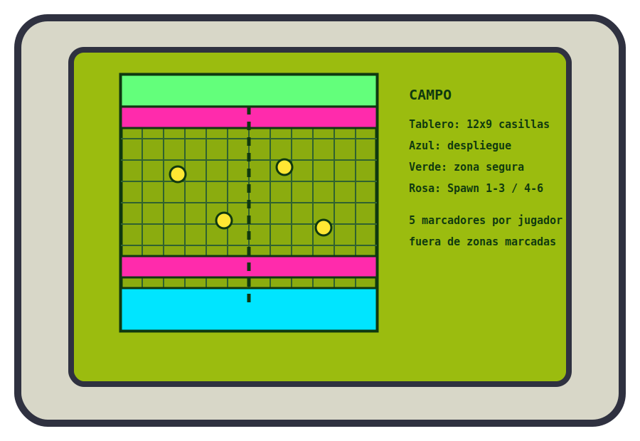
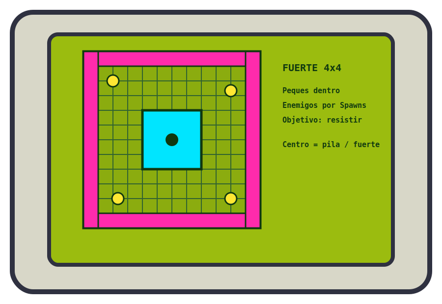

## Aventura 4 — Cinturón blanco, corazón negro

La pandilla cruza los campos de las afueras y se mete sin querer en territorio porcino. Cerditos Furtivos y Vacas Locas acechan entre la hierba.

### Objetivo y recompensa

Saca a todos tus peques por la zona segura del extremo opuesto. La primera pandilla que lo consiga obtiene 10 chapas.

### Preparación

Cada jugador coloca cinco Marcadores Furtivos fuera de las zonas de despliegue, de la zona segura y de los Spawns. Los peques comienzan en su zona de despliegue.

<figure class="gameboy-map">
  
  <figcaption><strong>Despliegue sugerido:</strong> tablero aproximado de <strong>12 × 9 casillas</strong>. La pandilla empieza en un extremo y debe cruzar hasta la zona segura; los Marcadores Furtivos no se colocan en despliegues, Spawns ni zona segura.</figcaption>
</figure>

Al comienzo de cada ronda aparece un Marcador Furtivo en un Spawn aleatorio y se mueve hacia el centro la mitad de 1D6 casillas, redondeando hacia arriba. Cuando un peque se acerca a 2 casillas, tira 1D6; con 3+, sustituye el marcador por un Cerdito Furtivo.

> **Cerdito Furtivo:** Salud 8 · Molar 8 · Armas ninja 2 · Defensa 2. Animal, Cerdo, Esbirro.

## Aventura 5 — Vuela a casa

La pandilla llega a su fuerte con toda la fauna rural pisándole los talones. Hay que atrancar puertas y ventanas y resistir ocho rondas.

### Objetivo y recompensa

Mantén en pie el fuerte durante ocho rondas. Cada enemigo derrotado concede 1 chapa.

### Preparación

Coloca en el centro un fuerte de 4 × 4 casillas con **15 de Salud**. Todos los peques empiezan dentro.

<figure class="gameboy-map">
  
  <figcaption><strong>Despliegue sugerido:</strong> el fuerte mide <strong>4 × 4 casillas</strong>, ocupa el centro y tiene <strong>15 de Salud</strong>. Usa cuatro bandas de Spawn para simular los resultados 1–3, 4–6, 7–9 y 10–12 del PDF.</figcaption>
</figure>

En cada ronda aparecen, en Spawns aleatorios, dos Cerditos Furtivos y dos Vacas Locas por pandilla. Intentan entrar en el fuerte; si quedan adyacentes y no hay un peque junto a ellos, lo atacan. En la ronda 4 aparecen también Cerdos de Artillería.

Si el fuerte llega a 0 de Salud, la pandilla pierde. Si sigue en pie al terminar la octava ronda, gana.

| Malo | Salud | Molar | Ataque | Defensa | Reglas |
|---|---:|---:|---|---:|---|
| Vaca Loca | 9 | 9 | Pezuña 2 | 1 | Animal, Vaca, Esbirro. Un peque atropellado supera una prueba de Molar o pierde su próxima activación. |
| Cerdo de Artillería | 8 | 8 | Explosión 2 | 0 | Animal, Cerdo, Esbirro. Si no tiene un peque adyacente, dispara al objetivo más cercano —fuerte o peque—. Adyacente ataca con Pezuña 1. |

## Aventura 6 — ¡Porkageddon!

La fauna no ha logrado derribar el fuerte, así que saca la artillería pesada. Pon música de jefe: ha llegado el Bacon Bomber.

### Objetivo y recompensa

Destruye el Bacon Bomber. Quien le dé el golpe final obtiene una Habilidad nueva y un apodo de Jefe.

### Preparación

Monta un campo sin cobertura. Cualquier peque puede recoger y arrojar guijarros: **Cuerpo, Arrojadiza 3 casillas, Daño 1**. Coloca dos Cerditos Furtivos por pandilla y un Cerdo de Artillería. En solitario, utiliza dos Cerditos y un Cerdo de Artillería.

### Bacon Bomber

> **Salud:** 15 · **Molar:** 12 · **Defensa:** 2  
> **Palabras clave:** Animal, Cerdo, Jefe, Volador.

Solo puede recibir ataques a distancia. Al activarlo, tira 1D4:

1. **Infierno de balas:** todos los peques superan una prueba de Cuerpo o sufren 1 Consecuencia.
2. **Pasada rasante:** se mueve la mitad de 2D6 casillas, redondeando hacia arriba, en una dirección ortogonal aleatoria.
3. **Soltar lechón:** aparece un Cerdito Furtivo en una casilla adyacente libre.
4. **Maniobra evasiva:** se mueve la mitad de 1D6 casillas, redondeando hacia arriba, en una dirección aleatoria y recupera 1D6 de Salud.

Al llegar a 0 de Salud se estrella y el cerdo piloto huye.
