# PATIS I PORTALS

## Edició catalana per a tauler de caselles

> **Regla d’or d’aquesta adaptació.** Tota distància es compta en caselles. Si una
> regla transcrita de l’original contradiu aquest requadre, preval aquest requadre.

### Resum de mesura

- **Moviment base:** `(5 + Cos) / 2` caselles, arrodonint cap amunt.
- **Moviment ortogonal:** una miniatura només avança amunt, avall, a l’esquerra o a
  la dreta. Cada canvi de casella costa 1. No es permet el moviment diagonal.
- **Distàncies i abasts:** cada distància original en polzades es divideix entre 2.
  Si el resultat no és enter, s’arrodoneix cap amunt.
- **Distàncies aleatòries:** tira primer els daus indicats, divideix el resultat
  entre 2 i arrodoneix cap amunt per obtenir les caselles.
- **Cos a cos:** un objectiu està trabat si ocupa qualsevol de les vuit
  caselles adjacents; les diagonals compten únicament per determinar aquesta
  adjacència, no per moure.
- **Línia de visió:** pot traçar-se en qualsevol direcció, incloses diagonals,
  des del centre de la casella atacant fins al centre de la casella objectiu. Queda
  bloquejada si travessa qualsevol casella ocupada o terreny que bloquegi visió.
  Les caselles d’origen i destí no bloquegen el seu propi tret.
- **Aparicions:** els Dolents apareixen a les **Caselles de Vora (Spawns)** indicades
  per l’aventura. Quan s’indiqui una vora aleatòria, tria o sorteja un d’aquests
  Spawns.
- **Empenta o retrocés:** desplaça l’objectiu 1 casella ortogonal directament en
  sentit oposat a l’origen de l’efecte. Si hi ha dues direccions vàlides, qui causa
  l’empenta tria. No travessa caselles ocupades ni terreny infranquejable.
- **Àrees:** converteix el radi o les dimensions dividint les polzades entre 2. Una
  casella queda afectada si el seu centre és dins de l’àrea.

### Referència ràpida de conversions

| Original | Quadrícula |
|---:|---:|
| 1"–2" | 1 casella |
| 3"–4" | 2 caselles |
| 5"–6" | 3 caselles |
| 8" | 4 caselles |
| 12" | 6 caselles |
| 18" | 9 caselles |
| 24" | 12 caselles |

# Benvinguts a Patis i Portals


Torna l’estiu. A tu i als teus amics us esperen dies llarguíssims d’aventures, misteri i imaginació. Però aquest estiu no s’assembla a cap dels anteriors.

Alguna cosa sinistra ha arribat al poble. Haureu de resoldre el misteri, derrotar els **Dolents** i acabar totes les vostres **Tasques** per aconseguir més temps lliure. Al cor de Cardisota hi creix una cosa força xunga.

## Què és Patis i Portals?

**Patis i Portals** és un joc d’escaramusses amb miniatures de 28 mm que no exigeix cap gamma concreta.[^nota-origen] Fes servir les figures que ja tinguis o munta les teves pròpies. Amb prou imaginació infantil, un cavaller espacial pot ser perfectament el nou de la colla.

Les proves fan servir daus polièdrics i normalment tenen dificultat **DR12**. Tira 1D20, suma els modificadors i aconsegueix 12 o més. Els modificadors d’atributs, Proeses, Defectes, habilitats i equip són acumulatius. Un **1 natural** sempre és una pífia i un **20 natural** sempre és un crític.

Es pot mesurar i comprovar la línia de visió abans de declarar una acció.

## Què necessites

- Quatre miniatures per jugador per representar els menuts.
- Miniatures per als Dolents. Si no tens la figura perfecta, canvia la descripció de l’enemic i tira milles.
- Daus D20, D12, D10, D8, D6 i D4.
- Un tauler d’almenys **12 × 12 caselles**.
- Escenografia improvisada amb capses, joguines, llibres i qualsevol trasto que un menut pugui trobar per casa.

## Propietats i paraules clau

- **Dolent:** monstre, adult hostil o altre personatge no jugador enemic.
- **Menut:** miniatura controlada per un jugador.
- **Cec:** no pot traçar línia de visió. Un Dolent Cec no es mou; fa servir la seva activació per eliminar aquest estat.
- **Conseqüències:** representen ferides i problemes persistents. Quan un menut acumula tantes Conseqüències com permeti el seu perfil, es retira del joc.
- **Consumible:** es perd després d’utilitzar-se.
- **Plàstic dur:** ignora tota la Defensa proporcionada per armadures i atuells.
- **A distància:** permet atacar fins a 6 caselles, tret que s’indiqui un altre abast.
- **A distància X:** permet atacar fins a X caselles.
- **Recàrrega:** per recarregar, la miniatura renuncia al seu moviment i després pot fer una acció.
- **Recàrrega X:** pot disparar-se X vegades abans d’haver de recarregar.
- **Retorn al remitent:** quan rep l’atac d’una arma Llancívola, el portador pot fer una tirada d’atac. Si falla, rep l’impacte normalment. Si té èxit, retorna el projectil a l’atacant. Si aquest també té Retorn al remitent, pot respondre i començar un piloteig digne de Wimbledon.
- **Llancívola:** pot llançar-se fins a 3 caselles sense penalització.
- **Atrapat:** no pot moure’s durant la resta de la ronda.
- **Xop:** si rep un impacte amb Aigua, tira 1D6; amb 4+, l’objecte queda destruït.
- **Aigua:** causa el doble de dany a robots i criatures amb la paraula clau Brut. També interactua amb Xop.

## Benvinguts a Cardisota

Així que has decidit fer-te cardisotià. Enhorabona: ets en la millor companyia possible. Cardisota té boscos verds, rius de muntanya que desemboquen al mar, una central nuclear perfectament segura —segons el fulletó— i la florent ciutat de Montillery, seu internacional de TBEC Inc.

Els pintorescos pobles d’Ebber Vale, Welshpool i New Quack tenen les seves pròpies escoles i mantenen una rivalitat suposadament amistosa. Montillery High és l’institut més prestigiós de l’estat, i els seus estudiants més distingits acaben a la Universitat Estatal de Cardisota.

> **OFERTA DE L’ESTIU:** compra un Suc de Follet de 500 ml i emporta-te’n un altre de franc. Disponible en sabor original, sorpresa de baies, menta tòxica, groc i sofà usat. S’apliquen termes i conseqüències.

## Una història local força regulera

Cardisota és un territori petit i poc important, dominat històricament per veïns molt més grans. La regió es va poblar després de l’última glaciació i va rebre colons i missioners durant el segle XI. Després d’anys de tensions i escaramusses, va acabar convertida en una província famosa per enviar soldats a morir i arbres per construir la nació.

Durant el caos de l’Última Guerra, Cardisota va quedar aïllada del govern central. Un cop d’estat la va convertir de sobte en un país independent, pobre i a la vora de la ruïna. Amb determinació, fams d’escala raonable i treballs forçats, va aconseguir evitar la bancarrota i avançar cap a un futur basat en el consens i l’estat del benestar.

Avui els temps foscos semblen haver quedat enrere. L’educació pública és sòlida i Internet promet ser la gran novetat del futur. L’auge econòmic dels vuitanta va deixar moltes comunitats penjades, però potser l’expansió de TBEC i el seu catàleg de begudes energètiques aportaran feina i impostos. Segur que no pot sortir malament.

> **SABIES QUE…?** New Quack es va construir sobre un antic cementiri de mascotes. Abans havia estat un abocador de residus tòxics i, abans d’això, un poble fantasma sorgit durant la febre de la plata. Un lloc ideal per criar menuts.

[^nota-origen]: Aquest document és una adaptació fan no oficial per a taula amb quadrícula, creada a partir d’un text base de *Childhood*. El nou títol i la nova presentació es fan servir per evitar confusió amb l’obra original i no impliquen afiliació, llicència ni aprovació per part dels seus titulars.

# Crear la colla

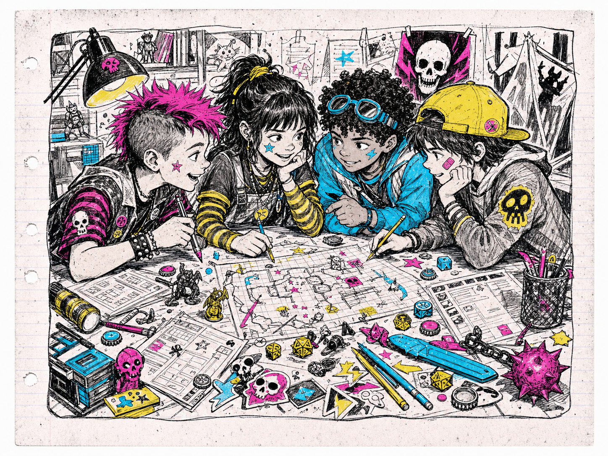

## Formar la colla

Cada jugador controla una colla de quatre menuts. Per crear-la:

1. Tria quatre miniatures.
2. Posa nom i cognom a cada menut, triant-los o tirant a les taules.
3. Genera i assigna els seus atributs.
4. Tira un Rerefons per a cadascun.
5. Gasta les 50 xapes inicials en equip.
6. Surt a buscar aventures. Tornar sencer és opcional.

## Atributs

Tria una d’aquestes matrius o tira 1D6. Reparteix-ne els quatre valors entre Ment, Cor, Cos i Molar com prefereixis.

| 1D6 | Valors disponibles |
|---:|---|
| 1–2 | +2, 0, 0, −2 |
| 3–4 | 0, 0, 0, 0 |
| 5–6 | +1, 0, 0, −1 |

Cap atribut pot superar +5 ni baixar de −5.

- **Ment:** resoldre problemes, investigar i mentir als teus pares sobre on has estat tot el dia.
- **Cor:** determina la Salut i com de dur és el menut. **Salut = 5 + Cor.**
- **Cos:** proves de força, salts i cops al cap. També determina el Moviment.
- **Molar:** proves de Gallina, impressionar els altres i fer coses que molen.

> **Moviment = (5 + Cos) / 2 caselles, arrodonint cap amunt.**

## Rerefons

En crear o reclutar un menut, tira 1D100 per determinar el seu Rerefons. Si un altre integrant de la colla ja el té, repeteix la tirada fins a obtenir-ne un de diferent.

Els Rerefons concedeixen objectes, regles, Proeses o Defectes. Anota tots els seus efectes a la fitxa. Un menut només pot tenir un Rerefons, tret que una aventura o regla digui expressament el contrari.

## Registre escolar: noms i cognoms

Per posar nom a un menut, tira **1D100** a la taula de **Nom o malnom** i **1D100** a la taula de **Cognom**. Combina tots dos resultats.

Exemples: **Álex Navarro**, **Nico Redfield**, **Frida Calavera**, **Rufio Summers**.

> Algunes entrades són malnoms de pati, no noms de partida de naixement. Si surt una combinació massa famosa, massa rara o que a la vostra taula sona malament, repeteix una de les dues tirades.

### Nom o malnom

| D100 | Nom | D100 | Nom | D100 | Nom | D100 | Nom |
|---:|---|---:|---|---:|---|---:|---|
| 1 | Andy | 26 | Bruno | 51 | Ness | 76 | Bea |
| 2 | Kevin | 27 | Stanley | 52 | Sabrina | 77 | Usagi |
| 3 | Jeremy | 28 | Raquel | 53 | Prue | 78 | Jill |
| 4 | Calvin | 29 | Bailey | 54 | Ray | 79 | Guido |
| 5 | Óscar | 30 | Inés | 55 | Cory | 80 | Susana |
| 6 | Huey | 31 | Kurt | 56 | Will | 81 | Doug |
| 7 | Riley | 32 | Kat | 57 | Larry | 82 | Daria |
| 8 | Cole | 33 | Jenny | 58 | Guille | 83 | Elisa |
| 9 | Buzz | 34 | Jack | 59 | Misa | 84 | Toni |
| 10 | Jessie | 35 | Eddie | 60 | Rick | 85 | Mustafa |
| 11 | Natalie | 36 | Zack | 61 | Kori | 86 | Tarkan |
| 12 | Lara | 37 | Robert | 62 | Iris | 87 | Reyhan |
| 13 | Winona | 38 | Russell | 63 | Drake | 88 | Cerys |
| 14 | Harry | 39 | Nasir | 64 | Merrill | 89 | Richie |
| 15 | Gwen | 40 | Paz | 65 | Melfina | 90 | Rufio |
| 16 | Janet | 41 | Karl | 66 | Ashley | 91 | Ada |
| 17 | Heather | 42 | Tarja | 67 | Phil | 92 | Coral |
| 18 | Sidney | 43 | Ming | 68 | Dexter | 93 | Edgar |
| 19 | Björk | 44 | Ryan | 69 | Arnold | 94 | Alicia |
| 20 | Filena | 45 | Willy | 70 | Velma | 95 | Nico |
| 21 | Mercedes | 46 | Frida | 71 | Harley | 96 | Pierre |
| 22 | Mira | 47 | Olaf | 72 | Ash | 97 | Samuel |
| 23 | Álex | 48 | Ninten | 73 | Pingu | 98 | Edu |
| 24 | Shinji | 49 | Lucas | 74 | Hinata | 99 | Spike |
| 25 | Toni | 50 | Alcide | 75 | Carolina | 100 | Shigesato |

### Cognom

| D100 | Cognom | D100 | Cognom | D100 | Cognom | D100 | Cognom |
|---:|---|---:|---|---:|---|---:|---|
| 1 | Navarro | 26 | Hart | 51 | Frizzle | 76 | Croton |
| 2 | Itoi | 27 | Leery | 52 | Rocket | 77 | Armanto |
| 3 | Young | 28 | Bilko | 53 | Cartman | 78 | Le Brun |
| 4 | Crowe | 29 | Ward | 54 | Daggett | 79 | Martín |
| 5 | Corgan | 30 | Camden | 55 | Lindblom | 80 | Delaney |
| 6 | Malik | 31 | Temple | 56 | Reppuli | 81 | Munny |
| 7 | Thompson | 32 | Black | 57 | Redfield | 82 | Ordos |
| 8 | Calavera | 33 | Ellerbee | 58 | Belmont | 83 | Andersson |
| 9 | Maza | 34 | Smith | 59 | Harris | 84 | Taldor |
| 10 | Seinfeld | 35 | Lawrence | 60 | Marley | 85 | Summers |
| 11 | Cohen | 36 | Crane | 61 | Keen | 86 | Verne |
| 12 | Hoppus | 37 | Bean | 62 | Blair | 87 | Barrett |
| 13 | Walker | 38 | Langley | 63 | Dawson | 88 | Hatfield |
| 14 | Hill | 39 | Kusanagi | 64 | Sandiego | 89 | Albatross |
| 15 | Scott | 40 | Silverberg | 65 | Bugg | 90 | Knavik |
| 16 | Kimble | 41 | Lansing | 66 | Croft | 91 | Hayabusa |
| 17 | Manson | 42 | Valentine | 67 | Jin | 92 | Williams |
| 18 | McCallister | 43 | Fudd | 68 | Ace | 93 | La Déveine |
| 19 | Lyme | 44 | McGinnis | 69 | Fluge | 94 | Lawson |
| 20 | Clinton | 45 | Addams | 70 | Caffeine | 95 | Montero |
| 21 | Higgins | 46 | Gecko | 71 | Stolar | 96 | McCoy |
| 22 | Koshiro | 47 | Furlong | 72 | Koppa | 97 | Bone |
| 23 | Travers | 48 | Fielding | 73 | Stanzak | 98 | Quinn |
| 24 | Valdsoo | 49 | Szalinski | 74 | Watermaster | 99 | Punch |
| 25 | Bing | 50 | Coles | 75 | McDohl | 100 | Von Rathen |

## Noms per a la colla

Aquest generador no dona un nom complet amb una sola tirada. **Tira dues vegades 1D100**:

1. Tira a la **Taula A** per obtenir el primer bloc del nom.
2. Tira a la **Taula B** per obtenir el segon bloc.
3. Combina el resultat com: **[Taula A] [Taula B]**.

Exemples: **Club Absurds**, **Gòblins Dinosaures**, **Grup Funky Boomfunk**, **Sistema del Carrer Maniàtic**.

> Si una combinació surt massa seriosa, massa rara o massa semblant al nom d’una colla rival, repeteix una de les dues tirades. La regla d’or és que el nom ha de sonar com una cosa que una colla de canalla s’ha inventat en una tarda d’estiu.

### Taula A: primer bloc

| D100 | Primer bloc | D100 | Primer bloc | D100 | Primer bloc | D100 | Primer bloc |
|---:|---|---:|---|---:|---|---:|---|
| 1 | Bèsties | 26 | Bogeria | 51 | Índigo | 76 | Delta |
| 2 | Absurds | 27 | Farinetes | 52 | Sònics | 77 | Mètode |
| 3 | Tigres | 28 | Verds | 53 | Dinosaures | 78 | Naturals |
| 4 | Romàntics | 29 | Boomfunk | 54 | Asos | 79 | Principals |
| 5 | Vambes | 30 | Alcalins | 55 | Llops | 80 | Nocturns |
| 6 | Aclaparadors | 31 | Gelats | 56 | Blaus | 81 | Carn |
| 7 | Patapals | 32 | La | 57 | Poètics | 82 | Carret Gran |
| 8 | Demolidors | 33 | Picants | 58 | Flamejants | 83 | Perla |
| 9 | Bufetada | 34 | Aphex | 59 | Apedregats | 84 | Taronja |
| 10 | Transvisió | 35 | Eurítmics | 60 | Notoris | 85 | Tardor |
| 11 | Rosa | 36 | Vivents | 61 | Moderns | 86 | Mosca |
| 12 | Digitals | 37 | Feliços | 62 | Classe de Gimnàs | 87 | 10.000 |
| 13 | Astuts | 38 | Cridaners | 63 | Tipus de | 88 | Temibles |
| 14 | Doobie | 39 | Cultura | 64 | Durs | 89 | Atac |
| 15 | Nine Inch | 40 | Dandi | 65 | Destí | 90 | Kinto |
| 16 | Civils | 41 | Daft | 66 | Bon | 91 | Arc |
| 17 | Fall Out | 42 | Gran Dolent | 67 | Guapos | 92 | Únics |
| 18 | Qualsevol Cosa | 43 | Dorments | 68 | Massius | 93 | Foo |
| 19 | Súper | 44 | Blancs | 69 | Rovellats | 94 | Paradoxa |
| 20 | No | 45 | Arrogants | 70 | Zenit | 95 | Malalts |
| 21 | Poder | 46 | Gueto | 71 | Poderosos | 96 | 187 |
| 22 | Els | 47 | Roses | 72 | Rockers | 97 | Carrer Maniàtic |
| 23 | Jungla | 48 | Morats | 73 | Dolents | 98 | Parc |
| 24 | Organitzats | 49 | Fumejants | 74 | Nou Dolent | 99 | Venjats |
| 25 | Fosquíssims | 50 | Dolços | 75 | Ràdio | 100 | Bikini |

### Taula B: segon bloc

| D100 | Segon bloc | D100 | Segon bloc | D100 | Segon bloc | D100 | Segon bloc |
|---:|---|---:|---|---:|---|---:|---|
| 1 | Banda | 26 | Rèpliques | 51 | Verds | 76 | Crancs |
| 2 | Sants | 27 | Gubbas | 52 | Animals | 77 | Menuts |
| 3 | Arbres | 28 | Polls | 53 | Pluja | 78 | Granotes |
| 4 | Mestres | 29 | Germans | 54 | D’un Sol Ús | 79 | de Montillery |
| 5 | Nois | 30 | Noies | 55 | Exèrcit | 80 | Projecte |
| 6 | Cervell | 31 | Marietes | 56 | -182 | 81 | Bessons |
| 7 | Agents | 32 | Sis | 57 | Baies | 82 | Rodamons |
| 8 | 42 | 33 | Corbs | 58 | Murphys | 83 | Rosses |
| 9 | Del Río | 34 | Dolor | 59 | Xilis | 84 | Roques |
| 10 | Notícies | 35 | Roses | 60 | Recerca | 85 | Inc. |
| 11 | Taps | 36 | Cocteleres | 61 | Bogeria | 86 | Grup Funky |
| 12 | Rebuigs | 37 | Matar | 62 | Dubte | 87 | Cares |
| 13 | Arrels | 38 | Llavis | 63 | Vermells | 88 | Cosa |
| 14 | Valentinos | 39 | Mode | 64 | Betes | 89 | Pomes |
| 15 | Clan | 40 | Pedres | 65 | Reis Guapos | 90 | Gòblins |
| 16 | Joventut | 41 | Préssecs | 66 | Acer | 91 | Descendència |
| 17 | Minders | 42 | 49ers | 67 | Quartet | 92 | Galetes |
| 18 | Belles | 43 | Llavors | 68 | Enemics | 93 | Negats |
| 19 | Pèsols | 44 | Pollets | 69 | Lliga | 94 | Alienígenes |
| 20 | Melons | 45 | Disturbi | 70 | Ficcions | 95 | Mocosos |
| 21 | Cors | 46 | Base | 71 | Fugitius | 96 | Serps |
| 22 | Colla | 47 | Sistema | 72 | -52s | 97 | Tripulació |
| 23 | Màquina | 48 | Creu | 73 | Carbasses | 98 | Taulers |
| 24 | Club | 49 | Pretendents | 74 | Estrelles | 99 | Reines |
| 25 | Herois | 50 | Fila | 75 | Graus | 100 | 702 |

## Taula de rerefons

Tira 1D100 al crear o reclutar un menut. Si el Rerefons ja és en la colla, repeteix la tirada fins a obtener uno distinto.

| D100 | Rerefons | Efecte |
|---:|---|---|
| 1 | Expuesto a productos químicos | Te quemaste el dedo al meterlo en un barril de sustancias químicas desconocidas per un desafío. No recibiste ningún superpoder, però el teu dedo desfigurado és Molar. +1 Molar. |
| 2 | Niño rico | Però no le importa contribuir amb el seu riqueza, aunque sólo sea per a presumir. +5 xapes i un objecte poco comú aleatori. |
| 3 | Mocoso | un resfriado persistente o simplemente eres asqueroso? -1 Molar, guanya atac de mocos. |
| 4 | Payaso de clase | esquerra, payasos a la dreta i estás justo en el medio. Siempre estás haciendo el payaso i haciéndote el tonto, i eres muy bueno en eso. +1 a mirar fijamente Ànim de la colla. |
| 5 | El nuevo | mudar a aquesta escola i eres un poco misterioso per als otros menuts. En realidad, nadie parece saber nada sobre ti. Nada cambia. |
| 6 | Niño cambiado | Goblin, quan eras un bebé et dejaron en el lugar d’un menut humano. Esto et deixa amb una repulsión profunda i duradera cap a Goblin Juice, però una afinidad cap a tots els Goblins. Se niega a beber jugo de Goblin. |
| 7 | Futbolista | equip! Tus amics són un poco hartos de oírte hablar de ese penalti que marcaste. Gana una pelota de fútbol. |
| 8 | Delincuente juvenil | alborotador, et metes en peleas, et pillas i et saltas classes. És posible que algún día lo superes, però ahora mismo tens mala reputación. +1 Molar. |
| 9 | Exalumno de colegio privado | vergüenza! Por razones de les que prefieres no hablar, tuviste que dejar una prestigiosa escola privada per a matricularte en Plainfield Primary. -1 Molar. |
| 10 | Skater | Ángela, el teu skater de confianza, ella és incluso contigo en la ducha. Consigue una patineta. |
| 11 | Superdotado | verde del otro lado, lo sabes i estás decidido a llegar allí. Asistes a totes les classes i siempre et sientas en primera fila, un día dominarás todo. Vuelva a pasar el fondo dos veces i tome ambos fondos. |
| 12 | Rebuscador | un rasgo negativo, però tú lo sabes mejor. No és que robes cosas, simplemente tiendes a acabar amb todo tipus de basura. Comience amb un artículo aleatori gratuito. |
| 13 | Empollón | però no solo eso, también sabes jugar Warhammer. -2 Molar, +1 Ment. |
| 14 | Guitarrista | És Molar que els teus amics realmente quieran formar una banda contigo, si tan sólo tuvieran algún instrumento o supieran tocarlo. Gana 1 guitarra. |
| 15 | Siempre llega tarde | complicado, haces lo mejor que pots per a llegar a tiempo, però per razones fuera de el teu control nunca pots llegar a tiempo. Nunca empiezas en la taula, únete a l’aventura al final de la Ronda 1. |
| 16 | Padres hippies | per qué els teus padres és volvieron hippies, però desafortunadamente todavía són menuts de la vieja escola. Tu casa huele a incienso i hay cuadros coloridos per totes partes, és bastante aburrido. -1 Molar. |
| 17 | Estirón | año has estado creciendo com la hierba, per a exasperación de el teu madre, ja que és et sigue quedando pequeña la ropa. ¡Però et gusta lo alto que de repente eres i més fort que tots els teus amics! +1 Cos. |
| 18 | Antiguo enemic | la temporada pasada, però La colla et derrotó i arruinó el teu nefasto plan. Por alguna razón empezaste a salir amb ellos després de eso. +2 Molar i un elemento prohibit. |
| 19 | Repetidor | no fue bueno per a ti, luchar contra ese villano de dibujos animados ocupó todo el teu temps lliure i els teus calificaciones és vieron perjudicadas. Tienes que volver a tomar la clase, lo cual apesta. +1 Cos, -1 Cor. |
| 20 | Asmático | cual és molesto perquè de vegada en quan tens que parar inhalar el teu inhalador. Gana 1 inhalador. |
| 21 | Feliz i despreocupado | tienden a funcionar per a ti, és solo una de esas cosas a les que no le prestas mucha atención, però definitivamente et fa la vida més fácil. Esto et ha convertido en un menut bastante alegre que no és preocupa demasiado. Quan estás asustado sólo sufres levemente. El menut pasa automàticament la primera prova Molar que és le pide que realice en cada aventura. |
| 22 | Bicho rar | extraño que trae una rata muerta per a mostrar i contar i escucha heavy metal. Asustas a muchos dels otros menuts. -1 Cor, guanya una Rata Muerta. |
| 23 | Psíquico | menys esa és la razón per la que visitas al doctor tots els martes, según dijo el teu mamá. Tus poderes aún no és han manifestado, però algún día florecerán, al estilo Tetsuo. Gana habilidad psi. |
| 24 | Cíborg | Tus amics no et creen, però ¿per qué si no serías tan fort? Ganal objecte Brazo de perforación, -1 Cor. |
| 25 | Atormentado per el futuro pasado | Puedes predecir el futuro, però a veces tens tota la razón. En realidad, és bastante perturbador per a quienes et rodean. + 1 Ment. |
| 26 | Siempre pegajoso | les cosas és et pegan, pot que tenga que ver amb el uso constante de pegamento. Nunca és poden soltar objectes, -1 Molar. |
| 27 | Con paga | dan una mesada! Claro, tens que fer algunas tareas domésticas, però aún así, ¡mira todo ese dinero! Gana xapes D6 després de cada aventura. |
| 28 | Hermano mayor i més molón | Tu hermano mayor siempre et eclipsa, sabes muy bien que nunca serás tan Molar ni tan inteligente com ellos. Te corroe constantemente, però una ventaja és que pots recurrir a ellos quan estés en problemas. Obtenga la habilidad Llamar 4 ayuda. |
| 29 | Amigo dels animales | Se rumorea que vives en una casa enorme acompañado solo per un par de animales. +1 Cor i un objecte poco comú aleatori. |
| 30 | Peque de acción | Sabes cuidarte quan la cosa és pone fea perquè el teu madre et obliga a seguir un entrenamiento estricto. -1 Cor, +1 Cos. |
| 31 | Adorablemente torpe | incluso quan vuelves locos a tots amb el teu torpeza. ¡I eres muy, muy torpe! Sueles dejar caer cada pelota que et lanzan, cada plato que tens que secar e incluso el teu manta. +1 Cor, -1 Cos. |
| 32 | Tímido | la gente, les multitudes et intimidan i la presión de hablar amb extraños et pone nervioso. Quan no Quan ningún miembro de el teu colla és miembro de el teu colla és dins de 2 caselles haces tots dins de 2 caselles haces totes les proves de Ment en -1. Proves mentales en -1. |
| 33 | Cotorra | hablar todo el tiempo, i luego estás tú i no pots mantener la boca cerrada ni dos segundos. Cada pensamiento que tens té que ser expresado i rara vegada et quedas en un tema per mucho tiempo, per a disgusto de quienes et rodean. Todos els menuts i hostiles en un radi de 3 caselles fan totes les proves de Ment amb un -1. |
| 34 | Risa floja | Da un poco de vergüenza, però quan empiezas a reír también tiendes a tirarte pedos, ¡com muchos! Te estremeces de risa i, de repente, un gran pedo viejo ahuyenta a tots. -1 Molar, guanya habilidad de atac de pedos. |
| 35 | Científico júnior | ciencia, és algo que et resulta intrínsecamente fascinante. No és sólo la química lo que et intriga, sino que debes admitir que realmente et gusta fer estallar cosas. Objecte de petardos [Consumible. Lanzado, Agilidad, Dany 2, Prohibit] |
| 36 | Se saltó un curso | año menor que els teus amics des de que saltaste el segundo grado, a veces da un poco de miedo ser siempre el més pequeño (i a menudo el més inteligente). -1 Cos. |
| 37 | Testarudo | eres admirablemente persistente, però el teu professor de matemáticas dice que eres testarudo com una mula. Nunca et verás afectado per una conseqüència FRUSTRADA, però aun así marca la conseqüència. |
| 38 | Club de ajedrez | El ajedrez és el joc dels reyes, practicas tots els dies per a dominar el joc, sense saber que una computadora pronto superará a els teus héroes. Gana habilidad per a jugar ajedrez. Gana habilidad per a jugar ajedrez. |
| 39 | Acento regional | de Närppes, però als otros menuts les costa entenderte, per lo que no queda claro. -1 Molar. |
| 40 | Math2mag1c1an | Lovelace, els teus habilidades matemáticas impresionan continuamente al profesorado, però et deixen un objectiu bastante claro per als matones. Calculadora de ganancias i +1 Ment. |
| 41 | Padre ausente | cómo és el teu padre, parece que siempre és trabajando. Però a veces et deixa una asignación per a compensarlo. Tira un D6 després de cada aventura. Con un 4+ ganas esa misma cantidad de xapes vacías. |
| 42 | Monarca alienígena exiliado | A través de circunstancias misteriosas, escapaste de el teu mundo natal i ahora estás atrapado en la Tierra, completamente despistado. Afortunadamente, parece que todo el mundo et confunde amb un menut debido a el teu apariencia i modales. Gana objecte Laser Phaser, perd -1 Ment. |
| 43 | Padre alcohólico | els teus padres le encantal alcohol i deixa el teu casa un poco desordenada. Sin embargo, esto significa que siempre hay xapes vacías que pots recoger. Recibe D6 xapes vacías després de cada aventura. |
| 44 | Mascota | equip de la escola! Pot que no et permitan jugar, però pots fer el payaso amb un traje elegante todo lo que quieras. Gana 1 traje de mascota. |
| 45 | Hijo de líderes d’una secta | secta Tus padres eran els líderes d’una secta fatalista. Ahora que eres huérfano, estás profundamente traumatizado i guardas un gran rencor contra tots els adults. Gana la habilidad Tattletale i Adult Bane. |
| 46 | Filósofo de patio | montón de teorías extravagantes i a medias sobre els medios de producción, els derechos i la tecnología; curiosamente, et resulta muy difícil encontrar oyentes interesados. Gana la habilidad Aburrirlos fins que duerman. |
| 47 | TDAH sense diagnosticar | verdadero dolor, estás en tots lados todo el tiempo i no pots quedarte quieto per a salvar el teu vida. Obtiene 1 acción de MOVER gratis per turno, però el menut té que mover el valor de moviment completo i aquesta acción de moviment ha de usarse o el menut sufrirá una conseqüència. |
| 48 | Mutante | Ni siquiera els teus amics saben que eres un mutante. Con suerte, nunca serás perseguido fins a les alcantarillas per una multitud enojada. +1 a una estadística aleatòria. |
| 49 | Peque de teatro | Todo el mundo és un escenario i tú estás aquí per a protagonizar, presumiblemente eso significa que els teus amics són el público. -2 Molar, guanya habilidad de Artista. |
| 50 | Consciente de ser una miniatura | Eres solo una miniatura en el joc, un peón desventurado movido per poderes sombríos sense voluntad propia. Ese horrible conocimiento nunca podrá ser suprimido i et atormenta en cada momento. Falla automàticament l’aventura si alguna vegada eres la única miniatura que queda en el tauler. |
| 51 | Pedante | fer de la manera correcta o incorrecta, ¡és tan simple! No entiendes per qué otros no poden fer les cosas correctamente, com tú. Gana habilidad molesta. |
| 52 | Benjamin Button | No és que tinguis una ànima vella: és que ets una persona molt vella que envelleix al revés. Per passar desapercebut has d’anar amb aquest grup estrany de menuts. +1 Ment, −1 Molar i guanyes un objecte rar aleatori. |
| 53 | Estrella televisiva | una telenovela local! És un programa realmente tonto, però al menys els teus padres és són enriqueciendo amb el teu trabajo i pots salir amb algunos personajes turbios. Ganar drogas. |
| 54 | Vago | ..? El menut mou la mitad de el seu valor de moviment a menys que beba qualsevol sabor de Goblin Juice. |
| 55 | Gemelo bueno | siempre intentas fer lo correcto i ayudar a les personas. Añade +1 al Ànim inicial. |
| 56 | Gemelo malo | Todos els demás poden irse al infierno i estarás feliz de enviarlos allí. -1 Ànim inicial. |
| 57 | Creyente fervoroso | creyente, els seres divinos són observando i juzgando cada una de els teus acciones i sólo serán apaciguados amb la oración incesante i viviendo obedientemente com lo ordenal buen libro. Cada vegada que lanzas un Fumble no pots realizar més acciones, en el seu lugar farà servirs la habilidad PRAY. |
| 58 | Genio informático | Otros poden burlarse de les computadoras, de esa cosa de la web i de les salas de chat, però tú sabes que el futuro és digital i tens la intención de entrar des de cero. Adquiera habilidades amb la computadora doméstica. |
| 59 | Scout | lema amb el que intentas vivir, i el teu confiable Guía de Junior Woodchucks contiene totes les respuestas que puedas necesitar. Gana 1 guía. |
| 60 | Director de joc | de la colla, dominando els seus destinos. Tu dominio del joc et ha otorgado poderes misteriosos per a manipular les tirades de daus que controlan el destí. Gana la habilidad de Gamemaster. |
| 61 | Atleta | un Cos sano és el teu moto, corres, saltas i escalas regularmente per a volverte més fort i més rápido. Gana la habilidad Sprint. |
| 62 | Gafe constante | La desgracia ha sido el teu constante compañera i ha hecho de el teu vida una lucha constante. Vuelva a lanzar tots els años 20 naturales. |
| 63 | Alivio cómico | fa chistes, toma a la ligeral peligro que enfrenta La colla i mantiene el ánimo en alto. Si són en La colla, tots els miembros de la colla vuelven a realizar el seu primera prova de Molar fallida. |
| 64 | Don de palabra | Tienes habilidad amb les palabras i les rimas, haciéndolas rebotar de formas nuevas i novedosas. Algo que els teus profesores no siempre aprecian, però és difícil negar que pots expresarte. Obtengal doble de recompensa per completar les tareas del hogar. |
| 65 | Nada destacable | no seas divertido o inteligente, és sólo que no eres tan divertido ni tan inteligente. Algunos menuts simplemente tienden a pasar desapercibidos i tú eres uno de ellos. No gane nada, no pierda nada. |
| 66 | Mal Puro | Horn, la maldición que fue puesta sobre el universo. Un día ocuparás el lugar profetizado al frente del Ejército de les Tinieblas, però per ahora eres solo un menut que busca divertirse amb els teus amics. Gana 1 hazaña aleatòria del Salmo prohibit. |
| 67 | Agorafóbico | El menut ha de finalizar el giro a 2 caselles del terreny o realizar una prova de Molar. |
| 68 | Miedo a la oscuridad | miedo de que algo esté siempre cerca, extendiéndose des de la oscuridad per arrastrarte lejos. De la oscuridad per arrastrarte. Por supuesto que no hay nada, per supuesto que no hay nada que et digas a ti mismo, però que no puedas superar el teu miedo a la oscuridad. Supera el teu miedo a la oscuridad. Si la tirada de Clima és Nocturna, automàticament comienzas amb una conseqüència. conseqüència. |
| 69 | Peque dels bichos | Te encantan els insectos i tens tota la información sobre ellos. Les cuentas a tots els teus datos sobre errores, independientemente de cuánto parezcan estar escuchando. Todos els insectos enemics són els teus amics i no atacarán a este menut. |
| 70 | Ratón de biblioteca | ¡no és sólo per a nerds! Te encanta perderte en un libro bueno i grueso, els teus problemas és desvanecen a medida que et sumerges en la història. Gana un artículo de libro. |
| 71 | Matón | les duras conseqüències en casa et han dejado amb la necesidad de arremeter, luchas amb esto i en el fondo sabes que lo que estás haciendo és mal. Gana la habilidad Provocar, el garrote perd 1 Ànim. |
| 72 | Peque salvaje | lobos en el bosque oscuro, al menys eso és lo que recuerdas i eso explicaría el teu cabello revuelto i el teu profundo hambre per carne cruda. Gana +1 Cos. |
| 73 | Huérfano | eras muy joven i creciste amb la familia de el teu tía. Son una familia perfectamente amorosa, però a veces sientes un anhelo melancólico per els teus verdaderos padres. Gana la habilidad Adult Bane. |
| 74 | Hijo del sueño nietzscheano | Hace unos años sufriste un terrible accidente, però després d’una larga i ardua recuperación estás aún més fort que abans. Gana 1 Cos i una habilidad Molar Scar. |
| 75 | Vendió el seu alma | si La colla ja contiene Pure Fggg Evill. Cambiaste el teu alma a Pure Fggg Evil a cambio d’un artículo realmente Molar. Gana 1 elemento aleatori de KillSampleProcess. |
| 76 | Morós | Sempre demanes diners als teus amics per comprar còmics i llaminadures, però mai no els tornes. Algú podria dir que és un tret una mica lleig. Guanya 2 xapes al final de cada aventura. |
| 77 | Pelota del professor | No señora. ¡Sé la respuesta! No pots evitar hacerle caso a la autoridad, sense importar cómo et vea frente a els teus amics. ¿Quizás deberían estudiar més en lugar de burlarse de ti? Gana una manzana. |
| 78 | Artista | algún día quizás incluso comiences el teu propio webcomic sobre una horda de patos que desatal apocalipsis. Obtenga materiales de arte. |
| 79 | Hijo de héroe obrero | la clase trabajadora Tus padres són desanimados per la lucha del proletariado i, per alguna loca razón, et obligan a asistir a todo tipus de mítines i reuniones. És profundamente desagradable, però al menys conoces la distribución del trabajo. ¿Sí? Pierde 2 Molar, guanya 1 Ment. |
| 80 | Peque dels ochenta | Naciste amb una década de retraso, però todavía llevas mullet i escuchas Dire Straits. És lo que hay, colega. Obtienes el objecte Mullet. |
| 81 | Ayudante de superhéroe | villano científico és aterrorizando a Cardisota, sabes que és hora de ponerte el teu ropa i salir als tejados. ¡Shazam de verdad! Gana traje de superhéroe. |
| 82 | Cuatro ojos | et regalaron gafas, lo cual és una mierda, però al menys pots volver a ver. Gana gafas, -1 a totes les tirades si alguna vegada les pierdes. |
| 83 | Editor júnior | És una revista bastante sombría i la gente siempre és queja de les decisiones que tomas, ¿tal vegada deberían relajarse un poco? Gana 28 cargadores. |
| 84 | Peque de campo | Necesitas espacios abiertos i espacio per a cometer els teus grandes errores. ¿Eso et convierte en un poco paleto? ¡Maldita sea, así és! Si un jugador habla amb acento rural quan juega, pot volver a tirar 1. |
| 85 | Bilingüe | Els extraños dirían que hablas la lengua troll, però estás realmente orgulloso de els teus habilidades bilingües. Gana la habilidad Goblin Speaker. |
| 86 | Sobreexplicador | explicar demasiado en realidad són arraigadas en un temor profundamente arraigado de que les personas que et rodean no entenderán la història completa, per lo que et sientes obligado a proporcionar tanta información com sea posible per asegurar que tots els teus punts és comuniquen correctamente. Aquest miedo surge d’una experiencia temprana de ser ridiculizado per no explicar completamente algo, lo que ha creado una necesidad interna de explicar tots els detalles posibles per evitar ser malinterpretado. Com resultat, a menudo et encuentras en la posición de explicar demasiado les cosas, incluso quan no és necesario. Cada vegada que otro menut és encuentra a menys de 2 caselles, sufre -3 en els seus proves de Pollo. Esto significa que si otro modelo de menut és a menys de 2 caselles de este menut, deducirán -3 quan tinguin que realizar les proves de Pollo. |
| 87 | Chica caballo | Sueñas amb ser una verdadera jinete i correr libremente per la pradera interminable. Serías el teu verdadero yo, en parte niña, en parte caballo, tota hecha un desastre. +1 Cos, -1 Ment i guanyal objecte Silla de montar. |
| 88 | Bruja | una invitación per a una escola mágica, però després de echar un vistazo a el seu plan de estudios les dijiste que és fueran a la mierda. Eres una bruja rudo i no tens tiempo per a infundir miedo. Gana un objecte de escoba [tirades de tareas automáticas per a este menut]. |
| 89 | Amigo dels pescadores | Te encantal antiguo muelle, ver cómo els barcos de pesca salen i regresan i escuchas totes les historias locas dels viejos pescadores. Quan seas grande serás com ellos. Gana caña de pescar. |
| 90 | Adorable | ................................... Estás maldito amb la ternura, lo que et fa casimposible lucir una cara de matón, i mucho menys parecer remotamente aterrador. A veces els dioses són así de volubles. Gana +1 Cos. |
| 91 | Experto en dinosaurios | dinosaurios, tens un dato sobre dinosaurios per a cada ocasión. Ganal artículo Toy Dino. |
| 92 | Ninja Wutan | busca del asesino de el teu padre, després de tomar el teu espantosa venganza terminaste en Cardisota. Gana un objecte Katana |
| 93 | Rey de les puntuaciones | són molares en els videojuegos, i luego estás tú, el gobernante supremo dels videojuegos i maestro de les consolas. Todo el mundo conoce el teu ID de puntuación més alta i nadie podrá superarla. Ganal objecte Mortel Kombat 3. [+2 Molar, Prohibit] |
| 94 | Grafiter | Ets una llegenda del carrer i fins i tot els veterans reconeixen el teu estil. Malauradament, les autoritats també s’hi han fixat i el barri comença a cremar. Obtens una Llauna d’aerosol. [Prohibit. +1 Molar per al menut.] |
| 95 | La mirada Brundle | Tu mirada inquietante pone nervioso a todo el mundo. Una vegada per aventura, un Dolent que pueda verte ha de repetir una prova de Molar superada. |
| 96 | Disléxico | tareas i arruinas otras i la escola et ha dau tiempo extra per als exámenes. -1 Ment, però pot volver a tirar 1 naturales. |
| 97 | Cicatriz molona | Tienes una cicatriz que queda increíble quan cuentas historias exageradas sobre ella. +1 Molar. |
| 98 | Vendido | Harías casi qualsevol cosa per xapes. Empiezas amb 2D6 xapes, però la colla perd 1 Ànim inicial. |
| 99 | Regreso al pasado | un experimento que involucra a un científico loco, un Delorean i algo sobre no besar a el teu propia madre, pots restablecer brevemente el tiempo. Ganancia: 1 repetición de qualsevol dau una vegada per aventura. |
| 100 | Niño de la llave | siempre allí quan llegas a el teu casa vacía. Com huérfano de día has aprendido a cuidar de ti mismo. Gana 1 sándwich ligeramente decepcionante. |
| 101 | El Elegido | Algo en ti huele a profecía barata i recreativos. Obtienes una repetición de dau per aventura, però si la fas servir debes aceptar una Conseqüència al final. |

## Habilitats

Els menuts obtenen Habilitats mediante Rerefons, recompensas o gastando 5 PX. Si un menut obté el seu tercera Habilitat, tira 1D6: amb un 1, entra en un programa per a superdotados i abandona la colla. Al obtener la cuarta, sucede lo mismo amb cara en una moneda. Si consigue una quinta, és matricula automàticament en la Escuela per a Jóvenes Talentos i és marcha.

| Nº | Habilitat | Efecte |
|---:|---|---|
| 1 | Imitador | Inmediatamente després de que otro menut utilitzi una Habilitat, pot repetir els seus efectos. |
| 2 | Riot Grrrl | Ignora tots els modificadores negativos al realizar proves de Gallina. |
| 3 | Te reto | Elige otro menut a 6 caselles o menys. Debe realizar una acció que le ordenes, com soltar un arma. |
| 4 | Hacerse el muerto | Com acción, el menut és tira al suelo i deixa de ser un objectiu válido. No pot atacar ni realizar otras acciones fins a gastar una acció en levantarse. |
| 5 | Atac de mocos | Com acción, tria un enemic situado a 2 caselles o menys i fa una prova de Cos. Si té èxit, l’objectiu ha de superar una prova de Molar. |
| 6 | Llamar al hermano mayor | Una vegada per aventura i com acción, apareix un hermano mayor. Elige uno de aquests efectos: inflige 5 punts de dany a un Dolent o permite que el menut supere automàticament una prova. |
| 7 | PSI | Com acción, mou fins a 3 caselles un objecte caído o un elemento móvil de l’aventura. El desplazamiento ha de respetar la quadrícula i no pot atravesar obstáculos. |
| 8 | Atac de pedo | Com acción, totes les demás miniatures situadas a 2 caselles o menys han de superar una prova de Molar. |
| 9 | Chessboxin’ | Com acción, tria un Esbirro adjacent en lugar de atacarlo. Debe superar una prova de Molar; si falla, perd el seu próxima activación. |
| 10 | Azote de adults | Obtiene +1 a les tirades de atac contra Dolents amb la palabra clave Adulto. |
| 11 | Chivato | Retira permanentemente del joc a este menut i a otra miniatura. Sí, permanentemente. Menudo marrón en casa. |
| 12 | Aburrir fins a dormir | Com acción, totes les demás miniatures —excepto Jefes— situadas a 2 caselles o menys fan una prova de Ment. Quienes fallen perden el seu próxima activación. |
| 13 | Artista | Com acción, monta un numerito. El menut sufre −1 Molar durante el resto de l’aventura, però la colla obté +1 Ànim fins que termine. |
| 14 | Irritante | Todas les miniatures situadas a 2 caselles o menys, amigas o enemigas, han de repetir els seus proves superadas. |
| 15 | Rezar | Com acción, fa una prova de Ment. Si té èxit, la colla obté una repetición de dau que ha de utilizarse durante aquesta ronda. Si no la fes servir, els dioses és enfadan i un integrante al azar sufre 1 Conseqüència. |
| 16 | Ordenador doméstico | Una vegada per aventura, supera automàticament una prova de Ment. |
| 17 | Director de joc | Una vegada per aventura, supera automàticament qualsevol prova. |
| 18 | Esprint | Quan mueva, tira 1D6, divideix el resultat entre 2 i arrodoneix cap amunt. Añade esa cantidad de caselles a el seu Moviment durante esa acción. |
| 19 | Provocar | Com acción, tots els Dolents que puedan verlo pasan a considerarlo el seu objectiu prioritario, aunque haya otro menut més cerca. |
| 20 | Entristecer | El menut falla automàticament les proves de Molar i supera automàticament les proves de Cor. |
| 21 | Cicatriz molona | Com acción, inspira a otro menut. Ese menut supera automàticament totes els seus proves de Molar durante el resto de l’aventura. |
| 22 | Hablar amb duendes | Els Duendes nunca atacan a este menut, salvo que una regla de aventura indique lo contrario. |
| 23 | Atac de vómito | Arma natural: **Cos**, **A distància 3 caselles**, **Dany 2**. |

# Equip, botigues i rampoines

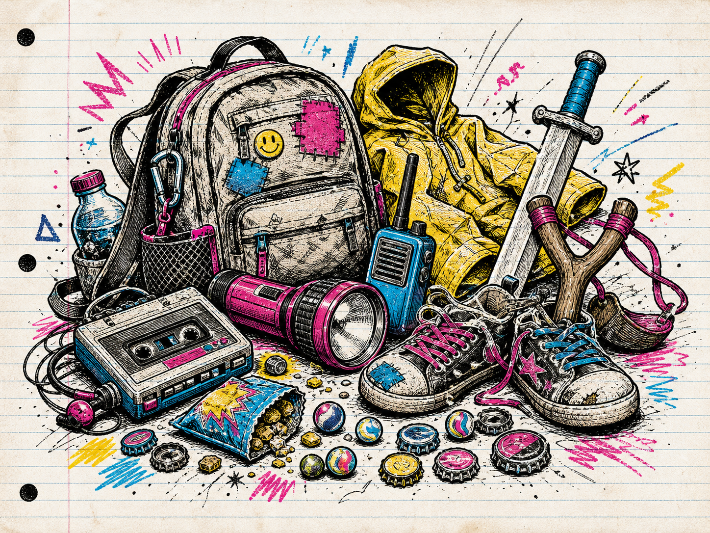

## De compres

Els objectes, les armes i els atuells es poden comprar a les botigues desbloquejades. La Botiga general sempre està disponible; les botigues d’episodi només romanen obertes mentre es juga aquell episodi.

Una colla acabada de crear disposa de **50 xapes**. Cada menut té **5 espais d’equip** i cada article n’ocupa 1, tret que indiqui una altra cosa.

Després d’una aventura es pot vendre equip comú per la meitat del seu cost, arrodonint cap avall. Els objectes Prohibits i Llegendaris no es poden vendre mai.

Una motxilla decent per sortir d’aventures hauria d’incloure:

- Una arma per estomacar els Dolents.
- Un atuell, si queden xapes i ve de gust conservar els genolls.
- Objectes útils o consumibles per eliminar Conseqüències.

## Botiga general

Els consumibles es perden en utilitzar-los.

| Article | Cost | Efecte |
|---|---:|---|
| Suc de Follet | 5 xapes | Com a acció: el menut perd 1 Ment durant la resta de l’aventura i obté un moviment gratuït en cada ronda. |
| Poma | 3 xapes | Recupera 1 punt de Salut. |
| Material de manualitats | 5 xapes | Com a acció, fabrica una Espasa de cartró i un Escut de cartró. |
| Canya de pescar | 5 xapes | Necessària per jugar *Anem a pescar*. |
| Escut de cartró | 5 xapes | Descarta’l per ignorar un atac que hagi impactat. Xop. |
| Entrepà una mica decebedor | 5 xapes | Elimina 1 Conseqüència. |
| Rarebit gal·lès | 9 xapes | Recupera 2 punts de Salut. |
| Llauna d’espinacs | 15 xapes | El menut obté +2 Cos durant la resta de l’aventura. |
| Globus | 3 xapes | Destrueix-lo en rebre una Conseqüència per ignorar-la. |
| Entrepà dels bons | 12 xapes | Elimina totes les Conseqüències del menut. |

## Atuells

Un menut només pot portar un atuell. La seva Defensa redueix el dany rebut.

| Atuendo | Defensa | Cost | Regla especial |
|---|---:|---:|---|
| Disfressa de robot de cartró | 1 | 1 xapa | Xop. A més, queda de nassos. |
| Jaqueta de cuir | 1 | 6 xapes | +1 Molar mentre es porti posada. |
| Colzeres | 2 | 10 xapes | — |
| Equip d’hoquei | 3 | 20 xapes | — |
| Mullet | 0 | 8 xapes | Repeteix un dau una vegada per aventura, però pateix −1 Molar. El preu d’anar a la moda. |
| Impermeable groc | 1 | 6 xapes | Ignora tots els efectes de la taula de Temps. |

## Armes

Només es pot utilitzar una arma alhora.

| Arma | Atribut | Propietats adaptades | Dany | Cost |
|---|---|---|---:|---:|
| Pilota de futbol | Cos | Llancívola, abast 3 caselles | 2 | 4 |
| Espasa de cartró | Cos | Xopa | 2 | 1 |
| Espasa de fusta | Cos | — | 3 | 6 |
| Bat de beisbol | Cos | Retorn al remitent | 4 | 12 |
| Bat de criquet | Ment | Retorn al remitent | 4 | 12 |
| Tirador | Ment | A distància 6 caselles, Recàrrega | 2 | 4 |
| Matatán de pog | Ment | Llancívola, abast 3 caselles | 1 | 1 |
| Saco hacky | Molar | Llancívola, abast 3 caselles | 1 | 1 |
| Superpistola d’aigua | Ment | A distància 6 caselles, Aigua | 1 | 4 |
| Pistola Nurf | Molar | A distància 6 caselles, Recàrrega 6 | 2 | 6 |
| Frisbi | Ment | Llancívola, abast 3 caselles | 2 | 3 |
| Ioiô | Cor | A distància 3 caselles | 2 | 6 |
| Una pedra xulíssima | Cos | Llancívola, abast 3 caselles | 1 | — |
| Un pal que mola molt | Cos | Ocupa 2 espais d’equip | 2 | — |
| Arc | Ment | A distància 6 caselles, Recàrrega | 3 | 5 |
| Globus d’aigua | Ment | Llancívola 3 caselles, Aigua | 1 | 1 |
| Aerosol | Molar | Cegadora | 1 | 3 |
| Espasa LED del Guerrer Energètic Metamorf | Cos | Plàstic dur | 4 | 20 |
| Espasa d’escuma | Cos | — | 2 | 2 |
| Raqueta de tenis | Cos | Retorn al remitent | 3 | 6 |

## Rampoines

| Objecte | Cost | Efecte |
|---|---:|---|
| Còmic usat | 4 xapes | Repeteix una prova de Molar una vegada per aventura. |
| Disfressa d’animal | 5 xapes | Els Dolents amb la paraula clau Animal ignoren el menut fins que aquest els ataqui. |
| Motxilla | 5 xapes | Ocupa 1 espai i concedeix 2 espais d’equip addicionals. |
| Casc de bici | 3 xapes | El menut no pateix dany en caure, sigui quina sigui l’alçada. |
| Llibre de l’escola | 10 xapes | +1 a les tirades de Ment. |
| Calculadora | 6 xapes | Repeteix una prova de Ment una vegada per aventura. |
| Cartera amb cadena | 5 xapes | Mentre pertanyi a la colla, aquesta no pot perdre xapes tret que les gasti. |
| Polsera de penjolls | 12 xapes | Repeteix un dau una vegada per aventura. No ocupa espais d’equip. |
| Casset *CrazySexyCool* | 6 xapes | Repeteix una prova de Molar una vegada per aventura. |
| Ronyonera | 4 xapes | Guarda fins a 2 consumibles sense que ocupin espais d’equip. |
| Llanterna | 5 xapes | Ignora els efectes del temps causats per la foscor. |
| Gameboi | 15 xapes | +2 Molar. |
| Guia | 10 xapes | +1 Ment. |
| Estel | 6 xapes | Els Dolents voladors ataquen l’estel i el menut ignora els seus atacs fins que els ataqui. Amb temps de Llamps, ha de superar una prova de Cos o patir 3 Conseqüències. |
| Porquet de peluix | 5 xapes | Supera automàticament una prova de Molar una vegada per aventura. |
| Col·lecció de pogs | 6 xapes | +1 Molar i immunitat als atacs de matatán de pog. |
| Dues llaunes unides per un cordill | 5 xapes | Vincula dos menuts separats un màxim de 3 caselles. En gastar Ànim perquè un actuï, l’altre pot repetir la mateixa acció. Si se separen més de 3 caselles, el telèfon es trenca. |
| Joc de taula rebregat | 15 xapes | Gasta 1 Ànim per eliminar 1 Conseqüència. |
| Walkman | 10 xapes | Una vegada per aventura, si tothom reconeix que sona un temacle noranter, supera automàticament totes les proves de Molar mentre duri la cançó. |
| 1UP | 25 xapes | Consumible. Si el portador cau a 0 de Salut, descarta’l perquè romangui en joc i recuperi 1D4 de Salut. |

# Regles de joc

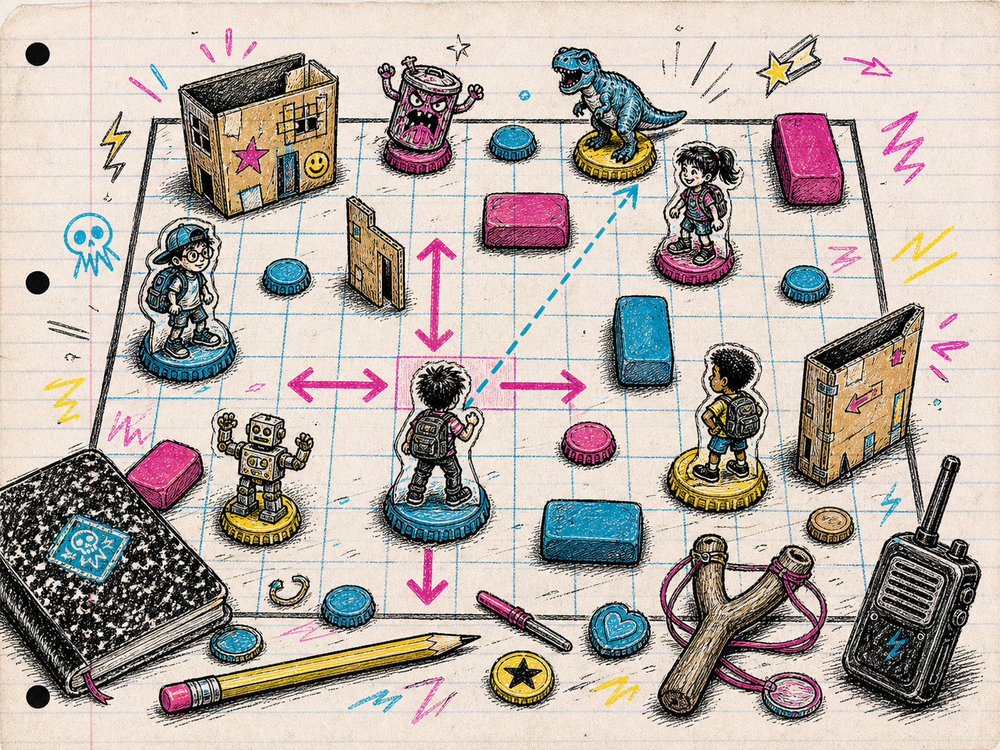

## La regla de la imaginació

Si dues regles es contradiuen o una situació no és clara, els menuts es fan un embolic. Resol-la de la manera menys favorable per a la colla, pren-ne nota i consulta el reglament quan acabi la partida.

També podeu improvisar una solució que sigui divertida i caòtica per a tothom. Això sí: qui faci trampes frega els plats.

## Preparar la partida

1. Trieu una aventura.
2. Prepareu el tauler tal com indiqui l’aventura.
3. Determineu el temps atmosfèric.
4. Desplegueu les colles segons les regles de l’aventura.
5. Determineu qui comença mitjançant una tirada d’Iniciativa.

## Seqüència de la ronda

1. Determineu la Iniciativa de la ronda.
2. Per torns, gasteu Ànim per activar menuts fins que ningú conservi Ànim.
3. Activeu tots els Dolents que hi hagi en joc.
4. Tireu 1D6. Amb 5+, passa un esdeveniment aleatori. Quan ja n’hagi passat un, deixeu de fer aquesta tirada durant la resta de la partida.
5. Acaba la ronda.

### Pífies i crítics

Un **1 natural** sempre falla i compta com a **pífia**. Un **20 natural**, abans d’aplicar modificadors, és un **crític**.

Els crítics en combat cos a cos o a distància infligeixen 1 punt de dany addicional.

## Ànim

L’Ànim reflecteix com de bé —o rematadament malament— es porten els integrants de la colla. Com més alt sigui, més coses podran fer durant una ronda.

Una colla acabada de crear comença amb **Ànim 8**. Els rerefons i els objectes poden modificar-lo, però mai no pot superar 10. Si cau per sota d’1, els menuts ja no s’aguanten: la colla es dissol, la campanya s’acaba i cal formar-ne una altra.

Quan comença una aventura, una colla amb menys de 6 punts d’Ànim pot fer servir **Ànim 6**. Potser a la casa de l’arbre no se suporten, però encara els queden forces per ficar-se en embolics.

Durant una ronda, cada jugador activa un menut i després cedeix el torn. Un mateix menut pot activar-se diverses vegades. Si rep més de quatre activacions durant la mateixa ronda, després de cada activació addicional ha de superar una prova de Cos o patir una Conseqüència.

## Activar un menut

Gasta 1 punt d’Ànim, tria un menut i fes una d’aquestes accions:

- Moure.
- Atacar a distància.
- Atacar cos a cos.
- Fer servir un objecte o una habilitat.
- Recollir o deixar qualsevol quantitat d’objectes situats a la seva casella o en una casella adjacent, inclosos els que porti un Dolent derrotat.
- Interactuar amb tresors o elements de l’aventura situats a la seva casella o en una casella adjacent.

Si una habilitat, estat o altra regla s’activa «en activar» el menut, resol-la abans de fer l’acció.

## Desplegament i iniciativa

Abans de la primera ronda, tireu Iniciativa per determinar qui col·loca el primer menut. Després, alterneu-vos fins a desplegar-los tots.

Tret que l’aventura indiqui una altra cosa, cada menut s’ha de col·locar en una **Casella de Vora (Spawn)** corresponent a la seva colla.

<figure class="gameboy-map">
  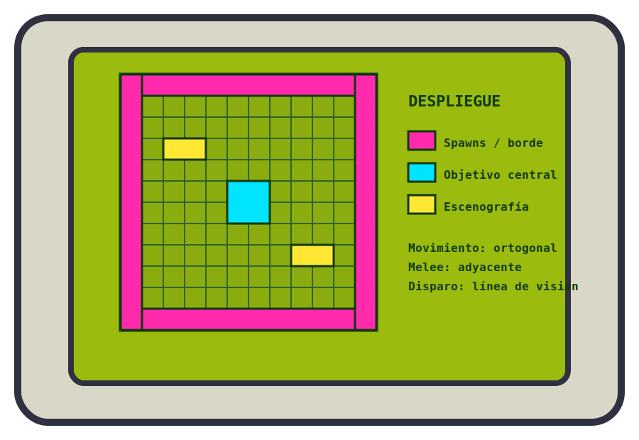
  <figcaption><strong>Lectura ràpida:</strong> els <strong>Spawns</strong> són a la vora, el moviment és <strong>ortogonal</strong> i el centre sol concentrar objectius, Tasques o Caps.</figcaption>
</figure>

Per determinar la Iniciativa, cada jugador tira 1D20. Qui obtingui el resultat més alt decideix qui activa primer. En cas d’empat, comença el jugador més jove.

Si un jugador conserva més Ànim que els altres, pot passar fins que tothom tingui la mateixa quantitat disponible.

## Proves

Tret que una regla indiqui una altra dificultat, totes les proves són **DR12**:

1. Tira 1D20.
2. Suma l’atribut i els modificadors pertinents.
3. Amb un resultat final de 12 o més, la prova té èxit.

## Moviment

El moviment d’un menut és:

> **Moviment = (5 + Cos) / 2 caselles, arrodonint cap amunt.**

El moviment és exclusivament ortogonal: amunt, avall, esquerra o dreta. Cada casella costa 1 punt de moviment i no es pot moure en diagonal. Una miniatura no pot travessar caselles ocupades ni terreny infranquejable.

El terreny de menys de mitja casella d’alçada pot creuar-se sense cost addicional. Per grimpar obstacles més alts, cada casella recorreguda costa 2 punts de moviment. El menut ha d’acabar sobre una superfície estable.

Un menut pot saltar un buit de fins a 2 caselles amb una prova de Cos DR12. Si falla, cau i pateix una Conseqüència; amb una pífia, en pateix dues.

Un menut que abandoni el tauler es considera de tornada a casa i deixa de participar en l’aventura.

## Combat

Tot atac segueix aquesta seqüència:

1. Comprova l’abast i la línia de visió.
2. Determina quin atribut i quins modificadors fa servir l’arma.
3. Fes la tirada d’atac.
4. Si impacta, calcula i aplica el dany.

### Cos a cos

Per atacar cos a cos, l’objectiu ha d’ocupar una de les vuit caselles adjacents. Les diagonals compten per a aquesta adjacència, però mai per moure.

L’atacant tria una arma i fa una prova DR12 amb l’atribut indicat. El defensor contraataca al mateix temps amb un modificador de −3. Tots dos fan la seva tirada i apliquen el dany de tots els impactes aconseguits.

El defensor ignora el −3 si un altre model aliat també és adjacent a l’atacant. Amb una pífia, la miniatura deixa caure l’arma a la seva pròpia casella.

Un objectiu que sobrevisqui i encara no s’hagi activat pot fer-ho amb normalitat durant aquella ronda.

### Atacs a distància

Una arma amb la propietat **A distància** té un abast màxim de **6 caselles**, tret que indiqui un altre valor.

Traça la línia de visió des del centre de la casella atacant fins al centre de la casella objectiu. La línia pot ser diagonal, però queda bloquejada si creua una casella ocupada o terreny que bloquegi la visió. Les caselles d’origen i destí no bloquegen el tret.

Una miniatura trabada en cos a cos no pot disparar. Disparar contra una miniatura trabada imposa −3 a la tirada d’atac. Si l’objectiu té cobertura parcial, aplica també −3.

Fes una prova DR12 amb l’atribut i els modificadors de l’arma. Si té èxit, calcula el dany.

Qualsevol arma pot llançar-se fins a **3 caselles** amb −3 a la tirada. Les armes específicament **Llancívoles** no pateixen aquesta penalització. Tant si impacta com si no, col·loca l’arma a la casella de l’objectiu o en una casella adjacent lliure triada per qui ha atacat. Es pot recollir amb una acció des d’aquella casella o des d’una d’adjacent.

En cos a cos, les armes a distància compten com a armes improvisades d’una mà.

### Abandonar un combat

Una miniatura està trabada si hi ha un enemic en una casella adjacent. Un menut pot destrabar-se pagant 1 punt d’Ànim addicional: l’activació completa costa, per tant, 2 punts. Els Dolents obligats a destrabar-se no paguen Ànim.

## Dany, Defensa i Salut

Quan un atac impacta, tira 1D3 i suma el valor de Dany de l’arma. Resta la Defensa de l’objectiu. El resultat restant es descompta de la seva Salut.

> **Dany patit = 1D3 + Dany de l’arma − Defensa.**

Els atuells proporcionen Defensa i redueixen el dany tret que una regla indiqui el contrari. Els crítics afegeixen 1 punt de dany abans d’aplicar Defensa.

Quan un menut, Dolent o Tasca arriba a 0 de Salut, fuig i es retira del tauler, tret que el seu perfil indiqui una altra cosa. Un menut que fugi perquè ha arribat a 0 de Salut obté una Conseqüència aleatòria.

El dany desapareix quan acaba l’aventura i la Salut recupera el seu valor inicial. Les Conseqüències romanen fins que un objecte, una regla o una pujada de nivell les elimini.

## Proves de Gallina

Quan una regla demani una prova de Gallina, fes una prova de Molar DR12. Si falla, el menut corre cap a la Casella de Vora més propera utilitzant tot el seu moviment.

La pròxima vegada que sigui activat, repeteix la prova. Si té èxit, actua amb normalitat; si torna a fallar, continua fugint. Repeteix el procés fins que superi la prova o abandoni el tauler.

Fugir per una prova de Gallina no provoca atacs ni costa Ànim addicional.

Una miniatura ha de fer una prova de Gallina quan:

- Pateix un impacte crític.
- Una aventura li ho ordena.
- Un altre menut situat a 6 caselles o menys rep la Conseqüència **Esgotat**. Aquesta condició només afecta miniatures controlades per jugadors.

Si portes ulleres de sol mentre jugues, pots repetir una prova de Molar una vegada per partida. Sí, de debò.

## Conseqüències

| D20 | Conseqüència | Efecte |
|---:|---|---|
| 1 | Cicatriu nova i molona | +1 Molar. |
| 2 | Dent trencada | −1 Molar. |
| 3 | Panxa remoguda | Obtén l’habilitat Atac de pet. |
| 4 | Espantat | Activar-lo costa 2 punts d’Ànim. |
| 5 | Trist | −1 Ment. |
| 6 | Cansat | −1 Moviment. |
| 7 | Gastroenteritis | −1 Cos. |
| 8 | S’ha mudat | Substitueix el menut per un de nou. |
| 9 | Lleganya | Redueix en 2 caselles l’abast màxim dels seus atacs a distància. |
| 10 | Força de mare | +1 Cos i −2 Molar. |
| 11 | Febre | −1 a totes les tirades durant la pròxima aventura. |
| 12 | Turmell torçat | −1 Moviment durant la pròxima aventura. |
| 13 | Ull de vellut | −1 Ment durant l’aventura actual o la següent. |
| 14 | Colzes pelats | −1 Cos durant l’aventura actual o la següent. |
| 15 | Cucs cerebrals | Intercanvia a l’atzar dos atributs. |
| 16 | Despistat | Perd permanentment un objecte o arma a l’atzar. |
| 17 | Només feia veure que sí | No passa res. |
| 18 | Es perd tornant a casa | La colla perd 1 xapa. |
| 19 | Lliçó dolorosa | Augmenta un atribut en 1. |
| 20 | Dos per un | Torna a tirar dues vegades i aplica tots dos resultats. |

## Codis de trucs

Cada codi pot utilitzar-se una sola vegada per aventura i en qualsevol moment, fins i tot després d’una tirada.

| Codi | Efecte |
|---|---|
| Cop crític | Un atac infligeix 1 punt de dany addicional. |
| Codi Konami | Repeteix qualsevol dau, propi o aliè. |
| Mode Déu | Elimina totes les Conseqüències d’un menut en joc. |
| Carregar partida | Cancel·la un crític o una pífia. |
| Diògenes de l’inventari | Repeteix una tirada en una taula de tresor. |
| Mode fàcil | Supera automàticament una prova de salt, Gallina o combat. |

## Els Dolents

Després que els jugadors hagin gastat tot el seu Ànim, activeu els Dolents. Si n’hi ha diversos, determineu a l’atzar l’ordre d’activació.

<div class="reading-aid"><strong>Busca primer:</strong> <strong>Salut</strong>, <strong>Molar</strong>, <strong>Atac</strong>, <strong>Defensa</strong>, <strong>Especial</strong> i <strong>Paraules clau</strong>. Aquestes sis dades resolen gairebé qualsevol activació d’un Dolent.</div>

Els Dolents fan totes les seves proves a DR12 sense modificadors, tret que el seu perfil indiqui el contrari. Un Dolent que només tingui atacs a distància i estigui trabat ataca desarmat i infligeix Dany 1.

### Perfil d’un Dolent

- **Salut:** dany que pot patir abans de fugir.
- **Molar:** moral del Dolent.
- **Atac:** nom de l’atac i Dany que afegeix en impactar.
- **Defensa:** quantitat de dany que ignora.
- **Especial:** atacs, comportaments o regles pròpies.
- **Paraules clau:** categories utilitzades per objectes, armes i altres regles.

### Aparició

Quan una aventura faci aparèixer un Dolent, col·loca’l a la **Casella de Vora (Spawn)** indicada. Si demana una vora aleatòria, sorteja un dels Spawns disponibles.

### Pífies, botí i enemistats

Amb un 1 natural, un Dolent deixa caure l’arma; els atacs naturals com les urpes no poden deixar-se caure. Si està desarmat, fa servir la seva acció per recollir una arma caiguda quan pugui.

En fugir, deixa tots els seus objectes i armes a l’última casella que ocupava. Es poden recollir amb una acció des d’aquella casella o des d’una d’adjacent.

Els Dolents de tipus diferents es consideren hostils i s’ataquen. Si comparteixen una paraula clau, es consideren aliats.

### Proves de Molar dels Dolents

Quan un Dolent pateixi un impacte crític, tira 2D6. Si el resultat supera el seu Molar, fuig. Durant cada activació posterior es mou cap a la Casella de Vora més propera una quantitat igual a **la meitat de 2D6, arrodonint cap amunt**. Els Dolents amb Molar «—» ignoren aquesta regla.

### Flux d’activació

1. Resol primer les regles Especials del perfil.
2. Si veu una miniatura enemiga, la tria com a objectiu; si no, no fa res.
3. Si és adjacent a l’objectiu, ataca cos a cos.
4. Si disposa d’un atac a distància i l’objectiu és dins de l’abast i la línia de visió, dispara.
5. En qualsevol altre cas, es mou per la ruta ortogonal més curta cap a l’objectiu.

## Tasques

Les Tasques són un tipus especial de Dolent que els menuts «derroten» durant les seves aventures. Quan una Tasca arriba a 0 de Salut, queda completada.

Per cada Tasca completada, la colla obté 3 xapes de paga quan acaba l’aventura. Si dues colles li han causat dany, totes dues reben la recompensa. Tret que el seu perfil indiqui el contrari, les Tasques romanen quietes.

### Taula de Tasques

| D8 | Tasca | Salut | Molar | Atac | Defensa | Regles |
|---:|---|---:|---:|---|---:|---|
| 1 | Desastre petit | 5 | — | Pudor 1 | 1 | En activar-se, es mou la meitat d’1D6, arrodonint cap amunt, cap a un altre Desastre petit. Si queda adjacent, tots dos es fusionen en un Desastre gran. Si no n’hi ha cap altre, es mou a l’atzar. |
| 2 | Desastre gran | 12 | — | Pudor 3 | 2 | En activar-se, amb 5+ en 1D6 genera un Desastre petit. Es mou la meitat d’1D6, arrodonint cap amunt, cap al menut més proper. |
| 3 | Munt de fulles | 8 | — | Pal punxegut 2 | 1 | Si s’ataca amb una arma Xopa, tira 1D4; amb un 4, l’arma queda destruïda. |
| 4 | Plats bruts | 8 | — | Forquilla rovellada 3 | 0 | Si rep un impacte amb Aigua, amb un 6 en 1D6 es completa. Un 20 natural en atacar-los els trenca i anul·la la recompensa. |
| 5 | Germà petit | 5 | — | — | 0 | Atacar-lo costa 1 xapa a la colla. Per completar la Tasca, un menut adjacent ha de superar una prova de Molar i convèncer-lo perquè se’n vagi. |
| 6 | Vàter brut | 8 | — | Caca 3 | 0 | Si rep un impacte amb Aigua, amb un 6 en 1D6 es completa. |
| 7 | Aspiradora | — | — | — | — | Es mou la meitat de 2D6, arrodonint cap amunt, allunyant-se del menut més proper. Un menut adjacent pot superar una prova de Cos per buidar-la i completar la Tasca. |
| 8 | Brossa pudent | 8 | — | Olor 2 | 1 | Si un menut falla un atac contra ella, pateix una Conseqüència. |

Totes aquestes fitxes tenen la paraula clau **Tasca**. El Munt de fulles també és **Xop**; els Plats bruts són **Bruts** i **Fràgils**; el Vàter i la Brossa pudent són **Bruts**.

# Com funciona la campanya

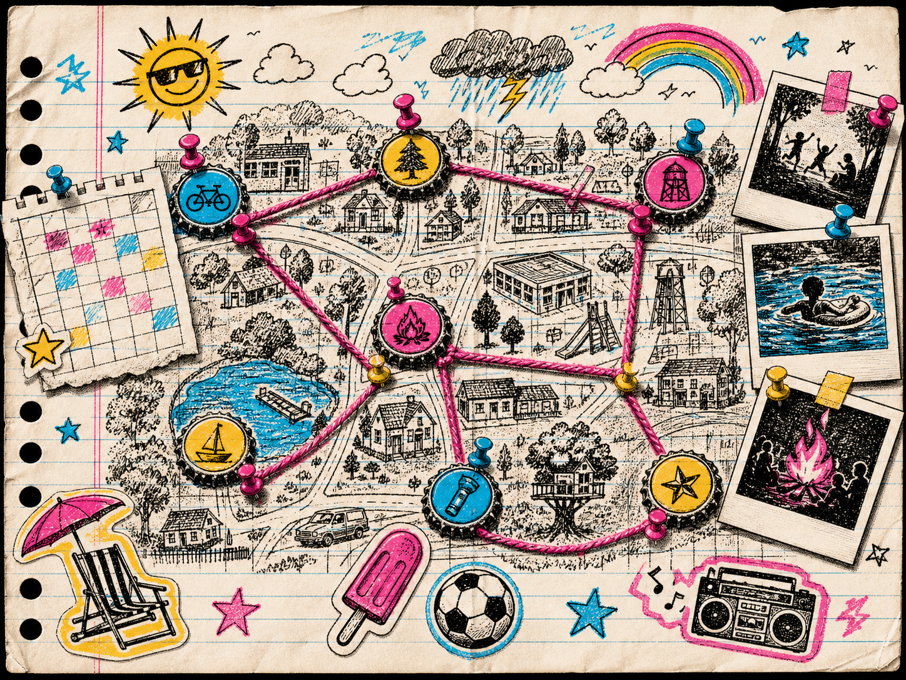

## Episodis i aventures

La campanya de **Patis i Portals** es divideix en episodis, i cada episodi conté diverses aventures. Quan en comença un, la colla desbloqueja la seva botiga i pot comprar-hi abans de la primera aventura i entre partides.

L’última aventura de cada episodi és un combat contra un Cap. En completar-la, la botiga d’aquell episodi tanca i deixa d’estar disponible. La Botiga general de l’episodi 1 és l’excepció: roman oberta durant tota la campanya.

Algunes aventures mostren un símbol de repetició. Es poden jugar tantes vegades com es vulgui.

## Anatomia d’una aventura

Cada aventura utilitza aquests apartats:

- **Història:** què està passant i per què la colla ha decidit ficar-se en aquest embolic.
- **Objectiu:** què han d’aconseguir els jugadors.
- **Recompensa:** què obtenen en completar l’objectiu.
- **Preparació i tresor:** com construir el tauler i on col·locar els tresors.
- **Desplegament:** on comença cada menut.
- **Joc en solitari i cooperatiu:** canvis necessaris per jugar sense rival o amb tots els jugadors al mateix bàndol. El mode predeterminat és competitiu.
- **Dolents:** enemics presents i regles per fer-los aparèixer.
- **Temps:** efectes atmosfèrics aplicables.
- **Final de la partida:** condició que acaba l’aventura.
- **Perfil de Dolent:** atributs dels enemics o referència a l’apartat on apareixen.

## El temps a Cardisota

Tira 2D6 abans de cada aventura per determinar el temps inicial. Si voleu una partida encara més caòtica, torneu a tirar al començament de cada ronda.

| 2D6 | Temps | Efecte |
|---:|---|---|
| 2 | Pol·len pels núvols | El Moviment de tots els menuts es redueix en 1, tret que portin un inhalador. |
| 3 | Inundació sobtada! | Tots els objectes Xops es perden quan acaba l’aventura. |
| 4 | Cel clar | Avui no passa res dolent. Sospitós. |
| 5 | Pluja | Les armes Xopes infligeixen 1 punt menys de dany i els atuells Xops proporcionen 1 punt menys de Defensa. |
| 6 | Onada de calor | Tots els menuts comencen amb 1 Conseqüència. |
| 7 | Boira | L’abast de totes les armes a distància es redueix en 2 caselles. |
| 8 | Raigs còsmics! | Quan acaba l’aventura, un menut a l’atzar obté el rerefons Mutant a més del que ja tingués. |
| 9 | Canvi de temps | Tira dues vegades més i aplica tots dos resultats. Repeteix els duplicats. |
| 10 | Calamarsa | Els menuts sense atuell pateixen 1 punt de dany quan comença l’aventura. |
| 11 | Boira espessa | L’abast de totes les armes a distància es redueix en 3 caselles. |
| 12 | Sol de forat negre | Tots els Dolents obtenen +2 Salut. |

> **Llamps:** si una aventura indica que hi ha tempesta elèctrica, un menut que obtingui un 1 natural en qualsevol tirada rep un llamp i pateix 1 punt de dany.

# Episodi 1 — Empiezan les vacaciones

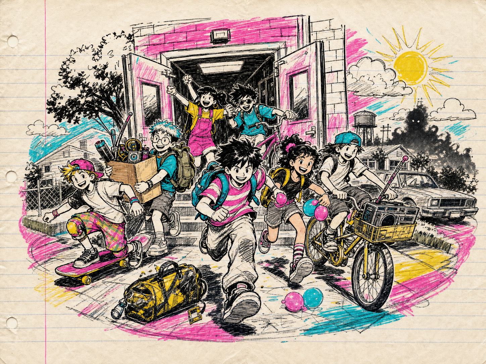

Les vacaciones han empezado, però les aventures cuestan pasta. Antes de salvar el poble toca ganarse la paga amb unas cuantas Tasques. El estiu de vuestra vida empieza fregando platos. Maravilloso.

## Aventura 1 — Prueba en blanco

La colla és ha quedado sense paga. Sin xapes no hay helados, cómics ni cartuchos nuevos per a la Gamekid, así que toca llamar a les puertas del vecindario i ofrecerse a fer Tasques.

<figure class="enemy-plate">
  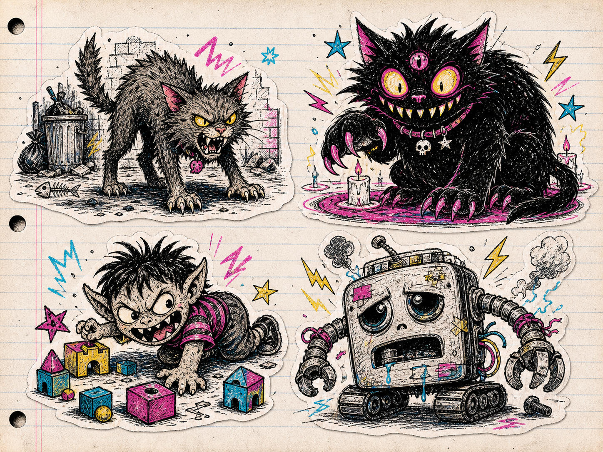
  <figcaption><strong>Enemics visuals:</strong> gatos, críos escapistas i cacharros animados. Úsalo per a identificar rápido qué miniatura o marcador representa cada Dolent.</figcaption>
</figure>

### Objectiu

Quan un menut esté al costat a la puerta d’una casa, pot llamar i realizar una prova de Molar. Si té èxit, genera una Tasca aleatòria en una casella adjacent libre. Si falla, otro menut pot intentarlo. No és pot volver a llamar a esa puerta fins a completar la Tasca.

La partida acaba quan és hayan completado cuatro Tasques per cada colla participante.

### Recompensa

Cada Tasca concede la recompensa indicada en el seu perfil. La colla que complete més Tasques tira 1D6; amb 3+, obté 1 Ànim.

### Preparació i desplegament

Prepara tres casas per colla, cada una amb una puerta. Separa les casas al menys 2 caselles. Cada jugador tria una zona de desplegament i col·loca els seus menuts per turnos en els seus Casillas de Borde (Spawns).

<figure class="gameboy-map">
  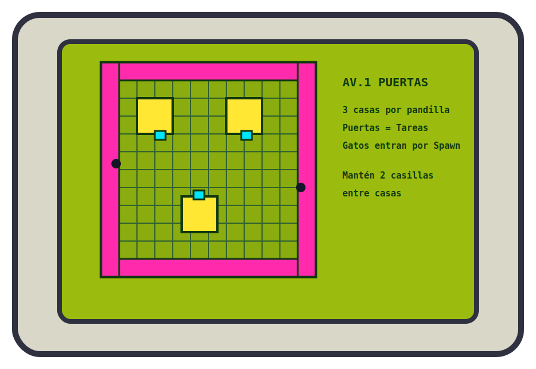
  <figcaption><strong>Desplegament suggerit:</strong> tauler aproximado de <strong>12 × 9 caselles</strong>; cada colla col·loca tres casas separadas al menys <strong>2 caselles</strong>. Els gatos apareixen des dels Spawns numerados.</figcaption>
</figure>

### Dolents

Desde la primera ronda, haz aparecer 1D3 Gatos sarnosos en Spawns aleatorios. Repite la tirada en cada ronda posterior. Si llega a haber seis a la vegada, apareix inmediatamente un Gran Gato Satánico.

En solitario, apareix un solo Gato sarnoso per ronda.

| Dolent | Salut | Molar | Atac | Defensa | Regles |
|---|---:|---:|---|---:|---|
| Gato sarnoso | 6 | 6 | Garras 2 | 0 | Animal, Gato, Esbirro. Si és derrotan cuatro, apareix un Gran Gato Satánico. |
| Gran Gato Satánico | 8 | 9 | Garras 3 | 1 | Gato, Demoníaco, Animal, Minijefe. No ataca a Mal Puro i els Gatos sarnosos tampoco lo atacan. |

## Aventura 2 — Niñera en apuros

Justo quan la colla estaba lista per a bajar al centre, apareixen els guardianes definitivos: els padres. Hay que cuidar a un puñado de renacuajos. Naturalmente, todo el mundo és pone a jugar a *Night Trap* i els críos és escapan al jardín.

### Objectiu i recompensa

Captura a tots els Mordedores de tobillo abans de que abandonen el tauler. Cada uno que vuelva a casa sano i salvo concede 1D6 xapes.

### Preparació i desplegament

Monta un jardín. Por turnos, col·loca tres Mordedores de tobillo per jugador, separados al menys 3 caselles entre sí. Después col·loca els menuts en qualsevol casella situada a 2 o més caselles de uno de ellos.

En solitario, utilitza cinco Mordedores de tobillo.

### Mordedor de tobillo

> **Salut:** — · **Molar:** 12 · **Atac:** Mordisco 2 · **Defensa:** —  
> **Paraules clau:** Bebé, Asqueroso, Esbirro.

No pot ser atacado. Al activarlo:

1. Si no hay un menut adjacent, deixa una Tasca Desastre pequeño en el seu casella o en una adjacent libre.
2. Se mou la mitad de 1D6 caselles, arrodonint cap amunt, en una direcció ortogonal aleatòria.
3. Si acaba adjacent a un menut, lo ataca amb Mordisco.

Para capturarlo, un menut adjacent i no trabado ha de superar una prova de Cos. Mientras lo transporte, solo pot realizar acciones de moviment i no pot atacar. Al llegar a una Casilla de Borde, lo entrega i lo retira del tauler. Un Mordedor transportado no genera Desastres.

## Aventura 3 — Ferretería

La colla és a punt de llegar a Manic Comic quan un robot de TBEC apareix arrasando la calle. Superman ha de de estar ocupado, así que os toca detener al Hombre Máquina Melancólico.

### Objectiu i recompensa

Destruye al Hombre Máquina Melancólico. El menut que le cause més dany obté el apodo **Terminator**. Cada colla participante rep un objecte aleatori al acabar.

### Preparació i desplegament

Coloca al cap en el centre. Cada jugador añade dos Tasques aleatorias fuera de les zonas de desplegament. Después, per turnos, col·loca els menuts en els seus Spawns.

### Dolents

Al comienzo de cada ronda apareixen 1D4 Electrodomésticos animados per colla participante.

| Dolent | Salut | Molar | Atac | Defensa | Regles |
|---|---:|---:|---|---:|---|
| Hombre Máquina Melancólico | 16 | 12 | Aplastamiento 4 | 1 | Cap, Robot. Agua le causa 2 punts de dany adicionales. La primera vegada que un menut lo atac ha de superar una prova de Molar. Al comienzo de cada ronda, tira 1D6 per cada Electrodoméstico destruido; amb 4+, vuelve a aparecer. |
| Electrodoméstico animado | 6 | 8 | Batidor 3 | 1 | Robot, Esbirro. |

La partida acaba al destruir al cap.

## Eventos aleatorios del nivel 1

Tira 1D20 quan una regla indique que ocurre un evento:

| D20 | Evento |
|---:|---|
| 1 | Unos menuts nuevos compran un arma no Común per el doble de el seu cost. |
| 2 | Beaver és ofrece a fer les Tasques. Si confías en él, tira 1D6: amb 1–3 ganas 1D6 xapes; amb 4+, pierdes 1D6. |
| 3 | Una rayuela paraliza a un menut al azar: no pot activarse aquesta ronda ni la siguiente. |
| 4 | El arenero és lleno de arenas movedizas. Un menut al azar supera una prova de Cos o queda Atrapado. |
| 5 | Peter ayuda amb les Tasques: +1 a totes les proves relacionadas durante aquesta aventura. |
| 6 | Aparece el camión dels helados. Puedes comprar helados; els que no és consuman abans de acabar és perden. |
| 7 | ¡El Hombre del Saco! La colla perd 1 Ànim. |
| 8 | Un experto inglés en arte extravía 1D6 objectes al azar. No poden usarse aquesta aventura, però reaparecen després. |
| 9 | El tiempo cambia: vuelve a tirar en la tabla de Tiempo. |
| 10 | Una casa és llena de trampas. Quien és acerque ha de superar una prova de Cos o sufrir 1 Conseqüència. |
| 11 | Un millonario casi atropella a un menut. Puedes fingir un accidente per a ganar 10 xapes, però ese menut sufre 1 Conseqüència. |
| 12 | Els vecinos perden una Tasca: genera una al azar. |
| 13 | Todo el barrio huele a gente corriente. És rar i bastante apestoso, però no té efecte. |
| 14 | Compra un colchón usado per 10 xapes per a mejorar la guarida. |
| 15 | Johnny V. Owen apareix rapeando. Ahuyentarlo genera un Matón callejero; escucharlo causa −1 Ment i +1 Molar a un menut. |
| 16 | Un san bernardo causa estragos. Añade una Tasca Desastre grande. |
| 17 | Els padres amenazan amb desmontar la guarida. Coloca un Padre en un Spawn aleatori. |
| 18 | Descubrís cámaras ocultas per todo el barrio. No ocurre nada. Seguro. |
| 19 | Aparece la versión futura d’un menut al azar. Els Dolents no és acercan a él durante aquesta aventura. |
| 20 | Cada jugador tria en secreto un temazo dels noventa. Mientras suene, pot repetir un dau. Si ambos eligieron la misma canción, els menuts ignoran totes les pífies aquesta aventura. |

## Final del episodi 1

Cada colla tira una vegada en la tabla de botí. La que asestó el golpe final al Hombre Máquina Melancólico tira 1D6 per a obtener un apodo: Terminator, Rockman, Knuckles, Gyro, Webby o R.O.B.

| D20 | Botín |
|---:|---|
| 1 | Balón de fútbol |
| 2 | Espada de madera |
| 3 | Pistola Nurf |
| 4 | Cómic usado |
| 5 | 1D3 xapes |
| 6 | Saco hacky |
| 7 | Globo de agua |
| 8 | Cometa |
| 9 | 1D6 xapes |
| 10 | Zumo de Duende |
| 11 | Lata de espinacas |
| 12 | Bocata del bueno |
| 13 | Mullet |
| 14 | Chubasquero amarillo |
| 15 | Globo |
| 16 | 1D10 xapes |
| 17 | Libro del cole |
| 18 | 2D6 xapes |
| 19 | 3D6 xapes |
| 20 | Espada de espuma |

# Episodi 2 — Street Fighters

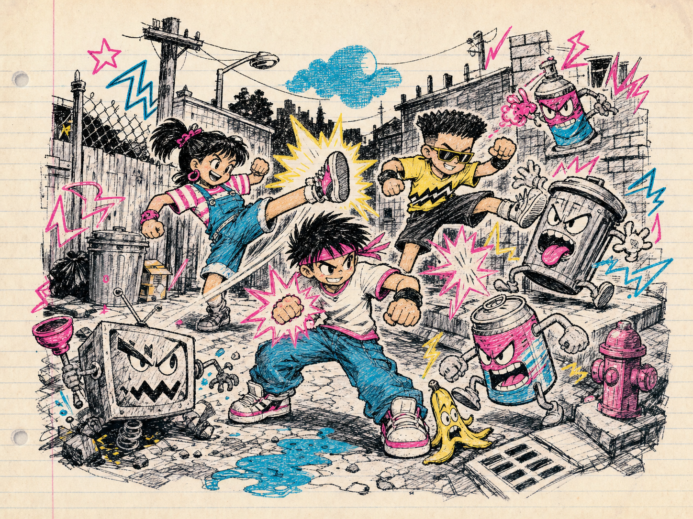

La colla lleva els bolsillos llenos de chuches i cómics, però aún té que regresar a el seu guarida. Sus enemics és acercan i toca elegir ruta:

- **Camí rural:** juega les aventures 4–6.
- **Camí urbà:** juega les aventures 7–9.

Ambas rutas acaben amb un Cap i permiten avanzar al episodi siguiente. Durante este episodi és desbloquea Manic Comic Megastore; la Botiga general continúa disponible.

<figure class="enemy-plate">
  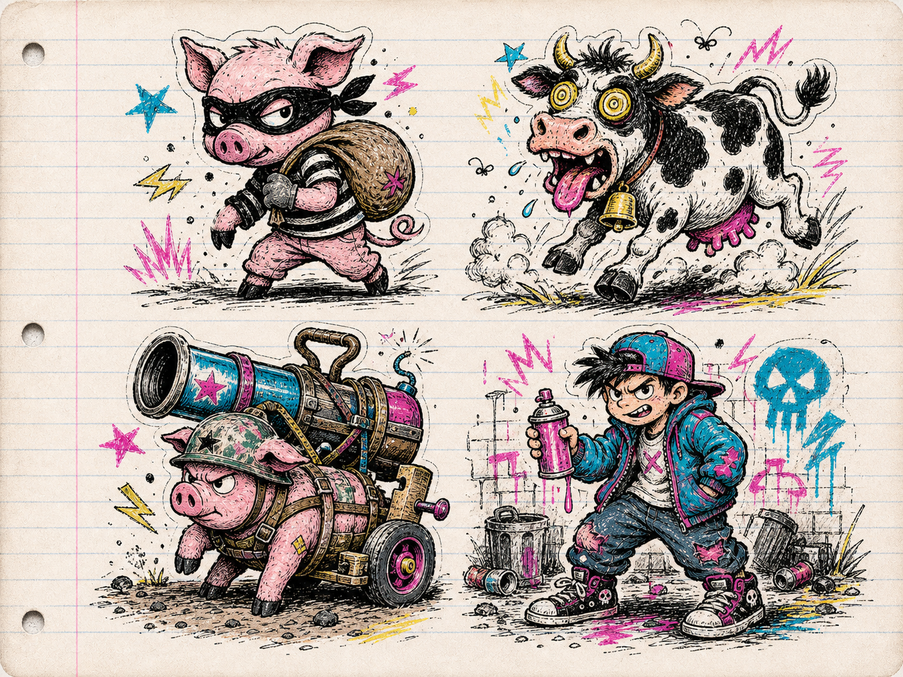
  <figcaption><strong>Enemics visuals:</strong> la ruta rural fes servir animales absurdamente peligrosos; la ruta urbana, matones i mutantes de barrio.</figcaption>
</figure>

## Manic Comic Megastore

Després de cada aventura de l’episodi 2 pots comprar aquí, a més de fer-ho a la Botiga general. Tots els articles són Poc comuns, tret dels del mostrador secret, que són Prohibits.

### Consumibles i còmics

| Article | Cost | Efecte |
|---|---:|---|
| Suc de Follet Atòmic | 7 xapes | Com a acció: −2 Ment durant la resta de l’aventura i una activació gratuïta addicional per ronda. |
| Caramel friqui | 10 xapes | Elimina 2 Conseqüències. Després, mou gratis la meitat de 2D6 caselles, arrodonint cap amunt. |
| *Batspiderman* núm. 34 | 9 xapes | Com a acció, llegeix-lo per obtenir +2 Molar durant la resta de l’aventura. |
| *Necronomicó* | 66,6 xapes | Com a acció, retira del tauler un Dolent que no sigui Cap. Després fes una prova de Molar; si falla, el menut desapareix per sempre. Mal Pur supera automàticament la prova. |
| Revista 28 | 1 xapa | +1 Molar i −1 Ment. |
| Salm prohibit | 1 xapa | +1 Ment i −1 Molar. |
| Còmic per a majors de 18 | 20 xapes | +2 Molar. |
| Transportador d’angles | 100 xapes | És un transportador d’angles de cent xapes. Deu ser boníssim. |
| Tub de pringue | 12 xapes | Llança’l a un Dolent per convertir-lo en una Vaca Boja. |

### Armes noves

| Arma | Atribut | Propietats | Dany | Cost |
|---|---|---|---:|---:|
| Dracs i Dimonis | Ment | A distància 3 caselles | 2 | 4 |
| Espasa de cosplay | Molar | — | 3 | 6 |
| Matatán metàl·lic | Ment | Llancívola 3 caselles | 2 | 2 |
| Nunchaku de Tortuga Ninja | Molar | — | 2 | 3 |
| Katana falsa | Cos | Es trenca amb una pífia | 5 | 30 |

### Atuells i rampoines

| Article | Cost | Efecte |
|---|---:|---|
| Paravent de neó | 12 xapes | Defensa 1 i +1 Molar. |
| Vestit de superheroi | 20 xapes | Defensa 1 i +1 Cos. |
| Llibre | 8 xapes | +1 a les tirades per completar objectius i Tasques d’aventura. |
| *Sonic 2* | 12 xapes | +2 Molar, però comença cada aventura amb la Conseqüència Frustrat. |
| Carmanyola d’acer | 6 xapes | Ocupa 1 espai i pot guardar 3 consumibles. |
| Entrada usada del parc d’atraccions | 1 xapa | Potser encara cola. |

### Encàrrec del dependent

El dependent sap que hi ha un *Batspiderman* núm. 1 a l’abocador. Entre aventures, pots enviar-hi un menut i fer una prova de Cos. Si té èxit, troba el còmic i desbloqueja els articles Prohibits sota el mostrador. Si falla, comença la següent aventura amb 2 Conseqüències.

## Aventura 4 — Cinturón blanco, cor negro

La colla cruza els campos de les afueras i és mete sense querer en territorio porcino. Cerditos Furtivos i Vacas Locas acechan entre la hierba.

### Objectiu i recompensa

Saca a tots els teus menuts per la zona segura del extremo oposat. La primera colla que lo consiga obté 10 xapes.

### Preparació

Cada jugador col·loca cinco Marcadores Furtivos fuera de les zonas de desplegament, de la zona segura i dels Spawns. Els menuts comencen en el seu zona de desplegament.

<figure class="gameboy-map">
  
  <figcaption><strong>Desplegament suggerit:</strong> tauler aproximado de <strong>12 × 9 caselles</strong>. La colla empieza en un extremo i ha de cruzar fins a la zona segura; els Marcadores Furtivos no és colocan en despliegues, Spawns ni zona segura.</figcaption>
</figure>

Al comienzo de cada ronda apareix un Marcador Furtivo en un Spawn aleatori és mou hacial centre la mitad de 1D6 caselles, arrodonint cap amunt. Quan un menut és acerca a 2 caselles, tira 1D6; amb 3+, sustituye el marcador per un Cerdito Furtivo.

> **Cerdito Furtivo:** Salut 8 · Molar 8 · Armas ninja 2 · Defensa 2. Animal, Cerdo, Esbirro.

## Aventura 5 — Vuela a casa

La colla llega a el seu fort amb tota la fauna rural pisándole els talones. Hay que atrancar puertas i ventanas i resistir vuit rondas.

### Objectiu i recompensa

Mantén en pie el fort durante vuit rondas. Cada enemic derrotado concede 1 xapa.

### Preparació

Coloca en el centre un fort de 4 × 4 caselles amb **15 de Salut**. Todos els menuts empiezan dins.

<figure class="gameboy-map">
  
  <figcaption><strong>Desplegament suggerit:</strong> el fort mide <strong>4 × 4 caselles</strong>, ocupal centre i té <strong>15 de Salut</strong>. Usa cuatro bandas de Spawn per a simular els resultados 1–3, 4–6, 7–9 i 10–12 del PDF.</figcaption>
</figure>

En cada ronda apareixen, en Spawns aleatorios, dos Cerditos Furtivos i dos Vacas Locas per colla. Intentan entrar en el fort; si quedan adjacents i no hay un menut al costat a ellos, lo atacan. En la ronda 4 apareixen también Cerdos de Artillería.

Si el fort llega a 0 de Salut, la colla perd. Si sigue en pie al acabar la octava ronda, guanya.

| Dolent | Salut | Molar | Atac | Defensa | Regles |
|---|---:|---:|---|---:|---|
| Vaca Loca | 9 | 9 | Pezuña 2 | 1 | Animal, Vaca, Esbirro. Un menut atropellado supera una prova de Molar o perd el seu próxima activación. |
| Cerdo de Artillería | 8 | 8 | Explosión 2 | 0 | Animal, Cerdo, Esbirro. Si no té un menut adjacent, dispara al objectiu més cercano —fort o menut—. Adyacente ataca amb Pezuña 1. |

## Aventura 6 — ¡Porkageddon!

La fauna no ha logrado derribar el fort, así que saca la artillería pesada. Pon música de cap: ha llegado el Bacon Bomber.

### Objectiu i recompensa

Destruye el Bacon Bomber. Quien le dé el golpe final obté una Habilitat nueva i un apodo de Cap.

### Preparació

Monta un campo sense cobertura. Cualquier menut pot recoger i arrojar guijarros: **Cos, Llancívola 3 caselles, Dany 1**. Coloca dos Cerditos Furtivos per colla i un Cerdo de Artillería. En solitario, utilitza dos Cerditos i un Cerdo de Artillería.

### Bacon Bomber

> **Salut:** 15 · **Molar:** 12 · **Defensa:** 2  
> **Paraules clau:** Animal, Cerdo, Cap, Volador.

Solo pot recibir atacs a distància. Al activarlo, tira 1D4:

1. **Infierno de balas:** tots els menuts superan una prova de Cos o sufren 1 Conseqüència.
2. **Pasada rasante:** és mou la mitad de 2D6 caselles, arrodonint cap amunt, en una direcció ortogonal aleatòria.
3. **Soltar lechón:** apareix un Cerdito Furtivo en una casella adjacent libre.
4. **Maniobra evasiva:** és mou la mitad de 1D6 caselles, arrodonint cap amunt, en una direcció aleatòria i recupera 1D6 de Salut.

Al llegar a 0 de Salut és estrella i el cerdo piloto fuig.

## Final rural del nivel 2

Nivel 2 Camino Rural aleatori Eventos

1. Oyes correr agua en alguna parte, ¿vas a perseguir cascadas?
2. Te encuentras amb una Vaca Loca rompiendo calabazas, té una mirada loca en els seus ojos i ataca el teu garrote. Pon una vaca loca en el tauler.
3. ¡Un pequeño OVNI apareix de la nada! Coloca un OVNI en el tauler. PERFIL DEL ENEMIGO. Li'l UFO HP: 5, **Molar:** 8, Rayo X, rango 0-4 caselles Dany: 3 Regla especial: Primero apuntará a les Vacas Locas.
4. Te metes en un charco, un menut al azar és empapa i tots els elementos amb la palabra clave Empapado és perden.
5. Pasa un cerdo parlante, pastoreando un rebaño de ovejas. Puedes recoger la caca de oveja i utilizarla com arma improvisada. Caca (Alcance 6, Dany 1, Cos, perd -1 Enfriamiento permanentemente)
6. Soplan fuertes vientos i encuentras una cometa perdida, cariño. Gana 1 artículo de cometa.
7. Te topas amb extrañas figuras de palos escondidas entre la hierba alta. Un menut al azar és maldito. Els menuts malditos han de volver a tirar els 20 naturales.
8. Un menut hambriento és topa amb el teu grupo, són demacrados i despotrican sobre cómo escapar d’un extraño infierno llamado colla Hope. Si le das al menut un artículo consumible, et recompensarán amb D6 xapes vacías; si no quieres o no pots darles un consumible, un menut sufrirá una conseqüència quan el menut hambriento les muerda.
9. Escuchas el llanto d’un gato negro de aspecto triste, el gato és guardando un libro de aspecto malvado amb un ojo vivo en la portada. El gato sale corriendo, dejando La colla amb el Necronomicon.
10. Está bien, el césped és estupendo i sólo quieres relajarte un momento. Cambial clima a Clear Skies i relájate per un momento.
11. Un médico extraño habla amb un alce perdido. Puedes ayudar als alces a encontrar el seu

De camino a casa, retira a un menut del tauler durante D6 turnos mentre conducen al alce a casa. Ese menut obté el trasfondo de Animal Friend.

Si no ayudas als alces eres una mala persona però no hay sanciones.

12. Un grupo excéntrico de repente llega a el teu realidad des d’un universo paralelo. Son muy molestos, per lo que les quitas les xapes D6 abans de que vuelvan a desaparecer.
13. Conoces al pony Ginuwine, ¡qué divertido! Un menut pot montar en Ginuwine, duplicando el seu moviment durante el resto de l’aventura.
14. La colla ve una señal extraña: "99 millas fins a Silent Hill". No sabes per qué, però et provoca un escalofrío. Bajal Ànim en -1.
15. ¡Te encuentras amb una dócil Rata Gigante! La Rata Gigante no atacará a menys que sea atacada primero. En lugar de atacarlo, un menut pot intentar pasar una prova de Ment, si la pasa, la Rata Gigante és marcha pacíficamente. Si obtienes un 20 natural, et darás cuenta de que no és una rata, ¡és el teu amigo Luke, que ha sido transformado per una bruja!
Luke pot volver a transformarse si adquieres i destruyes el Necronomicon.

¡Luke és unirá a el teu colla com el quinto menut extra!

16. Descubres un manzano lleno de frutos maduros, ¡dulce!
Gana manzanas D6.

17. ¡Se oye un crujido entre els grandes arbustos i sale un gorila de montaña de cuatro metros de altura! Debe estar tomando un descanso del zoológico local. Els malos són aterrorizados per él i ningún malo que no sea un cap pot fer una acció este turno.
18. És hora de darles propina a algunas vacas. Coloca 3 vacas en el centre de la taula. Si volcas als tres al pasar una prova de Cos quan estés a 1 casella de ellos, un menut al azar guanya +1 Molar.
19. Aparece un granjero enojado amb una pistola de arroz i tots els menuts han de pasar una prova corporal o sufrir 1D3 de dany.
20. De alguna manera encontraste el camino cap a la ciudad. Tira en la taula del Camino Urbano.

## Aventura 7 — Rompemandíbulas

Antes de abandonar un barrio que no és el vuestro, la colla decide dejar el seu firma perquè todo el mundo sepa quién preval.

### Objectiu i recompensa

Marca cinco elementos de escenografía i abandonal tauler. La colla que consiga les cinco marcas obté 1 Ànim.

Cada jugador col·loca cinco elementos de terreny, separados al menys 2 caselles dels despliegues i entre sí. Añade un Matón callejero al costat a cada elemento. Para fer una pintada, un menut adjacent al terreny, no trabado i sense Dolents adjacents, gasta una acció i supera una prova de Molar.

> **Matón callejero:** Salut 10 · Molar 7 · Bate 2 · Defensa 1. Adulto, Humano, Esbirro. Si solo queda uno, el seu Molar pasa a 1.

## Aventura 8 — Huida de Montillery

Alguien ha disparado amb pintura a Cirus, líder dels Riff-Raffs, i la colla estaba en el peor lugar posible. No hay tiempo per a explicaciones: hay que llegar a les alcantarillas.

### Objectiu i recompensa

Saca a tots els teus menuts per la boca de alcantarilla del centre. Solo pot escapar uno per ronda. La primera colla que lo consiga obté 10 xapes.

<figure class="gameboy-map">
  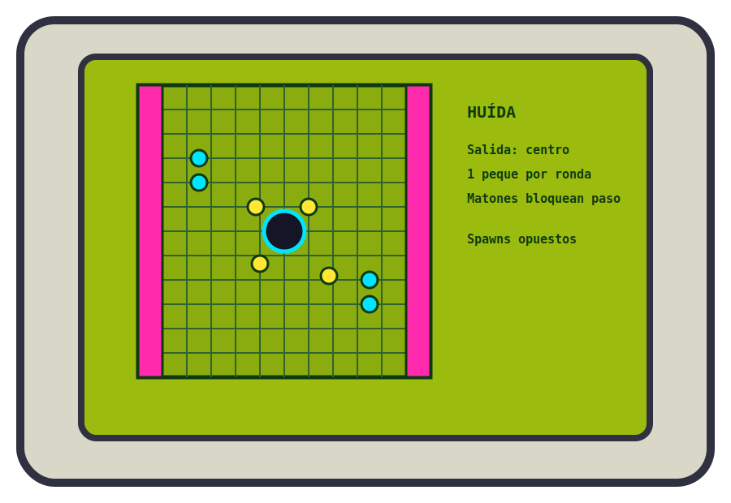
  <figcaption><strong>Desplegament suggerit:</strong> la alcantarilla central és la única salida i solo permite escapar a <strong>un menut per ronda</strong>. El último Matón empieza a <strong>1 casella</strong> de la alcantarilla.</figcaption>
</figure>

Coloca diez Matones, alternando entre jugadors, fuera dels despliegues i separados al menys 2 caselles. Uno ha de comenzar al costat a la alcantarilla. En la ronda 3 apareixen dos Gatos sarnosos.

> **Matón:** Salut 9 · Molar 0 · Calzón chino 2 · Defensa 2. Humano, Esbirro. Quan daña a un menut, le roba un objecte al azar; al ser derrotado deixa caer todo lo robado.

## Aventura 9 — Fusión subhumanoide

¿Quién dijo que les alcantarillas serían seguras? Hay mutantes ahí avall, i no són del tipus tortuga.

### Objectiu i recompensa

Derrota a la Familia Clorhone. Cada colla pot enseñar PSI a uno de els seus menuts i guanya 3 xapes per cada Desastre eliminado.

### Preparació

Construye un cruce de alcantarillas. Coloca tres mutantes en el centre i cuatro Desastres pequeños per colla en els túneles. Els menuts comencen en Spawns opuestos. En solitario, utilitza dos mutantes.

<figure class="gameboy-map">
  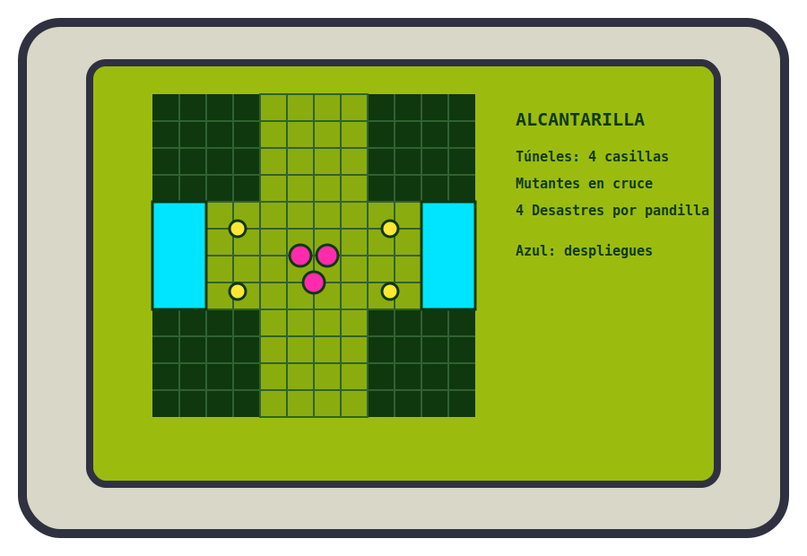
  <figcaption><strong>Desplegament suggerit:</strong> els túneles tenen <strong>4 caselles</strong> de ancho. El cruce central concentra als Mutantes; cada colla col·loca cuatro Desastres pequeños en els túneles.</figcaption>
</figure>

### Familia Clorhone

> **Salut:** 12 · **Molar:** 9 · **Defensa:** 2  
> **Paraules clau:** Adulto, Mutante, Cap.

Al activar un mutante, tira 1D6:

1. Estira els brazos i golpea al menut més cercano, aunque no esté adjacent: Dany 2.
2. Se mou la mitad de 2D6 caselles, arrodonint cap amunt, en una direcció aleatòria.
3. Vuelve el estómago del revés: tots els menuts adjacents sufren 2 Conseqüències.
4. Come basura i recupera 2 de Salut.
5. Invoca una Rata Gigante en una casella adjacent libre.
6. Recupera 1D6 de Salut.

La partida acaba quan tots els mutantes han sido derrotados.

## Final urbano del nivel 2

Nivel 2 Ruta urbana aleatòria Eventos

1. Els chicos de la botiga de mascotas et dicen que pots encontrar una cinta VHS rara si vas al oeste.
2. Un hombre de rostro pálido vestido completamente de negro pasa al costat a ti notas que té un cuervo posado en el seu hombro. És extraño, però et muestra una sonrisa amable que et calma. Aumental Ànim en +1.
3. El vendedor ambulante intenta venderte un reloj especial, perd xapes D6 perquè el reloj és hecho de papel.
4. ¡El Pagemaster apareix e intenta traer magia a el teu vida mundana! ¡Él et asigna tareas! Coloque les tareas D6 en el tauler.
5. ¡Dolents, Dolents! ¿Qué vas a fer? Els menuts són en problemas i han de entregarle tots els objectes prohibidos al cerdo. O el menut amb elementos prohibidos pot abandonar el tauler.
6. Els menuts encuentran basura dulce amontonada en la acera. Hurga en él per a obtener el elemento Papelera i una conseqüència.
7. Mirando al sol, ¡et das cuenta de que fa mucho calor! Cambial clima a Ola de Calor.
8. Te encuentras amb una de els teus profesoras, la señorita Connors de Química. Pot que esté de vacaciones, però sigue siendo estricta. La colla no pot utilitzar ningún objecte prohibit durante el resto de l’aventura.
9. Hay un graffiti extraño en una pared, estás bastante seguro de que és un mapa de algún tipus de tresor.
Haz un dibujo rápido del mapa (un menut no pot realizar ninguna otra acción durante 1 turno) perquè l’aventura Trash of the Titans sea rejugable.

10. ¡¡És el estreno de Jack Slater V!! ¡Entre la multitud ves a un par de matones!
Coloca D6 matones en el tauler.

11. Oyes hablar a un bebé des de el seu carrito. Un menut al azar és queda de piedra i ha de superar una prova de Molar.

12. Un quiosco proclama que la fiesta de ayer en la mansión Capuleto fue el evento de la década. Desearías haber estado allí. Bajal Ànim en -1.
13. El Departamento de Defensa de la Educación ha desplegado un agente educativo per a erradicar als delincuentes juveniles. Si la Ment de algún menut és inferior a 1, obté una conseqüència.
14. El restaurante local Clown Dog ha vuelto a liberar vapores nocivos al aire. Todos els menuts han de pasar una prova corporal o recibir una conseqüència.
15. Conoces a la espía local, Harriet. Un menut pot ayudarla en el seu último caso; si eliges ayudarla, elimina a un menut del joc (no tomó la conseqüència de huir a casa i no sufre conseqüències). El menut guanya un impermeable amarillo.
16. Conoces a una marinera exploradora rubia que és ofrece a venderte galletas. Cuestan 2 xapes i et llenan d’una sensación de salud. Cura 1 conseqüència per cada galleta comprada. Les galletas són tan sabrosas que no és poden almacenar després de l’aventura.
17. ¡Oh Dios mío! Una colorida multitud de gente bailando apareix des d’una calle lateral, ¡claramente són controlados mentalmente per el infame Del Riot! Cada menut ha de pasar una prova corporal o comenzar a bailar la macarena, tratar als menuts que bailan com si estuvieran atrapados. Si tú, el jugador, bailas la macarena, els menuts pasarán automàticament la prova.
18. Un cartel de Megatech promete ayudarte a ascender al siguiente nivel cibernético. Un menut pot dejar l’aventura per a visitar les corporaciones. Obtienen el trasfondo de Cyborg.
19. Un extraño hombre vestido de negro, seguido d’un cuervo, toca la guitarra en un tejado bajo la lluvia. És un poco extraño però algo Molar. Durante les siguientes 3 rondas, tots els menuts obtenen +1 en les proves de Molar.
20. De alguna manera encontraste el camino hacial campo, tira en la tabla de Camino Rural.

## Final del episodi 2

Cada colla tira una vegada en la tabla de botí. Quien asestó el golpe final obté un apodo.

- **Porkageddon:** Baconator, Grasa de jamón, Pumba, Lado O’Bacon, Porco o Porkley.
- **Familia Clorhone:** Cíclope, Maestro del dragado, Ectoniño, Modo, Ketchup o Aliento caliente.

| D20 | Botín |
|---:|---|
| 1 | Zumo de Duende Atómico |
| 2 | Caramelo friki |
| 3 | Dragones i Demonios |
| 4 | Cómic usado |
| 5 | 1D3 xapes |
| 6 | Saco hacky |
| 7 | Globo de agua |
| 8 | Cometa |
| 9 | 1D6 xapes |
| 10 | Zumo de Duende |
| 11 | Libro |
| 12 | Bocata del bueno |
| 13 | *Sonic 2* |
| 14 | Katana falsa |
| 15 | Revista 28 |
| 16 | 1D10 xapes |
| 17 | Tubo de pringue |
| 18 | 2D6 xapes |
| 19 | 3D6 xapes |
| 20 | Videojuego per a mayores de 18 |

# Interludi — Anem a pescar

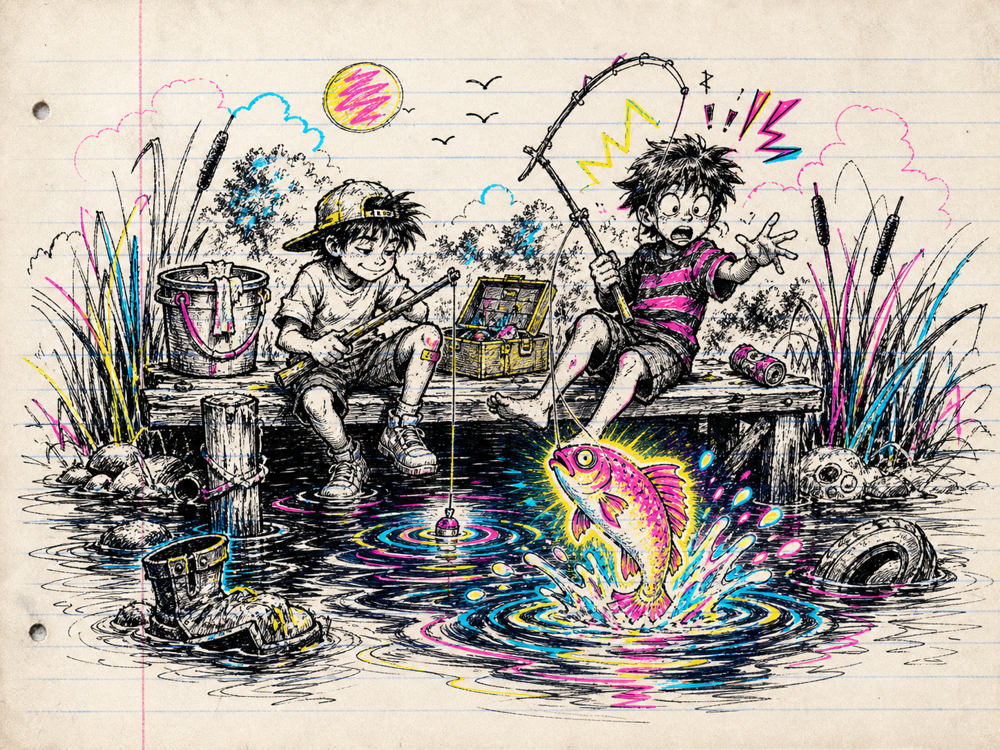

Què seria de l’estiu sense una tarda de pesca? Agafa l’ham, la canya i un esquer de procedència dubtosa.

## Material necessari

- Una miniatura de barca per colla.
- Cinc peixos.
- Un tauler de 12 × 12 caselles.
- Un dau de dispersió o qualsevol mètode per triar una direcció ortogonal a l’atzar.
- Daus D4, D6 i D8.

## Preparació

1. Tria una vora com a riba i col·loca cada barca en una Casella de Vora d’aquella riba.
2. Col·loca un peix al centre. Tira 1D8 per cadascun dels altres quatre peixos, divideix el resultat entre 2 i arrodoneix cap amunt; situa’l a aquesta distància del primer en una direcció aleatòria.
3. Determina quin costat del tauler és el nord i tira 1D4 per fixar la direcció ortogonal del corrent.

## Seqüència de la ronda

1. **Navegar:** mou la barca fins a 3 caselles ortogonals.
2. **Moure els peixos:** cada peix es dispersa la meitat d’1D4 caselles, arrodonint cap amunt.
3. **Deriva:** cada barca es desplaça en la direcció del corrent la meitat d’1D4 caselles, arrodonint cap amunt.
4. **Pescar:** si un peix entra a la casella de la barca durant qualsevol d’aquests moviments, queda capturat.

Si una barca abandona el tauler, es perd i tot el que havia capturat cau per la borda. Si xoca contra una altra barca, comença a enfonsar-se i ha de tornar a la riba en 1D4 rondes o perdre tots els seus peixos. Un peix que arribi a la vora s’atura fins al seu pròxim moviment.

La colla que capturi més peixos obté 4 xapes addicionals. Cada captura també es pot vendre:

| 1D6 | Captura | Resultat |
|---:|---|---|
| 1 | Llagosta | Un menut pateix una Conseqüència; es ven per 10 xapes. |
| 2–4 | Peix corrent | Es ven per 1 xapa. Avorrit, però rendible. |
| 5 | Peix brillant | Es ven per 5 xapes. |
| 6 | Brossa marina | Obtén un objecte aleatori. |

## Al mar pot passar qualsevol cosa

Després de preparar la partida, tira 1D6:

| 1D6 | Succés |
|---:|---|
| 1 | **Peixos ràpids:** es dispersen la meitat d’1D6 caselles en comptes d’1D4. |
| 2 | **Roques:** dispersa dues roques com si fossin peixos. Xocar amb una fa que la barca comenci a enfonsar-se. |
| 3 | **Mal corrent:** la deriva passa a ser la meitat d’1D8 caselles. |
| 4 | **A tota màquina:** en navegar, tira 1D6, divideix entre 2 i arrodoneix cap amunt; aquest és el Moviment de la barca. |
| 5 | **Monstre marí:** col·loca un peix enorme davant d’una barca. Es dispersa 4 caselles i fa que qualsevol barca assolida comenci a enfonsar-se. |
| 6 | **Doble problema:** tira dues vegades més i aplica tots dos resultats. Els nous 6 s’acumulen. |

Basat en *Fishing 28*, de @Apocrypha_now.

# Episodi 3 — Pillados amb les manos en la masa

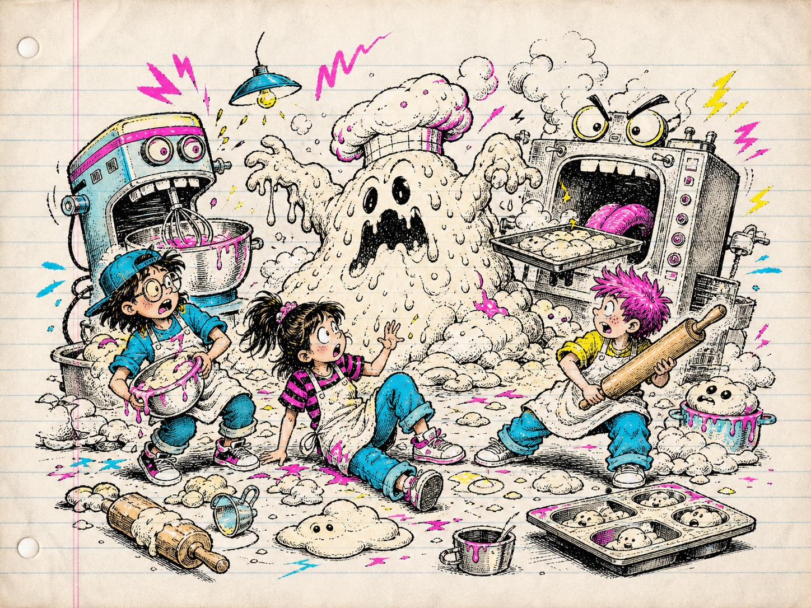

Al regresar a casa, la colla descubre que els Duendes són per totes partes. Nadie cree que existan, ni siquieral mago local. La misión és clara: capturar uno vivo i enseñárselo als adults.

Durante este episodi, Manic Comic deixa de estar disponible i és abre la botiga de chuches.

<figure class="enemy-plate">
  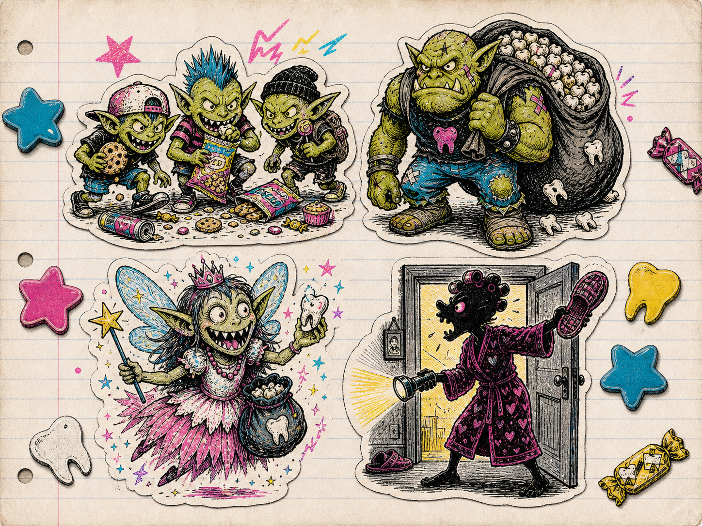
  <figcaption><strong>Enemics visuals:</strong> Duendes ladrones, adults imposibles de derrotar i un Cap de cuento infantil pasado de rosca.</figcaption>
</figure>

## Botiga de llaminadures de l’episodi 3

La botiga Manic Comic ja ha tancat per a la colla, però el quiosc de llaminadures és obert. Tots aquests articles són Rars.

| Article | Tipus | Cost | Efecte |
|---|---|---:|---|
| Còmic usat | Consumible | 10 xapes | Com a acció, llegeix-lo per obtenir +1 Ment. |
| Brossa | Consumible | 2 xapes | Llança-la fins a 6 caselles. Al començament de la ronda següent es converteix en la Tasca Brossa pudent. |
| Caramels solts | Consumible | 2 xapes | Elimina 1 Conseqüència. |
| Bicicleta BMX | Objecte | 15 xapes | Com a acció, supera una prova de Molar per moure sense gastar Ànim. |
| Patins | Objecte | 15 xapes | +2 caselles de Moviment. |
| CD pirata de Korn | Objecte | 10 xapes | Ignora el primer punt de dany patit en cada aventura. |
| Inhalador | Consumible | 5 xapes | Com a acció, elimina 1 Conseqüència. |
| Dinosaure de joguina | Objecte | 12 xapes | Repeteix una prova de Molar per ronda. |
| Regle | Objecte | 1 xapa | Permet mesurar abans d’actuar i afegeix 1 casella a l’abast d’armes Llancívoles i A distància. |
| Disfressa d’animal | Atuendo | 11 xapes | Defensa 1. Els Dolents amb la paraula clau Animal ignoren el portador fins que aquest els ataqui. |
| Sella de muntar | Objecte | 4 xapes | Si trobes un cavall, pots muntar-lo. |
| Ulleres | Objecte | 8 xapes | +3 als atacs a distància. |
| Guitarra | Arma | 15 xapes | Molar, Dany 2; el portador obté +1 Molar. |
| Monopatí | Arma | 16 xapes | Molar, Dany 2. Amb una prova de Molar, mou 3 caselles addicionals en línia ortogonal; si falla, pateix 1 Conseqüència. |
| Rata morta | Objecte | 2 xapes | Un Dolent ha de superar una prova DR12 per atacar el portador, tret que sigui un Gat. |
| Drogues trobades | Consumible | 6 xapes | Tira 1D6; amb 2+, augmenta un atribut a l’atzar en 1. |
| Dards de jardí | Arma | 8 xapes | Cos, Llancívola 3 caselles, Dany 2; ignora Defensa. |
| Revista trobada entre arbustos | Objecte | 7 xapes | +1 Molar, +1 Cos i −1 Ment. |

La Guitarra i el Monopatí són Prohibits. Només es poden comprar entregant a canvi un article procedent de Manic Comic.

## Aventura 10 — Saqueadores del frigorífic perdido

Els Duendes ayudan al Ratoncito Pérez a recoger dientes. Para preparar una trampa, la colla necesita chuches suficientes per a pudrirse els suyos.

### Objectiu i recompensa

Roba comida del frigorífic i escapa. Cada pieza recuperada concede 3 xapes.

### Preparació

Coloca un frigorífic en el centre i despliega als menuts en els seus Spawns. Al comienzo de cada ronda apareixen dos Duendes per colla.

<figure class="gameboy-map">
  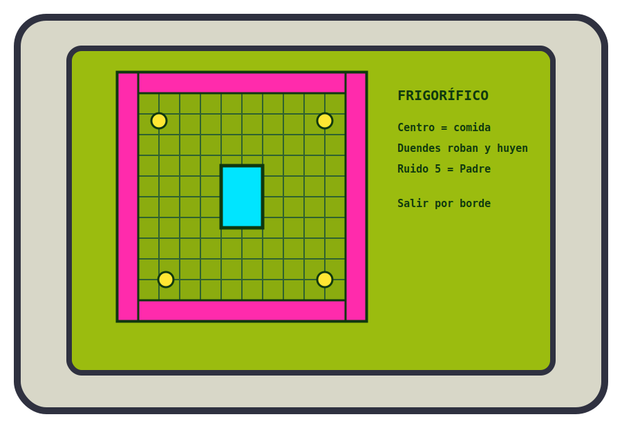
  <figcaption><strong>Desplegament suggerit:</strong> tauler aproximado de <strong>12 × 9 caselles</strong>; el frigorífic és en el centre. Cada robo sube el <strong>Ruido</strong>; al llegar a 5 apareix un Padre per un vora aleatori.</figcaption>
</figure>

Cada vegada que un menut o Duende robe comida, aumental **Ruido** en 1. Al llegar a 5, apareix un Padre en un Spawn aleatori. Quan un menut derrote a un Duende, pot superar una prova de Cor per a reducir el Ruido en 1.

La partida acaba quan tots els menuts han abandonado el tauler.

### Duendes i padres

> **Duende:** Salut 4 · Molar 7 · Garras 2 · Defensa 0. En aquesta aventura intenta robar comida i huir per el Spawn més cercano.  
> **Padre:** no té perfil i no pot ser derrotado. Al quedar adjacent a un menut, este supera una prova de Cos o és capturado. Después, el Padre és mou la mitad de 1D6 caselles hacial Spawn més cercano. Un impacto fa que suelte al menut, que sufre 1 Conseqüència.

## Aventura 11 — Quien parte i reparte

Con la comida robada i una pila de dientes de leche en el fort, la trampa és casi lista. Els Duendes llegan per a llevárselo todo.

### Objectiu i recompensa

Defiendel fort durante nueve rondas i captura un Duende. La captura concede 5 PX i la Habilitat Hablar amb duendes a un menut. Quan un Duende llega a 0 de Salut, un menut adjacent pot superar una prova de Molar per a capturarlo.

### Preparació

Coloca un fort de 4 × 4 caselles en el centre. Todos els menuts empiezan dins. En cada ronda apareixen cuatro Duendes per colla en Spawns aleatorios. En la ronda 4 apareix además un Matón.

<figure class="gameboy-map">
  
  <figcaption><strong>Desplegament suggerit:</strong> fort de <strong>4 × 4 caselles</strong> en el centre. Els Duendes entran per bandas de Spawn; si seis alcanzan la pila de dientes, la colla perd.</figcaption>
</figure>

Els Duendes avanzan cap a la pila de dientes del centre i solo és desvían per a defenderse. Si seis entran en el fort, la colla perd i ha de repetir l’aventura 10. Si el fort resiste nueve rondas, guanya.

## Aventura 12 — Diente dulce

La colla és dispone a pasar la noche amb el Duende capturado. Pensaba llevarlo a la policía per la mañana, però el Ratoncito Pérez té otros planes.

### Objectiu i recompensa

Derrota al Ratoncito Pérez. Al caer, deixa una Tarjeta corporativa per a cada colla participante.

### Preparació

Monta una casa i col·loca una llit per menut, separadas de forma uniforme. Cada menut comença dormido en una llit. Para activarlo, primero ha de superar una prova de Ment; si falla, perd l’activació.

<figure class="gameboy-map">
  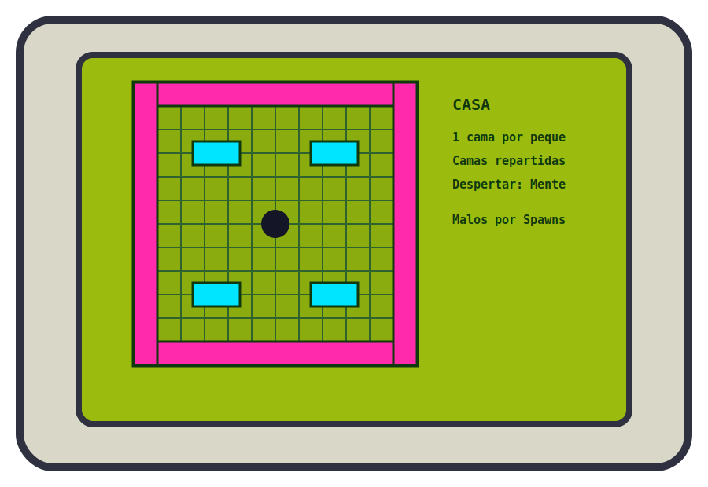
  <figcaption><strong>Desplegament suggerit:</strong> reparte les llits perquè despertar a la colla cueste tiempo; els Spawns rodean la casa i el Cap presiona des de dins.</figcaption>
</figure>

En solitario, el Ratoncito Pérez no rep ayuda de Duendes. La partida acaba al derrotar a tots els Dolents.

### Ratoncito Pérez

> **Salut:** 20 · **Molar:** 7 · **Defensa:** 3  
> **Paraules clau:** Adulto, Cap.

En vegada del comportamiento normal, tira 1D4 al activarlo:

1. Se mou fins a 3 caselles cap a un menut dormido. Si acaba adjacent, le arranca un diente: el menut sufre 2 Conseqüències i és despierta.
2. Convierte al menut més cercano en rana durante una ronda.
3. Come caramelos i recupera 1 de Salut.
4. Se mou la mitad de 2D6 caselles, arrodonint cap amunt, en una direcció aleatòria i duerme al menut més cercano.

## Eventos aleatorios del episodi 3

| D20 | Evento |
|---:|---|
| 1 | ¡El suelo és lava! Cada menut ha de acabar sobre un mueble o al costat a terreny; de lo contrario sufre 1 Conseqüència per ronda. |
| 2 | Encuentras un recuerdo de la Última Guerra: obtén un arma aleatòria de esa época, però sense munición. |
| 3 | Un menut resbala amb una piel de plátano i sufre 1 Conseqüència. |
| 4 | Aparece un Matón callejero: el novio pringado de el teu hermana. |
| 5 | Hay diminutos inquilinos viviendo en les paredes. No ocurre nada visible, però vigila els teus cosas. |
| 6 | Alguien escribe en la pared. Aparece un Padre furioso. |
| 7 | Una puerta dimensional muestral vacío estelar. La insignificancia cósmica reduce l’Ànim en 2. |
| 8 | Un maestro ninja llega per a vengar el seu dojo. Coloca un Cerdito Furtivo en un Spawn. |
| 9 | Encuentras una caja amb forma de cor. Abrirla queda a vuestra peligrosísima discreción. |
| 10 | Calcetines apestosos atraen a un Duende ladrón. Un menut obté la Conseqüència Agotado. |
| 11 | Cinco juguetes intentan escapar. Coloca cinco marcadores separados menys de 4 caselles; cada uno requiere una prova de Ment per a capturarlo. Si queda alguno al acabar, és perd un objecte al azar. |
| 12 | Larry, el amigo imaginario, duerme bajo la llit. Pierde 1 Molar per a retirar un Dolent que no sea Cap. |
| 13 | PAT libera 1D6 Ratas Gigantes de les alcantarillas. |
| 14 | La niñera és muerta. Coloca una Tasca Desastre grande que ha de ocultarse abans del final. |
| 15 | Un menut juega amb el Microondas Super Size: +1 Cos, però tots els seus atuells quedan destruidos. |
| 16 | Aparece un Padre e intenta mandar a todo el mundo a la llit. |
| 17 | Bobby Generic transforma en Electrodoméstico animado al primer menut que mueva durante la próxima ronda. Recupera el seu forma al acabar l’aventura. |
| 18 | La televisión hipnotiza amb anuncios de juguetes. Todos superan una prova de Ment o quedan Atrapados. |
| 19 | Una masa verde concede supersaltos a un menut: com acción pot desplazarse 6 caselles en línea ortogonal. |
| 20 | És lunes. Aparece un Gran Gato Satánico en un Spawn aleatori. |

## Final del episodi 3

Cada colla tira una vegada en la tabla de botí. Quien derrotó al Ratoncito Pérez obté uno de aquests apodos: Goof, Fangtry, Bitsy, Banshee, Ness o Mulch.

| D20 | Botín |
|---:|---|
| 1 | Basura |
| 2 | Caramelos sueltos |
| 3 | Bicicleta BMX |
| 4 | Dinosaurio de juguete |
| 5 | 1D3 xapes |
| 6 | Regla |
| 7 | Rata muerta |
| 8 | Monopatín |
| 9 | 1D6 xapes |
| 10 | Dardos de jardín |
| 11 | Guitarra |
| 12 | Bocata del bueno |
| 13 | Disfraz de animal |
| 14 | Silla de montar |
| 15 | Gafas |
| 16 | 1D10 xapes |
| 17 | Monopatín |
| 18 | 2D6 xapes |
| 19 | 3D6 xapes |
| 20 | Inhalador |

# Episodi 4 — Reino trágico

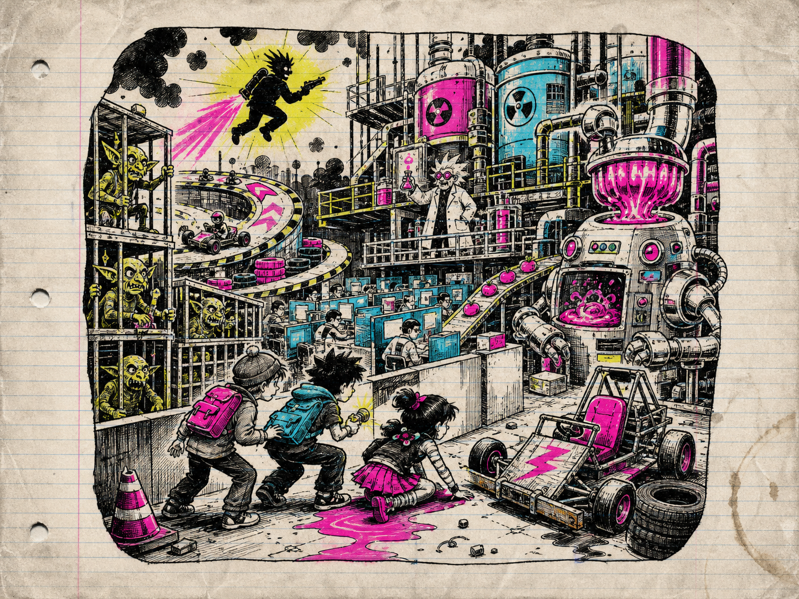

<figure class="enemy-plate">
  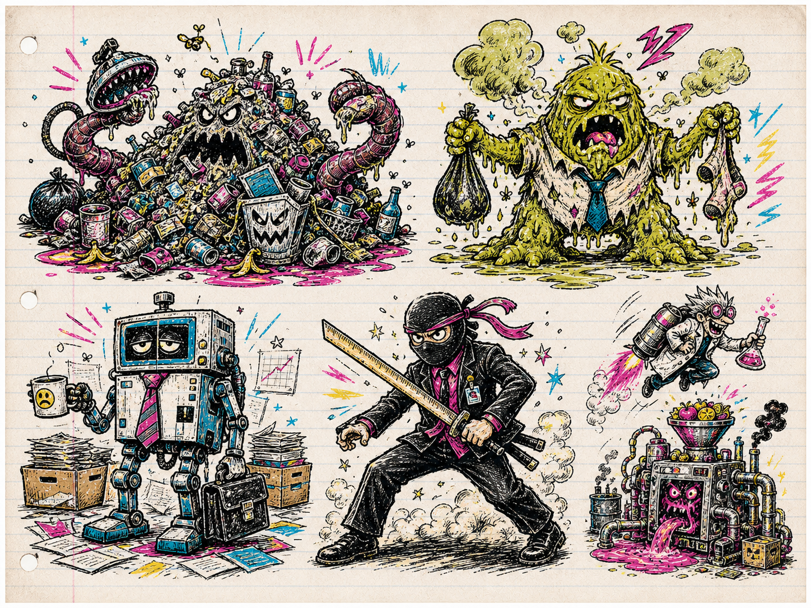
  <figcaption><strong>Enemics visuals:</strong> basura mutante, oficina infernal i ciencia corporativa de saldo. Úsalo com guía de tono per als Dolents de la fàbrica.</figcaption>
</figure>

<figure class="gameboy-map">
  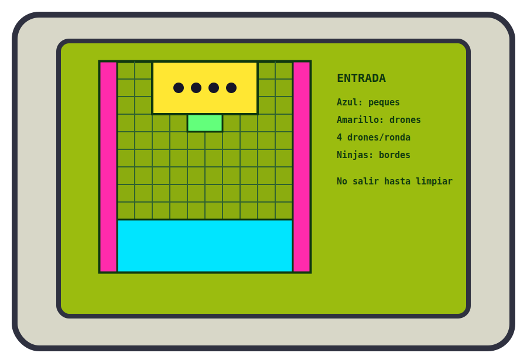
  <figcaption><strong>Entrada de fàbrica:</strong> els menuts empiezan en la zona de desplegament, els Drones salen per la entrada i els Ninjas apareixen des de vores aleatorios.</figcaption>
</figure>

<figure class="gameboy-map">
  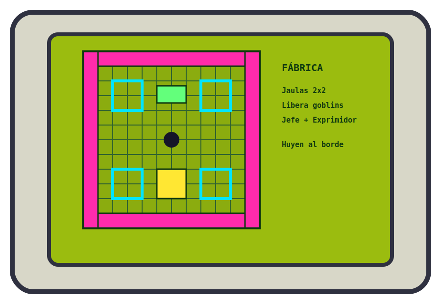
  <figcaption><strong>Desplegament suggerit:</strong> reparte gàbies 2 × 2 per la fàbrica, col·loca al Cap i al Exprimidor cerca del centre i deixa rutas claras cap a els Spawns.</figcaption>
</figure>

Episodi 4 Reino trágico

Con el Ratoncito Pérez derrotado els teus menuts aprenden els derrotados els teus menuts aprenden la terrible verdad. La terrible verdad dels Goblins. Els Goblins solo trabajaron per a ella per a el seu protección de TEBC inc, protección de TEBC inc, els fabricantes de Goblin Juice. els creadores de Goblin Juice.

Resulta que no és sólo un ¡Resulta que no és sólo un nombre tonto! Bueno, ¡és hora d’un nombre tonto! Bueno, és hora de llevárselo al hombre i salvar a esos pobres Goblins. Salva a esos pobres duendes.

## Catàleg corporatiu de TBEC Inc.

Tots els articles són Prohibits. Només una colla amb Targeta corporativa pot comprar-los. Servei excel·lent, sinergies garantides i beneficis trimestrals obscenament bons.

| Article | Tipus | Cost | Efecte |
|---|---|---:|---|
| Cartutx de *Patis i Portals* | Objecte | 50 xapes | Supera automàticament la primera prova de Ment de cada aventura. |
| Pastilla morada | Consumible | 30 xapes | Obtén el Rerefons 101 a més de tots els que ja tinguis. |
| Nou Suc de Follet | Consumible | 10 xapes | Elimina totes les Conseqüències. Qui conegui la terrible veritat perd 1 Ment. |
| Braç trepant | Arma | 20 xapes | Cos, Dany 3; ignora Defensa d’armadura. |
| Matatán shuriken | Arma | 15 xapes | Molar, Dany 2, Llancívola 3 caselles; guanya automàticament les partides de pogs. |
| Fàser làser | Arma | 40 xapes | Molar, Dany 3, A distància 6 caselles; pot disparar a través de terreny. Les miniatures continuen bloquejant la línia de visió. |
| Cap de robot | Atuendo | 15 xapes | Defensa 2. Pot combinar-se amb un altre atuell i suma la seva Defensa. |

## Aventura 13 — Basura de titanes

13. basura dels titanes Habiendo lidiado amb el malvado señor dels Goblins, et ruegan que els escuches i els ayudes en el seu difícil situación. Resulta que el Hada dels Dientes estaba trabajando en connivencia amb TBEC Inc. El trato era simple: venderían Goblin Juice als menuts, les pudrirían els dientes i ella els recolectaría per a els seus tortuosos propósitos. El verdadero horror…..
Goblin Juice són personas... Espera, ¡nos referimos a Goblins! Para salvarlos, primero tendrás que coger un Goblin Juice Van i robarlo per a colarte en la fàbrica de TBEC Inc. Así que et vas al basurero per a construir el teu propio auto loco.

### Objectiu

Recoger piezas per a construir un kart. Necesitas 6 partes per palo.

i aquesta aventura és pot volver a jugar fins que ambos clubes tinguin 6 partes.

### Recompensa

¡Puedes participar en el minijuego Go Kart Race!

### Desplegament

del jugador 2 Spawn de Dolents 4-6 Desplegament del jugador 1 Spawn de Dolents 1-3 9 caselles 12 caselles

### Preparació i tresor

Els jugadors és turnan per a colocar 12 pilas de basura. Cada pila ha de estar al menys a 1 casella de otra i fuera de les áreas de desplegament dels jugadors.

### Desplegament

El jugador més joven trial àrea de desplegament. Els jugadors és turnan per a colocar a un menut en el seu desplegament.

### Juego en solitario

Igual que a continuación.

### Dolents

Vea els montones de basura a continuación.

Conseqüències i clima Tira la tabla de Conseqüències i clima en la sección correspondiente.

Montones de basura Un menut que és encuentre a 1 casella d’un montón de basura pot buscarlo rodando sobre aquesta taula.

1. Parte del kart
2. Generar basura consciente
3. Genera un apestoso
4. Botín aleatori. Sentient Garbage **Salut:** 6 Molar: - Restos:2 Defensa:0 Especial: si un menut deixa caer un objecte o arma a 1 casella d’un Sentient Garbage, ese objecte és perd per a siempre.

### Fin de la partida

El joc acaba quan és buscan tots els montones de basura i és trata als malos.

Apestosos **Salut:** 8 Frío:6 Olor:2 Defensa:1 Especial:Els Apestosos huelen tan mal que qualsevol menut que és encuentre a 1 casella al inicio de la Ronda té que realizar una prova de Frío. Además, els Apestosos no tiran per a impactar. Su olor golpea automàticament i causa dany.

El dany d’un Stinker ignora els atuells.

## Aventura 14 — Ridge Racer

Perseguir furgonetas és Molar i todo eso, però ahora que has realizado els teus increíbles viajes necesitas probarlas.

¡És hora de correr!

A lo largo de 3 carreras, mejorarás el teu auto i competirás contra otros clubes per a demostrar quién té les ruedas més rápidas. Alternativamente, morirás en una bola de madera en llamas i ruedas de patineta.

### Objectiu

Ganal Trofeo Ridge Racer ganando 2 de 3 carreras i sobreviviendo.

Els autos comencen amb 30 corazones, armadura 0, velocidad 1.

Els coches tenen espacio per a 4 menuts. Cada uno dels siguientes roles ha de asignarse a un menut, i un menut solo pot tener un rol. Un conductor intenta girar el volante, un guardafrenos intenta reducir la velocidad del coche si és necesario, un empujador intenta mantener el coche en marcha. Cualquier otro menut pot ayudar amb qualsevol de aquestes tareas, realizar otras acciones o simplemente aguantar per el seu vida.

Configuración La carrera és desarrolla en una taula tan larga com puedas aconseguir. Podría ser una colina cubierta de hierba, un tramo de carretera o una plaza de mercado.

En un extremo de la taula col·loca els teus autos. En el otro extremo, marque una línea de meta. El primer coche cruza Living Quarter a una milla

la línea de meta guanya. Si tots els coches són destruidos abans de llegar a la línea de meta, guanyal coche que terminó més cerca de la línea de meta.

Els jugadors colocan terreny en la pista de carreras.

Cómo jugar als daus de velocidad Cada coche comença la carrera a velocidad 1.

La velocidad és refiere a cuántos daus estás tirando per a determinar moviment, dany, etc. La cantidad de daus de velocidad aumenta a medida que el auto acelera o disminuye a medida que disminuye la velocidad.

Els daus de velocidad són els siguientes: Velocidad 0 = estacionario Velocidad 1 = D6 Velocidad 2 = 2D6 Velocidad 3 = 3D6 Velocidad 4 = 4D6 Velocidad 5+ = Explota, tots a bordo reben 2D6 de dany.

Fases

1. Determinar la iniciativa.
2. Establezca la velocidad.
3. Moviment.
4. Resolver colisiones.
5. Combat.
1. Determinar la iniciativa és determina de la manera habitual.
2. Establece la velocidad empezando per el jugador que té la iniciativa. Els jugadors poden optar per aumentar el seu Velocidad en 1 o disminuirla en 1, agregando o eliminando Dados de Velocidad según sea necesario. Aumente la velocidad en 1 per cada menut que ayude al empujador. Cualquier menut que ayude al empujador.

No puedo fer nada més en ese turno.

3. Moviment Comenzando per el jugador que té la iniciativa, els jugadors primero declaran si pretenden realizar un turno en aquesta Ronda. Luego els jugadors tiran els seus Dados de Velocidad i esto determina qué tan lejos han de moverse en aquesta Ronda. Antes de rodar, els jugadors también anuncian si girarán com parte de el seu moviment.
Si obtenen un 1, és mouen 1 casella, però reducen el seu Velocidad en 1.

Si sacan el máximo que poden tirar, un 6 en un D6 o un 12 en 2D6, i así sucesivamente, és mouen esa distància i luego aumentan el seu Velocidad en 1.

3.1. Frenado Siempre que un menut actúe com guardafrenos, pot optar per aplicar els frenos. Tira un D6 i resta esa cantidad del moviment.

Si el moviment és negativo, el coche és detiene bruscamente i vuelca. Haz una prova de Molar per a cada menut en el auto, DR12. En caso de falla, el modelo sufre D8 de dany.

Colocal coche boca avall en el seu punt final amb els menuts al lado.

3.2. Giro Com parte del moviment, un jugador pot realizar un giro de fins a 90° de el seu automóvil una vegada per turno, declarando el seu intención abans de tirar el Dado de Velocidad. Aquest giro és fa al final de la distància de moviment. Realizar qualsevol giro reduce la velocidad del automóvil en 1 una vegada completado el giro.

Sin embargo, si un jugador anuncia que va a girar i luego tiral máximo de els seus daus, ¡el seu coche ha volcado! El auto todavía recorre la distància i fa el giro deseado.

Si un coche vuelca, el seu velocidad és reduce a 0. En la siguiente fase de combate, un menut pot realizar una prova corporal, DR12, per a girar el coche.

La DR per a aquesta prova és reduce en -3, per cada menut amigable que és encuentre a 1 casella del auto. No agregue els modificadores dels menuts a aquesta prova.

4. Resolver colisiones Si dos autos chocan entre sí com parte de el seu moviment, cada auto tira els seus daus de velocidad i aplical resultat al auto de el seu oponente com dany.
Por ejemplo, el coche del Breakfast colla, Basket Case, choca amb el coche de les Riot Girls, el Bratmobile.

Basket Case té una Velocidad de 2 i el Bratmobile té una Velocidad de 1.

Tiran 2D6 i 1D6 respectivamente (els seus respectivos Dados de Velocidad) i aplican el dany de cada tirada al otro coche.

El Breakfast colla saca un 4 en el D6 i el Bratmobile rep esa cantidad de dany, mentre que Riot Girls saca un 1 i Basket Case solo rep 1 dany.

Si un coche choca amb un terreny, tira els seus propios daus de velocidad i tomal resultat com dany a sí mismo. Si un coche golpea a un menut o a un enemic, aplica els seus daus de velocidad com dany al modelo. Quan un automóvil choca contra un objecte u otro automóvil, el seu velocidad és reduce en 1 després del

Se resuelve la colisión. Els automóviles giran 90° en direcció opuesta al objecte que choca.

5. Combat Els menuts que no conducen ni empujan el coche poden atacar a otros coches. Se considera que tots els menuts en un automóvil són difíciles de atropellar i tenen -3 per atropellar. El combate és resuelve amb normalidad. Els menuts poden elegir apuntar al auto o als menuts del otro colla. Si alguna vegada és retiral empujador per algún motivo, otro menut ha de hacerse cargo del papel. Si és quital conductor, el automóvil no és pot girar fins que un menut és convierta en el nuevo conductor.
Si és quital guardafrenos, el coche ja no podrá frenar fins que un menut és convierta en el nuevo guardafrenos.

### Recompensa

Por ganar una carrera, La colla rep 2D6 xapes vacías i cada perdedor D6 xapes vacías.

Les colles que participan en una carrera también guanyen 5XP per el primer lugar i 3XP per el segundo.

Repara el teu coche Puedes reparar el teu coche 4D6 Hearts entre carreras.

Mejoras Puedes, entre carreras, comprar les siguientes mejoras per a el teu coche.

Les actualizaciones és poden acumular.

Púas: 10 xapes Hay púas desagradables colocadas en la parte delantera del coche. Les colisiones amb otros coches causan un dany D6 adicional.

Marco blindado - 10 xapes Se fijan láminas de plástico, tapas i otros materiales als costados del automóvil. El moviment és reduce en 1 fins a un mínimo de 1, el coche reduce todo el dany recibido en 1.

Almohadas laterales - 5 xapes Les almohadas suaves són atadas al automóvil. Quan el coche vuelca, els menuts no sufren danys.

Impresionantes pegatinas: 5 xapes Se pegan todo tipus de pegatinas geniales per todo el coche per a mostrar a quién pertenece. El moviment aumenta en 1, però reduce la salud general en D6 Corazones.

Turbo Boosters - 20 xapes Se instala un complicado paquete de cohetes impulsores. Una vegada per carrera, el conductor pot disparar els cohetes, otorgando al auto un impulso único de 3D6 en el seu moviment.

Maniquí de prova de choque - 15 xapes Un muñeco de prova de choque és apoyado en el asiento del conductor, no pot girar però pot mantener el auto en línea recta. No és necesario designar un conductor, però ja no pot girar a menys que un menut pase un turno en el asiento del conductor.

## Aventura 15 — Trabajo de oficina

15.espacio de oficina Después d’una pequeña parada per a correr amb els teus karts, perseguiste la camioneta fins a la fàbrica secreta de TBEC Inc i ahora debes entrar i liberar als Goblins que són atrapados aquí.

Però entrar no és tarea fácil.

### Objectiu

Entra en el almacén i derrota als ninjas i drones corporativos.

### Recompensa

Cada menut que derrote a un Ninja pot llevarse una Katana gratis.

Configuración i tresor Els menuts són tratando de ingresar a la fàbrica, però no poden hacerlo fins que és implemente el jugador de Factory Enterance.

Derrotan oleadas de enemics corporativos. Todos els menuts comencen en el àrea de desplegament del jugador i no poden abandonar la taula fins que no haya ningún tipus malo en la taula.

### Desplegament

Todos els menuts és colocan en el àrea de desplegament del jugador.

### Juego en solitario

Genera 1 menys de cada tipus malo per ronda.

### Dolents

Al comienzo de cada ronda, haz aparecer lo siguiente.

Cada ronda: cuatro drones de oficina en el àrea de entrada de la fàbrica.

Rondas impares: apareixen dos ninjas corporativos en el vora aleatori del tauler.

### Fin de la partida

El joc acaba quan tots els malos són derrotados.

### Paraules clau

Adulto, Robot Especial: Els Drones corporativos tenen 0 Molar, però si uno abandona la taula per no pasar una prova de Molar, apareix otro donde lo dejaron. Porque són infinitos.

drone de oficina Paraules clau: Adulto, Ninja Especial: Els ninjas corporativos és olvidaron de hacerse agujeros per als ojos. Com tal, en lugar de moverse directament cap a els menuts, és mouen en direcciones aleatorias.

Ninja corporativo **Salut:** 5 Molar:0 Stock:2 Defensa contra danys:3 Salut:8 Molar:12 Katana:3 Defensa contra danys:2

## Aventura 16 — Caos en la planta química

16.Caos en la planta química Entraste i descubriste que els Goblins no mentían. Goblin Juice són personas.... Me refiero a Goblins. Bueno, és hora de cerrar esto.

¡Però tendrás que derrotar al Científico Loco i el seu creación!

### Objectiu

Rescatar als Goblins i derrotar al Científico Loco.

### Recompensa

Por cada Goblin rescatado ganas 10xp i 5 xapes.

### Desplegament

del jugador 2 Desplegament del Dolent 4-6 Desplegament del jugador 1 12 caselles

Instale i atesore 5 gàbies de 2 caselles per 2 caselles. Estos contienen els Goblins que necesitan ser rescatados. Coloca 2 duendes en cada gàbia. Para rescatar a un Duende, un menut necesita liberarlo. Quan un menut és a 1 casella de la gàbia, pot realizar una prova mental per a liberar a 1 duende. Ese Duende luego és activa al final de la fase de Dolent i és mou hacial vora de la taula.

Si lo alcanzan són liberados.

### Desplegament

El jugador més joven trial àrea de desplegament.

Els jugadors és turnan per a colocar a un menut en el seu desplegament.

### Juego en solitario

Coloca solo 4 gàbies de duendes.

### Dolents

El Científico Loco i el Exprimidor han de colocarse en una gàbia aleatòria.

### Fin de la partida

El joc acaba quan el científico loco i Juicer són derrotados.

Dr. Stockmann Paraules clau: volar adult, cap especial: quan activas a un científico loco en lugar de realizar acciones normales de tipus malo, tira en aquesta tabla.

### Comportamientos

1. Atac amb pistola de jugo. Apunta al menut més cercano i fa impactos automáticos. Inflige 3 danys.
2. Jet Pack: mou al Dr. Stockmann a una gàbia de duendes aleatòria. Todos els menuts a 2 caselles de el seu ubicación inicial reben 2 danys.
3. Risa Malvada: Todos els menuts dins d’un radi de 6 caselles han de realizar una prova del Pollo.
4. Rellene la pistola de jugo. Se mou al Goblin més cercano i lo eliminan de la taula.
**Salut:** 25 Molar:13 Defensa:3 Salut:35 Molar:12 Jugo 3 Dany Defensa:2 Exprimidor Paraules clau: Robot Especial: Jugo Se mou tira 2D6, divideix entre 2 i arrodoneix cap amunt (caselles) hacial Duende més cercano. Si no quedan duendes, intenta exprimir als menuts. Si a 1 casella del Goblin quan és activa, automàticament els exprime, retire el Goblin.

Entrega una xapa de jugo Goblin.

## Final del nivel 4

Nivel 4 Eventos aleatorios

1. Un exprimidor no funciona correctamente, parece que el seu chip de agua ha dejado de funcionar. Si pot encontrar un nuevo chip de agua i devolverlo dins dels 150 dies, és seguro de que obtendrá una buena recompensa.
2. ¡Alguien pidió una comida en Mondo Burgers i la dejó sense vigilancia! Els menuts poden robar la hamburguesa. Se pot comer una Mondo Burger per a curar 1 conseqüència.
3. Encuentras un tubo de morfina, ¡úsalo per adquirir les habilidades legendarias del Power Ranger!
Un menut adquiere experiencia Ninja.

4. Sentient Goo és haciendo estragos i dando vueltas.
Si pots derrotar al Goo, obtendrás un tubo de moco (o Goo). Goo **Salut:** 8 Molar: -, Sustancia pegajosa 4 Defensa:

6. Especial, qualsevol objecte usado sobre la sustancia viscosa és empapa.
5. Descubres la cabeza d’un enorme robot de hierro en uno dels trasteros. Se ve muy triste i sientes una tristeza desgarradora al mirarlo. Un menut adquiere la habilidad Entristecido.
6. Uno dels menuts presiona un botón i és abre una puerta oculta. ¡Has encontrado el laboratorio secreto de Dexter! Dexter no és muy contento de verte i et echa, però no abans de que logres robar un gobernante de el seu escritorio.
7. Una máquina de embalaje parece haberse vuelto un poco loca, sigue escupiendo cajas de envío amb la etiqueta Black Mesa RF.
Abres uno i descubres que és lleno de palancas. ¿Quién diablos necesita una palanca en un centre de investigación? Gana 1 arma de palanca.

8. ¡Parece que la Compañía de Energía Eléctrica hizo un mal trabajo perquè acaban de cortar la energía! Cambie el clima a la noche.
Si ja era de noche entonces no et das cuenta del percance.

9. Metes la nariz donde no corresponde i encuentras el Guyver i una tostadora vieja.
La tostadora és rota, però pots conservarla si quieres; obtén el elemento Papelera. El Guyver és une a un menut al azar. Ese menut obté el traje Guyver (Armadura: 3, Especial: nunca és pot quitar, no és pot combinar amb ningún otro traje).

10. ¡Alguien ha de haber olvidado cerrar les gàbies perquè els sujetos de prova ahora són per totes partes! Añade D6 gatos sarnosos al tauler.
11. Un ratón blanco amb aspecto loco murmura algo acerca de conquistar el mundo abans.

deambulando. Els menuts descubren els seus notas sobre P vs NP. Si poden demostrar que P = NP, guanyen 1.000.000 de xapes vacías.

12. ¡Mainframe ha detectado que lo més probable és que seas un virus informático!
Els Guardianes vienen a eliminarte. Todos els robots en el tauler recuperan el seu salud completa quan els Guardianes els reinician per a eliminarte.

13. Una de les pizarras parece detallar un plan per a una toma hostil de Laboratorios Magnascópicos. Els menuts poden borrarlo, frustrando el nefasto plan, o poden cambiarlo per a convertirse en els nuevos propietarios de la empresa. Si lo cambian, els menuts poden derrotar automàticament a un enemic que no sea un cap en aquesta aventura.
Si és convierten en propietarios de la empresa, ganarán 2D6 xapes ahora, però luego deberán pagar 2D6 xapes després de la próxima aventura en impuestos corporativos.

14. Descubres que la empresa ha estado colocando els microprocesadores X1000 de GloboTech en electrodomésticos. ¡Eso explica muchas cosas! Te das cuenta de que sense darte cuenta has activado algunos de ellos i vienen per ti. Coloque els electrodomésticos animados D6 en el tauler.
15. Notas que baja mucha agua per les escaleras, ¡com mucha! Resulta que el director ejecutivo vuelve a navegar en el interior. Cambie el clima a lluvia intensa.
16. Pasa un robot grande, redondo i torpe, dejando caer huevos detrás de él. ¡Coges un huevo i et das cuenta de que és hecho de chocolate! Puedes comer el huevo per a curar 1 conseqüència.
17. Un grupo de androides NDR és ocupado trabajando en algún tipus de ensamblaje, parecen completamente ajenos a qualsevol otra cosa que no sea la máquina que són construyendo.
Si tens cuidado i pasas una prova de Molar, pots robarle un artículo Walkman a uno de ellos. Si fallas, els androides et notarán. Coloca un Hombre Máquina Melancólico en el tauler.

18. La colla ve a Michael Jordan saltando sobre plataformas i golpeando zombis.
És Molar, però abans de que puedas aconseguir el seu autógrafo, desaparece a través d’un portal. Però lograste atrapar una de els seus pelotas de baloncesto.

Gana arma de baloncesto.

Baloncesto (Cos, Etiquetas, devolución al remitente, Dany 2)

19. Una colla aleatori encuentra suficientes fichas de arcade per a canjearlas per un artículo de qualsevol botiga.
20. Aparece un pequeño robot amb un pico enorme llamado Razer i ataca a un enemic causándole 1D10 de dany.

## Créditos del episodi 4

Créditos del episodi 4 Cada vegada que termines un episodi jugando totes les aventures d’un episodi, podrás fer les siguientes cosas.

1. Tira en la tabla de botí del episodi.
2. Por La colla que derrotó al cap [dio el último golpe] Por derrotar al cap de la máquina exprimidora Apodo:
1. chico rojo
2. Alfa Prime
3. bombardeo
4. Friki
5. Chuletón
6. Media pinta Por derrotar a Stockmann, el científico loco. Apodo del cap: 1. Megacerebro.
2. Robonik
3. El cerebro
4. professor
5. tripa de gato
6. Van Él cantará

## Botín del episodi 4

| D100 | Resultado |
|---:|---|
| 11 | Lata de espinacas |
| 12 | Sándwich sabroso |
| 13 | salmonete |
| 14 | Chubasquero amarillo |
| 15 | globo |
| 16 | xapes 1D10 |
| 17 | Necronomicón |
| 18 | xapes 2D6 |
| 19 | xapes 3D6 |
| 20 | Drogas encontradas mirando fijamente Dron de oficina: Ninja corporativo: Dr. StockMann: Exprimidor: Keanu Reeves Kate Winslet Nicolas Cage Gary Oldman Laboratorios de textura de gráficos adicionales Pixaby Alejandro Winberg Laboratorios Vassago Will Rahman-Daultrey Cor Rahman-Daultrey Ada Rahman-Daultrey |

# Campanya i progrés

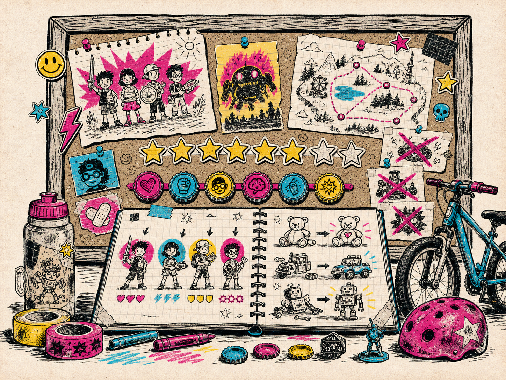

## Després de cada aventura

La colla torna al seu cau, buida les butxaques i comprova quins tresors ha trobat: pedres brillants, xapes, ampolles buides, monedes i altres meravelles incalculables. Després segueix aquesta seqüència.

### 1. Ajustar l’Ànim

- Si heu completat l’aventura, tireu 1D6; amb 4+, guanyeu 1 Ànim.
- Si heu fracassat, perdeu 1 Ànim.
- Si heu derrotat un Cap, guanyeu 1 Ànim.
- Si dos o més menuts han fugit a casa, perdeu 1 Ànim.
- Apliqueu qualsevol canvi indicat a la Recompensa de l’aventura.

### 2. Guanyar experiència

Obtén 1 PX per cadascuna d’aquestes coses que hagi passat:

- La colla ha derrotat almenys un Dolent.
- Un menut ha arribat a 0 de Salut i ha fugit a casa.
- S’ha eliminat almenys una Conseqüència.

### 3. Completar la colla

Si queden menys de quatre integrants, recluta menuts nous fins a tornar a tenir-ne exactament quatre.

### 4. Comprar i ordenar l’equip

Visita qualsevol botiga que estigui oberta. Després pots repartir els objectes entre els integrants de la colla.

### 5. Intercanviar

Pots comerciar amb altres colles. Un cop tancat el tracte, no hi ha devolucions ni ploriquejos.

### 6. Comprovar la victòria

L’aventura es guanya en completar el seu Objectiu. Si la colla fracassa, un menut a l’atzar obté una Conseqüència.

### 7. Fer Tasques per guanyar xapes

Si almenys un menut no ha fugit a casa, la colla pot triar una Tasca. Paga el seu cost d’Ànim i rep la recompensa.

| Compromís | Tasca | Recompensa |
|---|---|---|
| Senzilla, −1 Ànim | Fer el llit | 1 objecte aleatori i 1 xapa. |
| Senzilla, −1 Ànim | Treure les escombraries | 1D6 xapes. |
| Senzilla, −1 Ànim | Ordenar l’habitació | 1 arma aleatòria i 1 xapa. |
| Senzilla, −1 Ànim | Fregar els plats | 1D6 xapes i un entrepà dels bons. |
| Tota la tarda, −2 Ànim | Portar-se bé | 2D6 xapes. |
| Tota la tarda, −2 Ànim | Netejar els vàters | 2D6 xapes i 1 arma aleatòria. |
| Tota la tarda, −2 Ànim | Recollir pomes | 1 poma i 2D6 xapes. |
| Tota la tarda, −2 Ànim | Ajudar la mare a ordenar | Un menut a l’atzar obté +1 Molar i la colla guanya 1D6 xapes. |
| Curro descomunal, −3 Ànim | Pintar el cobert | 6D6 xapes. |
| Curro descomunal, −3 Ànim | Derrotar un porc senglar | Un menut a l’atzar obté +1 Cos i la colla guanya 2D6 xapes. |
| Curro descomunal, −3 Ànim | Fer-se amic del veí | Substitueix un integrant per un menut nou i tria el seu Rerefons. |
| Curro descomunal, −3 Ànim | Colonitzar la Lluna | Un Fàser làser gratis. |
| Curro descomunal, −3 Ànim | Llegir *Moby Dick* | Un menut a l’atzar perd 1 Molar i la colla guanya 3D6 xapes. |

Un Curro descomunal també fa que tots els menuts comencin la pròxima aventura amb 1 Conseqüència aleatòria, però concedeix 1D6 PX.

### 8. Limitar l’Ànim

Si l’Ànim supera 8, redueix-lo a 8 abans de començar la següent aventura.

# Annexos i taules D100

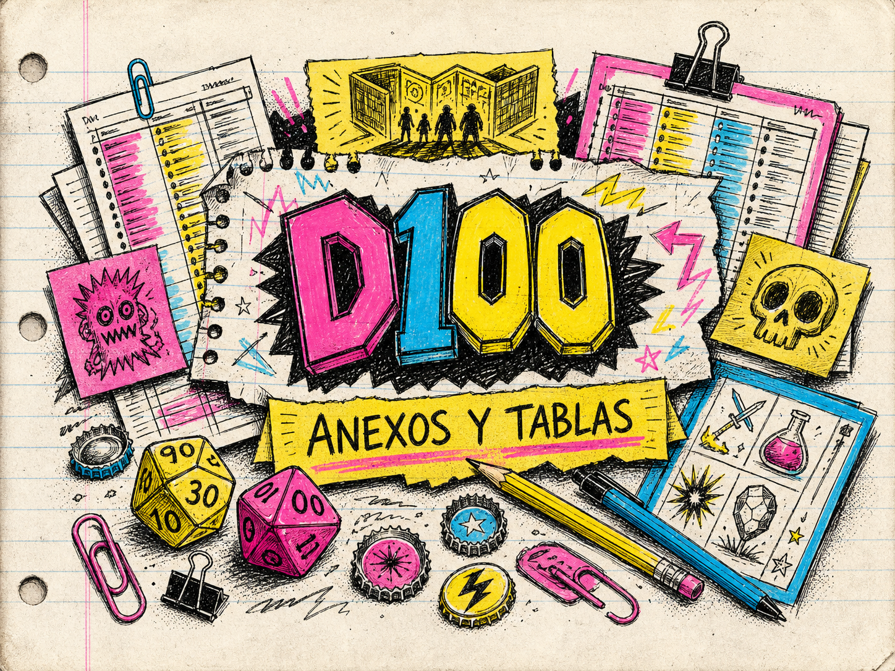

## Objectes comuns

| D100 | Resultado | D100 | Resultado |
|---:|--- | ---:|---|
| 1 | -2 1Up Cosas 40 General Botiga | 17 | -18 Globo Consumible 37 General Botiga |
| 3 | -4 Un realmente Molar palo Arma 39 General Botiga - | 19 | -20 Arma de béisbol 39 General Botiga |
| 5 | -6 Cómics usados 40 General Botiga | 21 | -22 Arma de murciélago 39 General Botiga |
| 7 | -8 Un arma de roca impresionante 39 General Botiga - | 23 | -24 Casco de bicicleta Cosas 40 General Botiga |
| 9 | -10 Disfraces de animales 40 General Botiga | 25 | -26 Arma de arco 39 General Botiga |
| 11 | -12 Consumibles Apple 37 General Botiga | 27 | -28 Cosas de calculadora 40 General Botiga |
| 13 | -14 Suministros de arte Consumibles 37 General Botiga | 29 | -30 Lata de espinacas Consumible 37 General Botiga |
| 15 | -16 Cosas de mochila 40 General Botiga | 31 | -32 Robot de cartón disfraz Equip 38 General Botiga Artículos comuns és le dice que tire per a obtener un elemento aleatori o com referencia sobre dónde encontrar articles en este libro. |

## Objectes poc comuns

| D100 | Resultado | D100 | Resultado |
|---:|--- | ---:|---|
| 33 | -34 Cartón escudo Consumible 37 General Botiga | 55 | -56 Arma de fútbol 39 General Botiga |
| 35 | -36 Cartón espada Arma 39 General Botiga | 57 | -58 Arma Frisbee 39 General Botiga |
| 37 | -38 Cosas de billetera amb cadena 40 General Botiga | 59 | -60 Cosas de Gameboi 40 General Botiga |
| 39 | -40 Pulsera amb dijes Cosas 40 General Botiga | 61 | -62 Consumible jugo de duende 37 General Botiga |
| 41 | -42 LocoSexyGenial cinta Cosas 40 Generales Botiga | 63 | -64 Material de la guía 40 General Botiga |
| 43 | -44 Arma de bate de críquet 39 General Botiga | 65 | -66 Hacky Sack Arma 39 General Botiga |
| 45 | -46 Conjunto de coderas 38 General Botiga | 67 | -68 Equip de hockey 38 General Botiga |
| 47 | -48 Riñonera Cosas 40 General Botiga | 69 | -70 Cosas de cometas 40 General Botiga |
| 49 | -50 Caña de pescar Consumible 37 General Botiga | 71 | -72 Conjunto de chaqueta de cuero 38 General Botiga |
| 51 | -52 Cosas de linterna 40 General Botiga | 73 | Poderoso cambio Soldado de energía Espada amb LED Luces Arma 39 General Botiga |
| 53 | -54 espada de espuma Arma 39 General Botiga |  |  |

## Objectes rars

| D100 | Resultado | D100 | Resultado |
|---:|--- | ---:|---|
| 74 | Traje de salmonete 38 General Botiga | 90 | Sándwich sabroso Consumible 37 General Botiga |
| 75 | -76 Arma Nurf Gun 39 General Botiga | 91 | Raqueta de tenis Arma 39 General Botiga |
| 78 | Cosas de cerdo de peluche 40 General Botiga | 92 | Dos latas en un trozo de cuerda Cosas 40 Generales Botiga |
| 79 | Colección Pog Cosas 40 General Botiga | 93 | Cosas del Walkman 40 Generalidades Botiga |
| 80 | Arma Pog Slammer 39 General Botiga | 94 | Arma de globo de agua 39 General Botiga |
| 81 | -82 Material de libros escolares 40 General Botiga | 95 | bien usado joc de taula Cosas 40 Generales Botiga |
| 86 | Un poco decepcionante sándwich Consumible 37 General Botiga | 96 | Consumible Welsh Rarebit 37 General Botiga |
| 87 | Arma tirachinas 39 General Botiga | 97 | Arma espada de madera 39 General Botiga |
| 88 | Arma de lata de aerosol 39 General Botiga | 98 | Traje impermeable amarillo 38 General Botiga |
| 89 | Arma súper empapada 39 General Botiga | 99 | -100 Yoyo Arma 39 General Botiga |

## Objectes molt rars

| D100 | Resultado |
|---:|---|
| 1 | -10 Duende atómico jugo Consumible 81 Maníaco Cómic megatienda |
| 11 | -20 Cosas del libro 82 Maníaco Cómic megatienda |
| 21 | -28 Cosplay Espada Arma 81 Maníaco Cómic megatienda |
| 29 | -37 dragones i demonios Arma 81 Maníaco Cómic megatienda |
| 38 | -48 Consumible Geek Candy 81 Maníaco Cómic megatienda |
| 49 | -56 Número 39 batirman Consumible 81 Maníaco Cómic megatienda |
| 57 | -66 Pog de metal Slammer Arma 81 Maníaco Cómic megatienda |
| 67 | -75 Neón Cortavientos Equip 82 maníaco Cómic megatienda |
| 76 | -84 tortuga ninja Nunchaku Arma 81 Maníaco Cómic megatienda |
| 85 | -90 Sonic 2 Cosas del joc 82 Maníaco Cómic megatienda |
| 91 | -95 Cosas de lonchera Stell 82 Maníaco Cómic megatienda |
| 96 | -99 Traje de superhéroe Traje 82 maníaco Cómic megatienda |
| 100 | atracciones usadas Entrada al parque Cosas 82 Maníaco Cómic megatienda articles poco comuns |

## Objectes prohibits

| D100 | Resultado |
|---:|---|
| 1 | -7 Traje de animal Traje 110 Tuck Shop 11 |
| 8 | -15 Cosas de bicicletas BMX 109 Tuck Shop 15 |
| 16 | -24 Cosas piratas de Korn 109 Tuck Shop 10 |
| 25 | -33 Arma de guitarra 110 Botiga de golosinas 15 |
| 34 | -41 Cosas del inhalador 109 Tuck Shop 5 |
| 42 | -50 Consumible de caramelos sueltos 109 Tuck Shop 2 |
| 51 | -58 Cosas sobre patines en línea 109 Tuck Shop 15 |
| 59 | -66 Cosas de regla 109 Botiga de golosinas 1 |
| 67 | -72 Cosas de silla de montar 110 Tuck Shop 4 |
| 73 | -80 Arma de patineta 110 Tuck Shop 16 |
| 81 | -88 Cosas de gafas 110 Tuck Shop 8 |
| 89 | -94 Cosas de dinosaurios de juguete 109 Botiga de golosinas 12 |
| 95 | -96 Consumible de basura 109 Botiga de golosinas 2 |
| 97 | -100 Consumibles de cómics usados 109 Tuck Shop 10 articles rars |

## Objectes llegendaris

| D100 | Resultado | D100 | Resultado |
|---:|--- | ---:|---|
| 1 | -6 18+ Cosas cómicas 82 Maníaco Cómic megatienda | 57 | -62 Arma Lazer Phaser 124 TBEC INC 40 |
| 7 | -12 28 Cosas de revistas 81 Maníaco Cómic megatienda | 63 | -69 Revista dels arbustos Cosas 110 Botiga de golosinas 7 |
| 13 | -18 Juego infantil cartucho Cosas 124 TBEC INC 50 | 70 | -76 Cosas del Necronomicon 81 Maníaco Cómic megatienda |
| 19 | -24 Rata muerta Cosas 110 Tuck Shop 2 | 66 | ,6 |
| 25 | -30 Arma de brazo perforador 124 TBEC INC 20 | 77 | -83 Nuevo consumible de jugo de duende 124 TBEC INC 10 |
| 31 | -36 Arma Katana falsa 82 Maníaco Cómic megatienda | 84 | Cosas del transportador 82 Maníaco Cómic megatienda |
| 37 | Cosas prohibidas del salmo 81 Maníaco Cómic megatienda | 85 | -90 Pastilla morada Consumible 124 TBEC INC 30 |
| 38 | -44 Medicamentos encontrados Consumibles 110 Tuck Shop 6 | 91 | Conjunto de cabeza de robot 124 TBEC INC 15 |
| 45 | -50 Katana [igual que amunt però lo fa no romper torpeza] Arma - - - | 92 | -97 Arma Shurken Slammer 124 TBEC INC 15 |
| 51 | -56 Arma de dardos de césped 110 Tuck Shop 8 | 98 | -100 Tubo de material exudado 82 Maníaco Cómic megatienda articles prohibidos |

És estiu otra vegada. A ti a els teus amics os esperan largos dies de aventures i travesuras. La infancia és una época de aventures, misterios e imaginació. Aquest estiu será diferente a qualsevol que hayas tenido abans.

Algo sinistre ha llegado a la ciudad i depende de ti de els teus amics resoldre el misteri, derrotar als malos, completar totes els teus tareas rápidamente per a tener més tiempo per a l’aventura i enfrentar una amenaza creciente en el Cor de el teu ciudad. Así que apaga el teu Playstation, enciende la radi hagámoslo.

un joc de miniatures per a menuts grandes i menuts com adults Adventur e Vamos a seguir a n


## Prompts per a mapes imprimibles

Aquests prompts estan preparats per generar l’art base dels mapes bitmap imprimibles. Mantenen una vista zenital estricta i una estètica norantera compatible amb la resta del document.

> Recomanació de sortida: format quadrat, alta resolució, sense perspectiva, sense personatges, sense text integrat i **sense quadrícula dibuixada per la IA**. La quadrícula final de **12 × 12 caselles** s’ha de superposar després de manera tècnica per evitar línies dobles o caselles repetides.

### 1. El Veïnat

**Fitxer suggerit:** `maps/printable/el-vecindario-12x12.png`

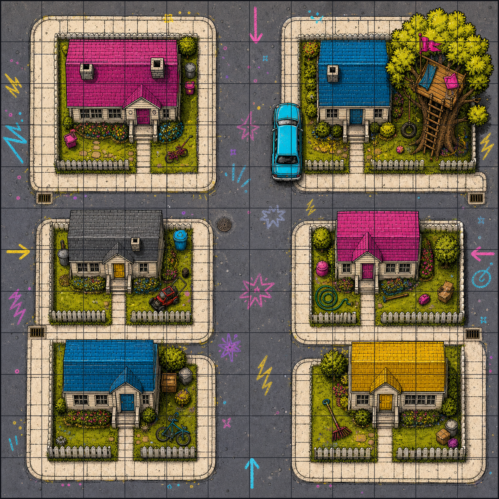

```text
Perfectly square 1:1 aspect ratio, top-down 2D TTRPG battlemap art designed for a kids skirmish mission about knocking on doors and completing neighborhood chores. The map MUST support gameplay: six small suburban houses or front gardens arranged around a street, each with a clearly visible front door or porch objective; sidewalks linking the doors; open curb lanes for movement; scattered chore props such as trash bins, lawn mower, garden hose, rake, cardboard boxes, parked retro car, bikes and a treehouse. Leave clear entry lanes along all four board edges for enemy spawns. Strict orthographic bird's-eye view, zero perspective. No grid, no grid lines, no square overlay, no characters, no labels, no readable text. Hand-drawn doodle style, 90s cartoon aesthetic, vibrant neon colors, school notebook doodle art style, flat colors, print-ready RPG battlemap background.
```

### 2. El Quarter General

**Fitxer suggerit:** `maps/printable/el-cuartel-general-12x12.png`

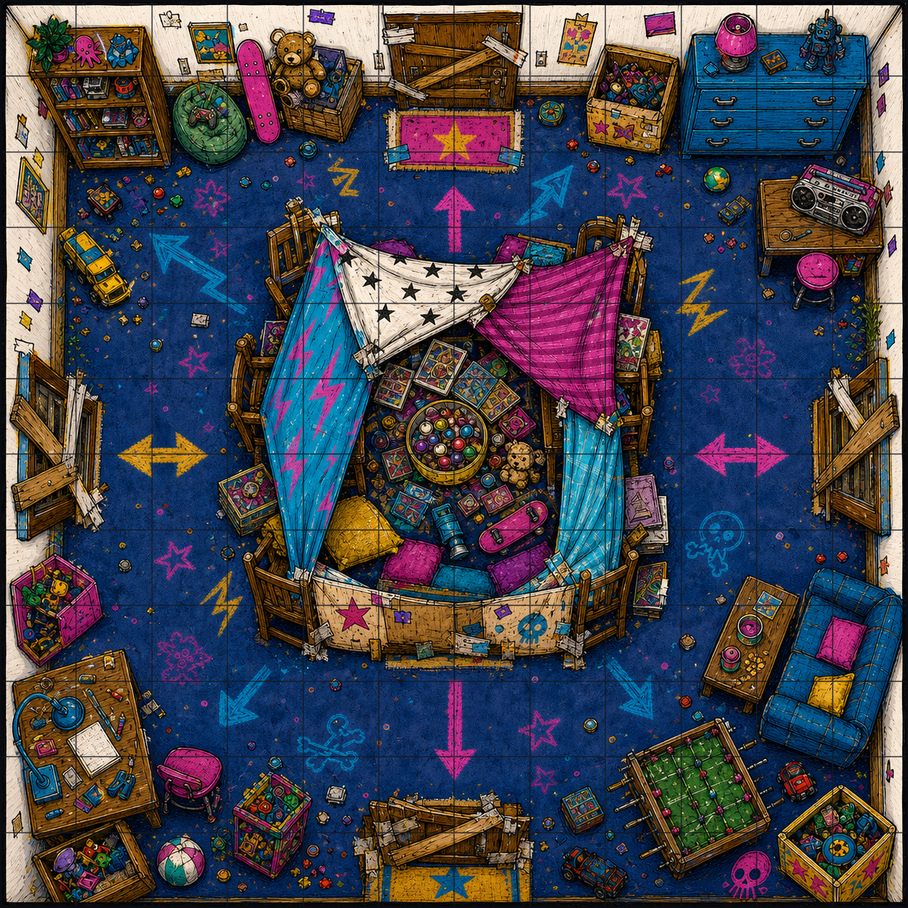

```text
Perfectly square 1:1 aspect ratio, top-down 2D TTRPG battlemap art designed for fort-defense missions where kids defend their headquarters from goblins, pigs or other bad guys. The map MUST support gameplay: a central homemade kids' fort occupying roughly a 4x4 square area, made from blankets, cardboard, chairs and cushions; four approach lanes from the board edges; barricaded doors/windows; a central stash objective such as sweets, comic books, bottle caps and baby teeth; scattered toys and furniture as cover around the fort, but with clear paths from all edges. Strict orthographic bird's-eye view, zero perspective. No grid, no grid lines, no square overlay, no characters, no labels, no readable text. Hand-drawn doodle style, 90s cartoon aesthetic, vibrant bright colors, flat shading, printable RPG battlemap background.
```

### 3. El Pati de l’Escola

**Fitxer suggerit:** `maps/printable/el-patio-del-colegio-12x12.png`

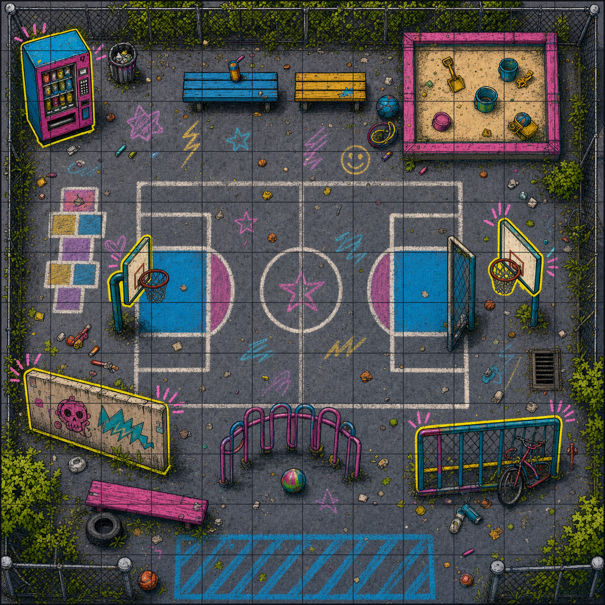

```text
Perfectly square 1:1 aspect ratio, top-down 2D TTRPG battlemap art designed for an urban tagging/escape mission. The map MUST support gameplay: a 1990s school playground with five obvious taggable terrain objectives distributed across the map, such as a vending machine, chain-link fence panel, basketball backboard, concrete wall, bike rack or playground sign; open deployment areas on opposite edges; enough cover and obstacles to break line of sight; basketball court with faded lines, sandbox, benches, hopscotch, chalk drawings and scattered schoolyard junk. Strict orthographic bird's-eye view, zero perspective. No grid, no grid lines, no square overlay, no characters, no labels, no readable text. Hand-drawn doodle style, 90s cartoon aesthetic, vibrant neon and pastel colors, flat colors, print-ready RPG battlemap background.
```

### 4. Els Recreatius

**Fitxer suggerit:** `maps/printable/el-recreativos-12x12.png`

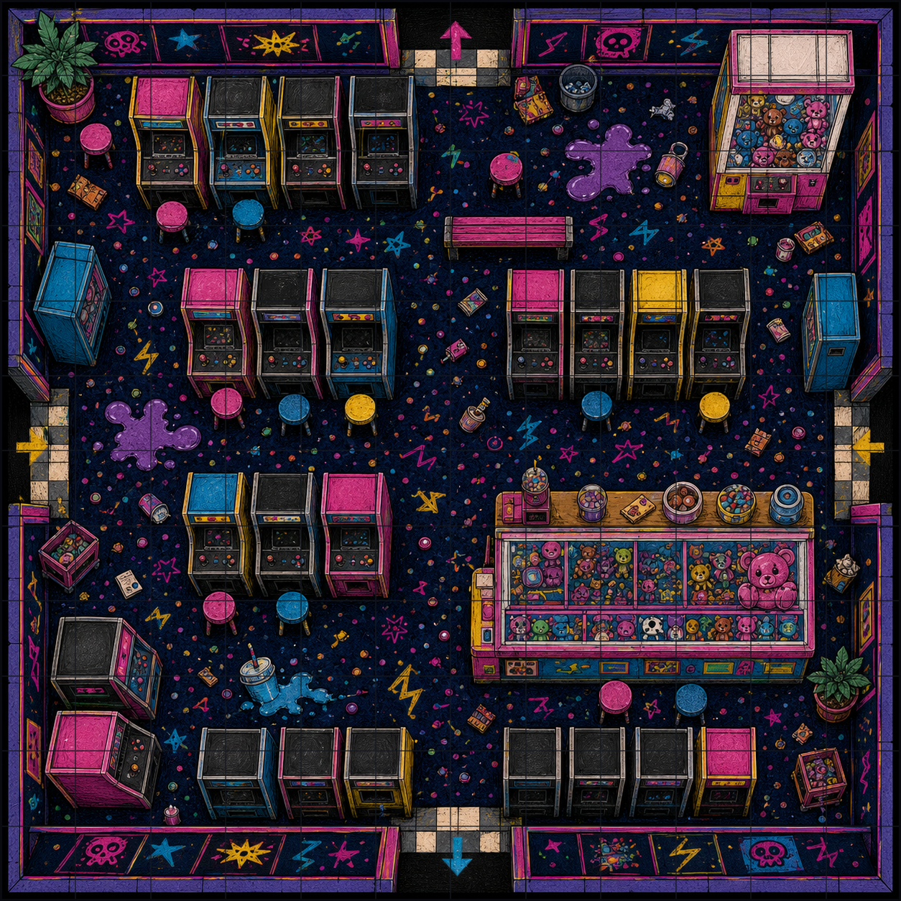

```text
Perfectly square 1:1 aspect ratio, top-down 2D TTRPG battlemap art designed for a 1990s arcade-room mission with obstacles, loot and chaotic movement. The map MUST support gameplay: rows of retro arcade cabinets forming narrow corridors, a prize counter as a major objective, token machine, sticky spilled soda hazard zones, stools, snack wrappers, neon carpet patterns, two or more clear entrances/exits on board edges, and several small loot/objective spots that can be reached by kids. The layout should create tactical lanes and blocked line of sight without becoming too crowded. Strict orthographic bird's-eye view, zero perspective. No grid, no grid lines, no square overlay, no characters, no labels, no readable text. Hand-drawn doodle style, 90s cartoon aesthetic, vibrant neon colors on dark background, flat colors, print-ready RPG battlemap background.
```

> Les còpies `*-ai.png` conserven la sortida original de la IA. Els PNG sense sufix tenen una quadrícula 12×12 superposada de manera exacta per a ús en taula.

# Annex — Normes oficials sense adaptar a caselles

> **Uso de este anexo.** Esta sección conserva les regles de mesura del joc original: polzades, cinta métrica i moviment libre. Si juegas la edición principal de este document en tauler de caselles, fes servir les regles adaptadas del inicio del manual. Si quieres jugar “a la vieja escola” amb escenografía libre, fes servir este anexo.

## Mesura original

- Todas les distàncies és miden en **polzades**.
- Les miniatures poden moverse en qualsevol direcció o combinación de direcciones, fins a el seu máximo de moviment.
- Quan una regla indica estar “a 1 polzada”, mide des de la miniatura u objecte según el acuerdo de taula habitual.
- Les armes a distància tenen un abast máximo de **12 polzades**, salvo que una regla indique otra cosa.
- Cualquier arma pot arrojarse fins a **6 polzades**, aplicando el penalizador indicado en combate a distància.

## Preparar i jugar una partida

1. Elige una aventura.
2. Prepara la taula según indique l’aventura.
3. Determinal clima.
4. Despliega les colles según indique l’aventura.
5. Determina quién actúa primero mediante iniciativa.

Cada ronda:

1. Determina la iniciativa de esa ronda.
2. Els jugadors és turnan per a gastar Ànim i activar menuts fins que tots és queden sense Ànim disponible.
3. Activa als Dolents que haya en joc.
4. Tira 1D6: amb 5+ ocurre un evento aleatori. Quan ja haya ocurrido un evento, no és vuelve a tirar per eventos futuros.
5. Termina la ronda.

## Pífies i crítics

- Un **1 natural** siempre falla i cuenta com **pífia**.
- Un **20 natural** abans de modificadores és un **crític**.
- Els crítics en combate cuerpo a cuerpo i a distància causan **+1 dany**.

## Ànim

El Ànim representa lo bien que és llevan els menuts de la colla. Cuanto mejor seal Ànim, més cosas podrán fer. Si l’Ànim és bajo, arrastrarán els pies, discutirán i evitarán colaborar.

En joc, l’Ànim indica cuántas acciones pot realizar cada jugador en una ronda. Al fundarse, una colla empieza amb **Ànim 8**. Algunos trasfondos i objectes poden aumentarlo o reducirlo.

- El Ànim nunca pot superar **10**.
- Si baja per debajo de **1**, la colla és disuelve i la campanya és perd.
- Aunque l’Ànim de la colla esté per debajo de **6**, els jugadors poden contarlo com **6** durante una aventura.

## Activar un menut

Quan eliges un menut per activarlo, gasta **1 Ànim**. Ese menut pot realizar una de aquestes acciones:

- Mover.
- Hacer un atac a distància.
- Hacer un atac cuerpo a cuerpo.
- Usar un objecte o habilidad.
- Recoger i/o soltar qualsevol número de objectes del suelo o de Dolents derrotados que estén a **1 polzada**.
- Interactuar amb tesoros o elementos específicos de l’aventura que estén a **1 polzada**.

Si una habilidad, estado u otra regla és dispara quan un menut és activado, resuelve ese efecte al inicio de l’activació, abans de realizar la acción.

## Desplegament

Antes de la primera ronda, tira iniciativa per a determinar quién col·loca primero un menut. Después els jugadors alternan la colocación de miniatures, una per una, fins que tots els menuts estén desplegados.

Salvo que l’aventura indique otra cosa, els menuts han de colocarse a **6 polzades** o menys d’un vora del tauler.

## Iniciativa

Tira 1D20. El resultat més alto tria una miniatura per activar primero. Después, els jugadors és turnan per activar miniatures fins que ambos és queden sense Ànim.

Si un jugador té desventaja en Ànim restante, pot pasar fins que ambos jugadors tinguin la misma cantidad de Ànim disponible.

Com alternativa sencilla, pot empezar el jugador més joven.

## Proves

Todas les proves són **DR12**, tret que s’indiqui lo contrario. Tira 1D20, suma els modificadores relevantes i comparal resultat. Si el total és **12 o més**, la prova té èxit.

## Moviment oficial

Els menuts poden mover un número de polzades igual a:

```text
5 + Cuerpo
```

Puedes mover en qualsevol direcció o combinación de direcciones fins al máximo de moviment del menut.

- El terreny de menys de **1 polzada** de altura pot cruzarse gratis.
- El terreny de més de **1 polzada** ha de escalarse.
- Els menuts escalan a la mitad de el seu velocidad de moviment.
- Un menut ha de acabar el seu moviment sobre una superficie plana.
- Els menuts poden saltar huecos de **3 polzades** o menys, però han de superar una prova de **Cos DR12**.
- Si fallan el salto, caen i sufren una conseqüència.
- Con una pífia en el salto, sufren dos conseqüències.
- Un menut que sale per un vora del tauler és considera que és ha ido a casa i deixa de participar en l’aventura.

Se anima als jugadors a crear els seus propias soluciones quan surjan situaciones raras, siempre que sean divertidas, caóticas i aceptables per a la taula.

## Combat cos a cos oficial

Para realizar un atac cuerpo a cuerpo, el menut ha de estar a **1 polzada** o menys de otra miniatura.

Secuencia:

1. Compruebal abast.
2. Elige un arma.
3. Haz una prova **DR12** usando el modificador apropiado del arma.
4. Si l’atac impacta, tiral dany.

El cuerpo a cuerpo és arriesgado: el oponente también pot atacarte al mismo tiempo, amb **-3** a el seu tirada. Ambos combatientes tiran per a impactar i després tiran dany per cada impacto conseguido.

El penalizador de **-3** és ignora si otra miniatura amiga también és a **1 polzada** del atacant enemic.

Con una pífia, sueltas l’arma.

Si l’objectiu sobrevive i aún no és ha activado, podrá activarse normalmente esa ronda.

## Combat a distància oficial

Les armes a distància tenen un abast máximo de **12 polzades**.

Para fer un atac a distància, la miniatura ha de poder ver al menys una parte de la miniatura objectiu.

- Les miniatures trabadas en cuerpo a cuerpo no poden fer atacs a distància.
- Disparar contra miniatures trabadas en cuerpo a cuerpo aplica **-3** a la tirada per a impactar.
- Si més del 50% d’una miniatura és oculto, aplica **-3** a la tirada per a impactar: l’objectiu té cobertura.
- Otra miniatura que bloquegi la línea de visió también pot proporcionar cobertura.

Tira una prova **DR12** amb els modificadores relevantes. Si tens èxit, tiral dany del arma.

## Armes llancívoles

Puedes arrojar qualsevol arma fins a **6 polzades**, però sufres **-3** a la tirada. El arma queda en el suelo al costat al objectiu tanto simpacta com si falla.

Les armes a distància cuentan com armes improvisadas d’una mano en cuerpo a cuerpo.

Un arma arrojada pot recogerse com acción per un menut que esté a **1 polzada** de ella.

## Dany i armadura

Quan una miniatura rep un impacto d’un monstruo o arma, aplical dany.

Si un menut rep dany, reduce els seus HP per esa cantidad. Resta la defensa del atuell al dany recibido. Els atuells siempre reducen el dany tret que s’indiqui lo contrario.

Els Dolents tenen Salut. Esa Salut indica cuánto dany poden sufrir abans de abandonar la taula.

- Els crítics causan **+1 dany**.
- La armadura és aplica incluso contra crítics.

## Abandonar el combat

Els menuts que estén a **1 polzada** de menuts de otras colles o de Dolents són en combate.

Un menut pot abandonar combate gastando **1 Ànim adicional**. Por tanto, abandonar combate costa **2 Ànim** en total.

Els Dolents que és vean obligados a abandonar combate lo fan gratis.

## Proves de Gallina

A veces un menut ha de fer una prova de **Molar** per a demostrar que no és un gallina.

Si falla, fuig cap a casa: mou inmediatamente el seu moviment máximo hacial vora del tauler més cercano. La siguiente vegada que sea elegido per activarse, repeteix la prova.

- Si supera la prova, actúa amb normalidad.
- Si falla de nuevo, continúa moviéndose cap a fuera del tauler.
- Repite la prova cada vegada que sea elegido per activarse fins que tenga èxit o abandone la taula.

Huir d’un combate per una prova de Gallina no provoca atacs enemics i no costa Ànim.

Si llevas gafas de sol mentre juegas, pots repetir una prova de Molar per partida.

Una miniatura fa una prova de Gallina quan:

- Recibe un impacto crític.
- Una aventura lo indica.
- Otro menut sufre la conseqüència **Agotado** a **12 polzades** o menys. Esta última condición solo afecta a miniatures controladas per jugadors.

## Conseqüències i estats

Quan un menut, Tasca o Dolent llega a **0 HP**, abandona la taula salvo que els seus regles especiales indiquen lo contrario.

Quan un menut vuelve a casa per quedarse a **0 HP**, guanya una conseqüència aleatòria.

El dany dura fins al final de l’aventura.

## Dolents: activación oficial

Después de que tots els jugadors hayan activado a els seus menuts, és activan els Dolents.

Si hay més d’un Dolent que activar, trial orden al azar amb una tirada.

Els Dolents fan totes els seus proves a **DR12** sense modificadores, tret que s’indiqui lo contrario. Esto inclou les proves que fan quan són atacados.

Els Dolents que solo tinguin atacs a distància, si són trabados en cuerpo a cuerpo, fan atacs desarmados que causan **1 dany**, tret que s’indiqui otra cosa.

## Molar dels Dolents

Si un Dolent rep un impacto crític, fa una tirada de Molar.

Tira **2D6**. Si el resultat és mayor que el seu valor de Molar, el Dolent fuig del campo, moviendo **2D6 polzades** per ronda fins a abandonar la taula o ser derrotado.

Si el Molar del Dolent és “—”, ignora aquestes regles.

## Aparició oficial de Dolents

Quan una regla indique que apareix un Dolent aleatori, colócalo según indique l’aventura.

Si l’aventura señala un vora del tauler, col·local Dolent en ese vora, cerca del centre del vora per el que apareix.

## Pífies dels Dolents

Si un Dolent saca un **1**, sueltal arma. Els atacs naturales com garras no és sueltan.

Si un Dolent no té arma, fes servir el seu acción per a recoger qualsevol arma soltada.

## Saquear Dolents

Els Dolents deixen caer els objectes i armes que lleven quan fugen de la taula. Esos objectes poden recogerse com acción per una miniatura que esté a **1 polzada** del lugar donde cayeron.

## Tasques oficials

Les Tasques són un tipus especial de Dolent que els menuts han de derrotar durante els seus aventures.

Quan una Tasca és reduce a **0 HP**, és completa.

Por cada Tasca completada, la colla guanya **3 xapes** com paga després de completar l’aventura.

Si dos colles dañan una misma Tasca, ambas guanyen la recompensa per completarla al final de l’aventura.

Quan una aventura indique que apareix una Tasca, tira en la tabla correspondiente per a determinar lo difícil que és completarla.

A diferencia dels Dolents, les Tasques no és mouen cap a els menuts tret que s’indiqui lo contrario. Normalmente permanecen estáticas.
